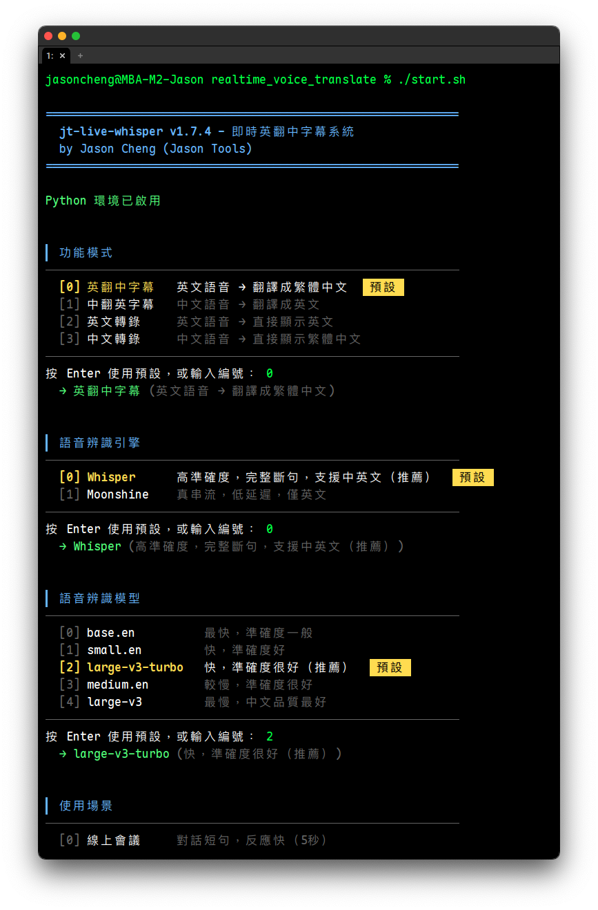
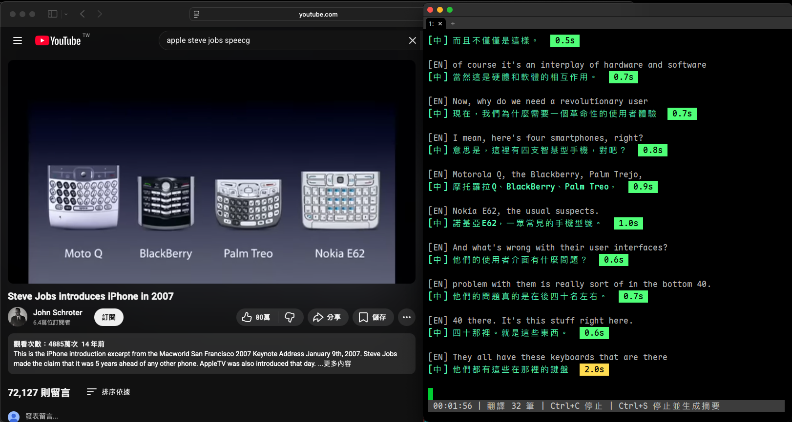
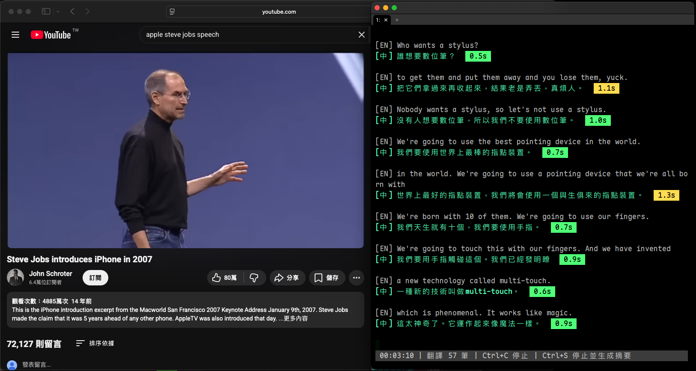
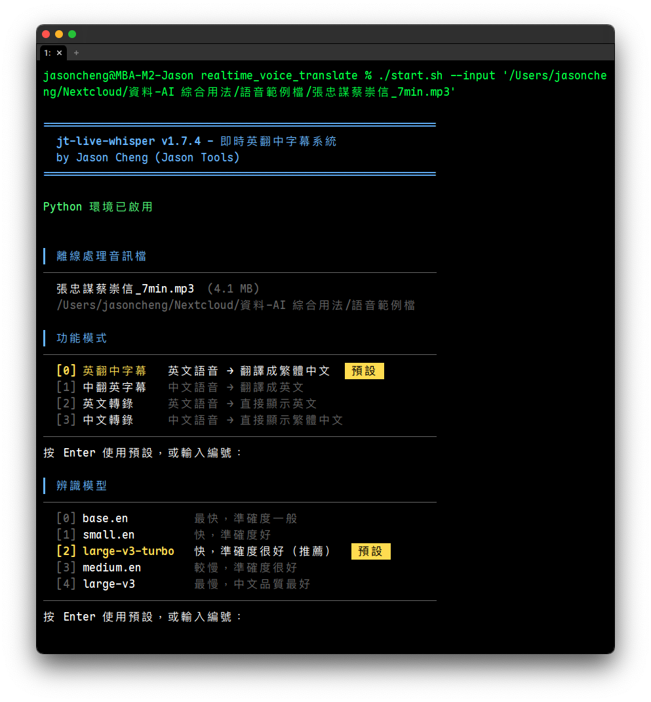
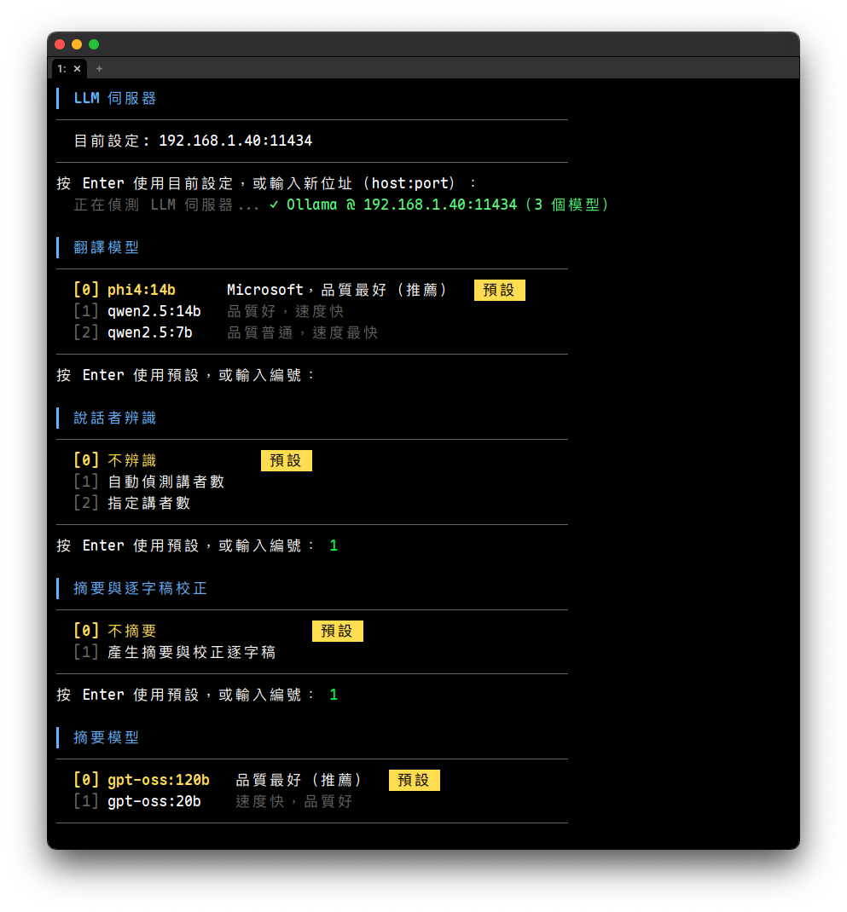
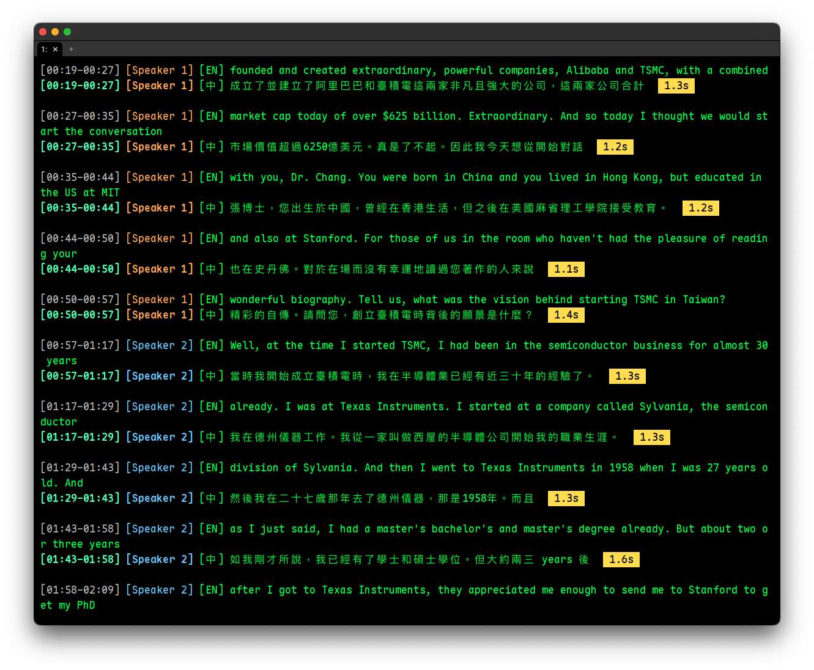

# jt-live-whisper 安裝與使用 SOP

即時英翻中字幕系統 v2.29.0 (by Jason Cheng)

| **目錄** | [系統架構](#一系統架構) · [音訊設定](#二事前準備音訊設定) · [安裝程式](#三安裝程式) · [啟動與使用](#四啟動與使用) · [REST API](#五rest-api給其他系統串接) · [使用流程總結](#六使用流程總結) · [常見問題](#七常見問題) · [檔案說明](#八檔案說明) · [硬體建議](#硬體建議) |
|---|---|

將英文語音即時轉錄並翻譯成繁體中文字幕顯示於終端機。採用系統音訊層級擷取（macOS 使用內建 ScreenCaptureKit，或 BlackHole 虛擬音訊裝置；Windows 使用 WASAPI Loopback；Linux 使用 PipeWire / PulseAudio 的 monitor 來源），**理論上任何軟體的聲音輸出都能即時處理**：視訊會議（Zoom、Teams、Meet）、YouTube、Podcast、串流影片、教育訓練等，不限定特定應用程式。亦可離線處理音訊檔案。

適用平台：macOS（Apple Silicon / Intel）/ Windows 10+ / Linux（Ubuntu 22.04、Debian 12 以上）

**全地端執行，不依賴雲端服務。** 所有語音辨識、翻譯、摘要皆在自有設備上完成，音訊資料不會離開你的網路環境。有兩種部署方式：

- **單機模式**：一台 Mac、Windows PC 或 Linux 桌機即可完成所有處理。語音辨識（Whisper/Moonshine）、翻譯（LLM/NLLB/Argos）全部在本機執行，不需要額外硬體。適合個人使用、外出攜帶。
  - **macOS Apple Silicon**（M1/M2/M3/M4）：透過 mlx-whisper 啟用 Metal GPU 加速，辨識速度約 1-3 秒，效能很好。
  - **macOS Intel**：僅能使用 CPU 辨識，建議搭配 small 模型。
  - **Windows + NVIDIA GPU**：安裝程式會自動偵測 NVIDIA GPU 並安裝 CUDA 版 PyTorch，faster-whisper 辨識走 CUDA 加速，效能與 GPU 伺服器相近（辨識速度約 1-3 秒）。即使沒有另外架設 GPU 伺服器，單機就能享受 GPU 加速的效能。
  - **Windows 無 GPU**：使用 CPU 辨識，建議搭配 small 模型，辨識速度約 5-10 秒。
  - **Linux + NVIDIA GPU**：安裝程式自動安裝 CUDA 版 PyTorch，faster-whisper 走 CUDA 加速。
  - **Linux 無 GPU**：使用 CPU 辨識，建議搭配 base.en / small 模型，或搭配 GPU 伺服器。

- **本機 + GPU 伺服器模式**：本機負責音訊擷取與介面操作，語音辨識和講者辨識交由區域網路內的 GPU 伺服器處理（系統音訊和麥克風兩路都可送遠端）。離線辨識速度快 5-10 倍，即時辨識約 0.3-0.5 秒。仍然是全地端架構，資料僅在區域網路內傳輸。適合需要處理大量音訊或追求最佳即時辨識品質的場景。GPU 伺服器可以是 DGX Spark、安裝有 NVIDIA GPU 的 Ubuntu/Linux 主機，搭消費級 RTX 4090/5090 之類亦可（需已安裝 CUDA）。

- **伺服器模式**：裝在無桌面的 Linux 主機（`install.sh --server`），WebUI 常駐，區網內的電腦用瀏覽器上傳錄音處理，從別台電腦操作需要密碼。搭配 GPU 伺服器時 2 vCPU、4 GB 記憶體、30 GB 磁碟即可。見「三種部署方式」。

單機與 GPU 伺服器兩種模式可隨時切換，GPU 伺服器離線時自動降級為本機處理，不中斷使用。

---

## 一、系統架構

### 三種部署方式

| 方式 | 適合 | 怎麼裝 | 建議規格 |
|---|---|---|---|
| **單機模式** | 個人使用：一台 Mac／Windows／Linux 桌機完成所有處理 | `install.sh`／`install.ps1` | 見「硬體建議」 |
| **本機＋GPU 伺服器** | 要更快：本機負責擷取音訊與介面，辨識與講者辨識交給區網內的 GPU 伺服器；伺服器離線時自動改回本機處理 | 本機照常安裝，安裝時填 GPU 伺服器位址 | GPU 伺服器見「GPU 伺服器建議」 |
| **伺服器模式** | 給團隊共用：裝在無桌面的 Linux 主機，WebUI 常駐，區網內的電腦用瀏覽器上傳錄音處理 | `install.sh --server`（見 3-1） | 搭配 GPU 伺服器時 **2 vCPU、4 GB 記憶體、30 GB 磁碟**即可；不搭配時改在 CPU 上辨識，建議 8 核、8 GB 以上 |

伺服器模式的規格是實測來的：37 分鐘的中文會議（辨識＋講者辨識＋校正）在搭配 GPU 伺服器時，
伺服器本身記憶體峰值約 0.4 GB、CPU 時間約 9 秒。從別台電腦操作需要密碼，見
「伺服器版的 WebUI 能從別台電腦操作到什麼程度」。

**即時模式：**

```
系統音訊（macOS: ScreenCaptureKit 或 BlackHole 2ch / Windows: WASAPI Loopback / Linux: PipeWire・PulseAudio monitor）
  → 擷取一份音訊給程式（macOS 由系統元件或虛擬裝置提供，Windows 與 Linux 直接擷取系統播放）
    → Whisper / Moonshine（即時語音辨識）           ← 本機或 GPU 伺服器
      → LLM（Ollama / OpenAI 相容）/ NLLB / Argos（翻譯）
        → 終端機顯示字幕 + logs/ 記錄檔
```

**離線處理模式（--input）：**

```
音訊檔案（mp3 / wav / m4a / flac 等）
  → ffmpeg 轉檔（→ recordings/ 暫存 16kHz mono WAV）
    → faster-whisper（離線語音辨識）                        ← 本機或 GPU 伺服器
      → （選配）resemblyzer + spectralcluster（講者辨識）   ← 本機或 GPU 伺服器
        → LLM（Ollama / OpenAI 相容）/ NLLB / Argos（翻譯）
          → （自動）LLM 校正逐字稿（有 LLM 時自動啟用）
            → 終端機顯示 + logs/ 記錄檔
              → （選配）LLM 摘要 → logs/
```

**離線處理產出檔案（存於 `logs/<session>/`）：**

| 檔案 | 說明 | 需要 LLM |
|------|------|----------|
| `時間逐字稿_*.txt` | 帶時間戳的逐字稿純文字（翻譯模式含原文+譯文） | 校正需要 |
| `時間逐字稿_*.html` | 互動式逐字稿（可點按時間戳播放對應音訊片段） | 校正需要 |
| `時間逐字稿_*.srt` | SRT 字幕檔（可匯入影片編輯軟體或播放器） | 否 |
| `時間逐字稿_*.vtt` | WebVTT 字幕檔（網頁播放器 `<track>` 標籤用） | 否 |
| `摘要_*.txt` | 會議摘要（重點摘要、事件與影響、決議、待辦、風險、未決問題、議題、發言統計，每一條附時間點）+ 校正逐字稿（純文字） | 是 |
| `摘要_*.html` | 會議摘要（時間點可點、議題時間軸、發言佔比、心智圖、依據的逐字稿、相關檔案連結） | 是 |
| 原始音訊副本 | 原始輸入檔案的副本（方便回溯） | 否 |

> LLM 校正會自動修正 ASR 辨識錯字（同音字、專有名詞等），有設定 LLM 伺服器時自動啟用，無需額外參數。純轉錄模式（不翻譯）同樣支援。

**GPU 伺服器架構（選配）：**

```
[本機 macOS / Windows]                          [伺服器 Linux + NVIDIA GPU]

translate_meeting.py                            remote_whisper_server.py (FastAPI)
  - 音訊擷取 / 轉檔                              - /v1/audio/transcriptions (ASR)
  - 上傳音訊到伺服器        --- HTTP --->           - /v1/audio/diarize（講者辨識）
  - 接收辨識結果          <-- JSON ---           - faster-whisper + GPU CUDA
  - LLM 翻譯 / 顯示 / 儲存                      - resemblyzer + GPU CUDA
  - SSH 啟停伺服器     --- SSH --->
```

有設定 GPU 伺服器時，語音辨識和講者辨識自動在伺服器執行（離線 30 分鐘音訊：本機約 3-5 分鐘，GPU 伺服器約 10-30 秒）。伺服器失敗時自動降級本機。多個用戶端可以共用同一個伺服器：**v2.21.7 起伺服器一次只跑一件，其餘自動排隊**（即時字幕另走一條線，不必等離線檔），詳見下方「GPU 伺服器的排隊與開機自動啟動」。

使用的 AI 模型：

| 用途 | AI 模型 | 說明 |
|------|---------|------|
| 語音辨識 | **Whisper** (OpenAI) | **多語（中日韓英）** 主力辨識模型；base / small / large-v3-turbo / large-v3 可選 |
| 語音辨識 | **Breeze-ASR-26** (MediaTek Research) | **台語（台灣閩南語）專用**，華語模式也可選用（台灣華語夾雜台語時）；Whisper large-v2 微調，結果直接輸出漢字，不需另外翻譯 |
| 語音辨識 | **Moonshine** (Useful Sensors) | **英文專用**，超低延遲串流辨識模型（不支援 Intel Mac） |
| 語音辨識 | **Qwen3-ASR 0.6B** (Alibaba Qwen) | **實驗選項（v2.23.0 起）**：離線處理錄音檔時選用，中文會議與中英夾雜明顯更準；限中文／英文／韓文輸入。GPU 伺服器（v2.23.0）或本機（v2.24.0 起：Apple Silicon、NVIDIA、CPU）執行，見「Qwen3-ASR（實驗）」 |
| 講者辨識 | **resemblyzer** + **spectralcluster** | 聲紋特徵提取 + 頻譜分群，可在本機或 GPU 伺服器執行 |
| 講者辨識 | **Nemotron 3 Diarization** (NVIDIA) | **v2.26.0 起預設使用**（transformers 5.18 以上；安裝程式會自動安裝並下載模型 0.71 GB）。Intel Mac、超過 8 人時改用上一列的方法 |
| 翻譯 (LLM) | 自架 LLM 伺服器，預設 **gemma4:26b**（伺服器沒有時改用 qwen2.5:14b） | 即時與離線翻譯（本機或區域網路 LLM 伺服器）；建議 14B 以上，並**選用不會思考、或思考可關閉的模型**，程式會自動關閉思考模式（gemma4、qwen3 等皆可），但 gpt-oss 系列架構上必定推理、關不掉，用於即時翻譯會明顯變慢 |
| 摘要 / 逐字稿校正 (LLM) | 自架 LLM 伺服器，預設 **qwen3.8:27b** | 會議摘要與逐字稿校正（兩者共用同一個模型）；建議 27B 以上，可與翻譯用不同模型 |
| 翻譯 (離線) | **NLLB 600M** (Meta) | 離線翻譯，支援中日韓英互譯，僅限本機 |
| 翻譯 (離線備援) | **Argos Translate** | 完全離線的輕量翻譯模型，僅支援英翻中 |

語音辨識的推論引擎（同一個模型可跑在不同引擎上，程式依平台與音訊來源自動選擇）：

| 引擎 | 用途 | 可跑的模型 |
|------|------|-----------|
| **whisper.cpp** | macOS 即時辨識（音訊來源為 SDL2 裝置時），本機或 GPU 伺服器 | Whisper 全系列（ggml） |
| **faster-whisper** (CTranslate2) | Windows / Linux 即時辨識、全平台離線處理、GPU 伺服器 | Whisper 全系列、Breeze-ASR-26 |
| **mlx-whisper** | Apple Silicon GPU 加速（即時與台語離線） | Whisper 全系列、Breeze-ASR-26 |
| **Moonshine** | 英文超低延遲串流（延遲 ~300ms，僅限本機） | Moonshine medium / small / tiny |
| **vLLM** | GPU 伺服器的離線辨識（獨立環境的子行程，實驗） | Qwen3-ASR 0.6B |
| **mlx-audio** | Apple Silicon 本機離線辨識（實驗，v2.24.0 起） | Qwen3-ASR 0.6B（MLX 8bit） |
| **transformers** | Windows / Linux 本機離線辨識（NVIDIA CUDA 或 CPU，實驗，v2.24.0 起） | Qwen3-ASR 0.6B |

你仍然可以正常從喇叭或耳機聽到聲音。macOS 13 以上使用系統內建的 ScreenCaptureKit 複製一份音訊給辨識程式（只需授權一次「螢幕錄製」，不必安裝驅動）；macOS 12 以下改用 BlackHole 虛擬音訊裝置；Windows 的 WASAPI Loopback 則直接擷取系統播放的音訊，同樣不需要安裝額外驅動；Linux 從 PipeWire / PulseAudio 的 monitor 來源擷取，也不需要虛擬音效卡。

**目錄結構：**

```
jt-live-whisper/
  translate_meeting.py     主程式（即時辨識、離線處理、翻譯、摘要，跨平台）
  webui.py                 WebUI 伺服器（FastAPI + WebSocket，瀏覽器介面後端）
  webui.html               WebUI 前端（單一 HTML，內嵌 CSS/JS）
  subtitle_overlay.py      懸浮字幕覆蓋視窗（PyQt6，選配）
  start.sh                 啟動腳本（macOS / Linux）
  start.ps1                啟動腳本（Windows）
  install.sh               安裝腳本（macOS；Linux 自動轉交 install-linux.sh）
  install-linux.sh         安裝腳本（Linux）
  install.ps1              安裝腳本（Windows）
  remote_whisper_server.py GPU 伺服器端 Whisper 辨識服務（選配）
  jtlw_tls.py              WebUI 與 REST API 共用的 TLS（HTTPS）模組
  sck_audio_capture.swift  macOS 系統音訊擷取元件（安裝時自動編譯）
  jtdt_meeting/            會議摘要的會議分析（jt-doc-tools 的程式，原封不動）
  jtlw_api/                REST API（給其他系統串接，伺服器版；介面規格在 schemas/）
  config.json              使用者設定（自動產生，含 LLM/GPU/WebUI 密碼等）
  SOP.md                   完整使用手冊
  CHANGELOG.md             版本更新記錄
  BENCHMARKS.md            實測紀錄（選模型、改預設值的依據）
  logs/                    記錄檔、摘要檔、HTML 逐字稿（自動建立）
  recordings/              暫存音訊轉檔（自動建立）
  api_data/                REST API 的作業紀錄、上傳暫存、憑證（啟用 API 後自動建立）
  whisper.cpp/             whisper.cpp 即時辨識引擎（macOS 自動編譯，Windows 自動編譯且為選用）
  venv/                    Python 虛擬環境
```

---

## 二、事前準備：音訊設定

### macOS 音訊設定

macOS 有兩種擷取系統音訊的方式，**預設用第一種，不需要安裝任何驅動**：

| 方式 | 適用 | 需要做的事 |
|---|---|---|
| **ScreenCaptureKit（預設）** | macOS 13 以上 | 只需授權一次「螢幕錄製」，不必裝驅動、不必重開機、不必改 Zoom/Teams 設定 |
| BlackHole | macOS 12 以下，或不想授權螢幕錄製 | 安裝驅動 → 重開機 → 建立多重輸出裝置 → 切換系統輸出 |

程式啟動時會自動判斷：macOS 13 以上且已授權就用 ScreenCaptureKit；否則自動退回 BlackHole。
也可以用 `--audio-source blackhole` 強制指定走 BlackHole。

---

#### 2-1. ScreenCaptureKit 系統音訊（預設方式）

> **自 jt-live-whisper v2.17.0 起支援。** v2.16.x 以前的版本 macOS 一律使用 BlackHole，升級後即可改用內建的 ScreenCaptureKit（原有的 BlackHole 設定不必移除，仍可作為備援）。

ScreenCaptureKit 是 macOS 內建的擷取機制，程式直接向系統借一份正在播放的音訊，**你的喇叭或耳機照常出聲、音量鍵照常可用**，Zoom / Teams / Meet 的喇叭與麥克風設定通通不用改。

```
任何應用程式的聲音（Zoom / Teams / Meet / YouTube / Podcast ...）
  │
  ├──▶ 你的喇叭 / AirPods / 耳機（照常聽到聲音，設定完全不用改）
  │
  └──▶ ScreenCaptureKit（系統複製一份給程式）
         │
         ▼
    jt-live-whisper → AI 語音辨識 → 翻譯 → 終端機即時字幕
```

安裝時 `./install.sh` 會自動編譯所需的擷取元件（`bin/jt-sck-audio`，約一分鐘），之後原始碼沒變就不會重編。

##### 「螢幕錄製」權限：什麼時候會跳、怎麼處理

**為什麼只取聲音卻要螢幕錄製權限？**
macOS 把 ScreenCaptureKit 整組歸類在「螢幕錄製」權限之下，即使程式只取音訊、完全不擷取畫面。macOS 15 起這個項目在系統設定裡顯示為 **「螢幕與系統音訊錄製」**。

**授權對象是「你的終端機程式」，不是 Python。**
macOS 記錄的是啟動本程式的那個 app：終端機（Terminal）、iTerm2、Ghostty、Warp、VS Code 等。程式會自動判讀並在提示訊息中**直接指名該勾誰**，不必自己猜。

**權限對話框什麼時候會跳出來：**

| 情況 | 程式的行為 |
|---|---|
| 第一次使用、尚未授權 | 終端機互動時直接詢問「現在開啟授權對話框？(Y/n)」，按 Enter 即跳出系統授權視窗 |
| 曾經按過「拒絕」 | macOS 不會再跳對話框，程式改為自動開啟「系統設定 → 隱私權與安全性 → 螢幕錄製」頁面讓你手動勾選 |
| 已安裝 BlackHole 但未授權 | 自動改用 BlackHole，並提示「未取得螢幕錄製權限」與啟用方式 |
| 想主動重新授權 | 隨時執行 `./start.sh --sck-permission` |
| 使用 WebUI | 設定頁的音訊來源區塊會顯示提示與「開啟授權對話框」按鈕 |

**授權後必須重新啟動終端機程式。**
這是 macOS 的規定：權限要等該程式重新啟動才會生效。請**完全結束**終端機程式（Cmd+Q，只關視窗不算），再重新開啟並執行一次。

**手動授權步驟（任何時候都可以用）：**

1. 開啟 **「系統設定」→「隱私權與安全性」→「螢幕錄製」**（macOS 15 顯示為「螢幕與系統音訊錄製」）
2. 在清單中找到你的終端機程式（Terminal / iTerm2 / Ghostty / VS Code…）並打開開關
3. 若清單中沒有它，先執行一次 `./start.sh --sck-permission` 讓它註冊進清單
4. 用 Cmd+Q **完全結束**該終端機程式，再重新開啟

##### 常見狀況

- **系統設為靜音就收不到聲音。** ScreenCaptureKit 取的是實際播放出來的音訊，系統靜音時只會收到無聲訊號。用耳機聽沒問題，但不要靜音。
- **換了終端機程式要重新授權。** 權限綁在 app 上，從 Terminal 換成 iTerm2 等於換了一個對象。
- **錄音想同時錄下自己的聲音**，選擇「系統音訊 + 麥克風」的混合錄音即可，**不需要**建立聚集裝置。

---

#### 2-2. BlackHole（macOS 12 以下，或不使用 ScreenCaptureKit 時）

> 以下設定只有在 macOS 12 以下、或你選擇不授權螢幕錄製時才需要。
> macOS 13 以上使用預設的 ScreenCaptureKit 可完全跳過本節。

##### 2-2-1. 安裝 BlackHole 虛擬音訊驅動

`./install.sh` 會協助安裝 BlackHole，不需手動執行。

安裝完成後**必須重新啟動電腦**，BlackHole 才會生效。

##### 2-2-2. 建立「多重輸出裝置」

BlackHole 2ch 是虛擬音訊裝置，搭配 macOS「多重輸出裝置」將系統音訊同時送給你的耳機/喇叭和本程式，音訊流向如下：

```
任何應用程式的聲音（Zoom / Teams / Meet / YouTube / Podcast ...）
  │
  ▼
macOS 多重輸出裝置（你建立的）
  ├──▶ MacBook 揚聲器 / AirPods / 耳機（你照常聽到聲音）
  └──▶ BlackHole 2ch（虛擬音訊裝置，無聲複製一份）
         │
         ▼
    jt-live-whisper 讀取 BlackHole 音訊
      → AI 語音辨識 → 翻譯 → 終端機即時字幕
```

1. 開啟 **「音訊 MIDI 設定」**（Audio MIDI Setup）
   - Spotlight 搜尋「音訊 MIDI 設定」，或從 `/Applications/Utilities/Audio MIDI Setup.app` 開啟
2. 點左下角 **「+」** → 選擇 **「建立多重輸出裝置」**
3. 在右側勾選：
   - v 你的喇叭或耳機（例如「MacBook Air 的喇叭」或 AirPods）
   - v **BlackHole 2ch**
4. 確認你的喇叭/耳機排在 BlackHole **上方**（可拖曳調整順序）
5. 勾選 **BlackHole 2ch** 的 **「主裝置」**（Master Device）欄位


> **重要：主裝置務必選 BlackHole，不要選耳機/喇叭。** BlackHole 是虛擬裝置，永遠不會斷線。如果主裝置設為藍牙耳機（例如 AirPods），一旦耳機斷線，整個多重輸出裝置會失效，導致 Zoom 等應用程式音訊中斷且無法恢復，必須重建裝置或重開機。

##### 2-2-3. 設定音訊輸出

將系統音訊輸出切換到多重輸出裝置，讓 BlackHole 能收到聲音：

1. 打開 **「系統設定」→「聲音」→「輸出」**
2. 選擇剛才建立的 **「多重輸出裝置」**


> **注意：** 多重輸出裝置下無法用系統音量鍵調整音量。如需調整音量，請用應用程式內部的音量控制（如 Google Meet 的音量滑桿）。

> **重要：Zoom / Teams 等視訊軟體的喇叭（輸出）也要設成「多重輸出裝置」，不能直接選 AirPods 或喇叭。** 如果直接選 AirPods，聲音不會經過 BlackHole，程式就收不到對方的聲音。麥克風（輸入）維持原本的設定即可，不需要改。

##### 2-2-4. 建立「聚集裝置」（選配，錄音時需要錄到自己的聲音才需要）

使用 BlackHole 時，即時轉錄的 ASR 辨識裝置固定使用 BlackHole 2ch（只擷取對方聲音），這樣辨識最準確。但如果你啟用了 `--record` 錄音功能，想要**同時錄下對方和自己的聲音**，就需要建立聚集裝置（Aggregate Device）。

> 使用預設的 ScreenCaptureKit 時不需要本節：直接選擇「系統音訊 + 麥克風」的混合錄音即可。

建立步驟：

1. 開啟 **「音訊 MIDI 設定」**（Spotlight 搜尋「音訊 MIDI 設定」）
2. 點左下角 **「+」** → 選擇 **「建立聚集裝置」**（Create Aggregate Device）
3. 勾選：
   - v **BlackHole 2ch**（系統音訊，對方的聲音）
   - v **你的麥克風**（例如「MacBook Air 的麥克風」或 AirPods 麥克風）
4. **時脈來源選 BlackHole 2ch**（虛擬裝置時脈穩定，不會因藍牙斷線而失效）
5. 其他實體裝置勾選 **「偏移修正」**（Drift Correction）
6. 取個好認的名稱，例如「聚集錄音」


> **重要：時脈來源務必選 BlackHole 2ch。** 原因與多重輸出裝置相同：BlackHole 是虛擬裝置，時脈永遠穩定。如果選實體裝置（如 AirPods 或 MacBook 麥克風），藍牙斷線或裝置休眠會導致時脈來源消失，整個聚集裝置跟著失效。

建好之後，程式會自動偵測聚集裝置作為錄音裝置，不需要手動選擇。如果偵測不到聚集裝置，會自動降級使用 BlackHole（僅錄對方聲音）。

**ASR 辨識裝置 vs 錄音裝置的差別：**

| 用途 | 選擇的裝置 | 擷取內容 | 說明 |
|---|---|---|---|
| ASR 即時辨識 | BlackHole 2ch | 僅對方聲音 | 即時字幕只處理對方語音，無法辨識自己的聲音 |
| 錄音 | 聚集裝置 | 對方 + 自己 | 同時錄下雙方聲音，事後用 `--input` 離線轉錄含自己的聲音 |

**Zoom / Teams 的設定不需要改：**

| 設定項目 | 選擇 | 說明 |
|---|---|---|
| Teams/Zoom 喇叭（輸出） | 多重輸出裝置 | 聲音同時送到耳機和 BlackHole |
| Teams/Zoom 麥克風（輸入） | AirPods / 原本的麥克風 | 對方聽到你說話，不受影響 |

完整音訊流向：

```
對方說話 → Teams 輸出 → 多重輸出裝置 → AirPods（你聽到）
                                       → BlackHole（ASR 辨識 + 聚集裝置的一部分）

你說話 → AirPods 麥克風 → Teams 輸入（對方聽到）

錄音時：
  聚集裝置 = BlackHole（對方聲音）+ MacBook 麥克風（你的聲音）
  → 程式同時錄下雙方聲音為 WAV 檔
```

##### 2-2-5. 驗證音訊設定

1. 播放一段英文影片或音訊
2. 確認你的喇叭/耳機有聲音
3. 回到「音訊 MIDI 設定」，確認 BlackHole 2ch 的音量指示器有跳動

### Windows 音訊設定

Windows 不需要安裝額外的虛擬音訊驅動。程式透過 WASAPI Loopback 直接擷取系統播放的音訊。

#### 2-W1. 確認音訊裝置

程式會自動偵測含有 "loopback" 或 "stereo mix" 的音訊裝置。大多數情況下不需要手動設定。

如果自動偵測失敗，可嘗試啟用「立體聲混音」（Stereo Mix）：

1. 右鍵點選工作列通知區域的音量圖示 → 「音效設定」（或「開啟音效設定」）
2. 點選「更多音效設定」→ 切換到「錄製」分頁
3. 在空白處右鍵 →「顯示已停用的裝置」
4. 找到「立體聲混音」（Stereo Mix），右鍵 →「啟用」
5. 若找不到「立體聲混音」，表示音效驅動未提供此功能，可嘗試更新音效驅動

> **注意：** 部分音效驅動（尤其是 Realtek 較舊版本）預設隱藏或不提供 Stereo Mix。大多數現代 Windows 系統的 WASAPI Loopback 模式可正常運作，不需要 Stereo Mix。

#### 2-W2. 驗證音訊設定

1. 播放一段英文影片或音訊
2. 開啟 PowerShell，執行 `.\start.ps1 --list-devices`
3. 確認列表中有 loopback 或 stereo mix 裝置

### Linux 音訊設定

Linux 不需要安裝虛擬音效卡，也不必改變輸出裝置。程式直接從「預設喇叭」的 **monitor 來源**錄音（PipeWire 與 PulseAudio 都有提供；Ubuntu 22.10 以後預設為 PipeWire），喇叭或耳機照常出聲，Zoom / Teams 的設定不用改。

```
對方說話 → Zoom/Teams → 預設喇叭 / 耳機（你聽到）
                      → monitor 來源（程式以 parec 擷取）→ AI 辨識 → 字幕
```

#### 2-L1. 確認音訊環境

1. 執行 `./start.sh --list-devices`
2. 列表最上方應出現 `[-500] 系統音訊（喇叭名稱）` 與 `[-600] 系統音訊 + 麥克風混合錄音`
3. 或執行 `./install.sh --doctor` 一次檢查音訊伺服器、預設喇叭、擷取工具

#### 2-L2. 注意事項

- 擷取的是**目前的預設輸出裝置**（`pactl get-default-sink`）。換了耳機或喇叭，程式下次偵測時自動跟著換
- 要指定其他來源：設定環境變數 `JTLW_MONITOR_SOURCE=來源名稱`，或在 `config.json` 加上 `"linux_monitor_source": "來源名稱"`。來源名稱可用 `pactl list short sources` 查詢（通常以 `.monitor` 結尾）
- 擷取工具優先使用 `parec`（套件 `pulseaudio-utils`），沒有時改用 `pw-record`（套件 `pipewire-bin`）
- 即時模式必須在**桌面工作階段內**執行。透過 SSH 連線時連不到使用者的音訊伺服器，只能做離線處理
- 錄音選「系統音訊 + 麥克風」即可同時錄下雙方聲音，不需要建立任何虛擬裝置
- 遠端桌面（xrdp）連線時，xrdp 會提供自己的虛擬喇叭 `xrdp-sink`，程式一樣可以擷取

---

## 三、安裝程式

### 3-1. 一鍵安裝

**macOS：**

打開終端機，貼上以下指令即可自動下載並安裝所有元件：

```bash
mkdir -p ~/Apps/jt-live-whisper && cd ~/Apps/jt-live-whisper
curl -fsSL https://raw.githubusercontent.com/jasoncheng7115/jt-live-whisper/main/install.sh -o install.sh
bash install.sh
```

**Linux（Ubuntu / Debian）：**

打開終端機，貼上以下指令（安裝過程會用 `sudo` 補齊系統套件）：

**桌機版**（即時字幕、WebUI、懸浮字幕）：

```bash
mkdir -p ~/Apps/jt-live-whisper && cd ~/Apps/jt-live-whisper
curl -fsSL https://raw.githubusercontent.com/jasoncheng7115/jt-live-whisper/main/install.sh -o install.sh
bash install.sh
```

**伺服器版**（無桌面主機；不裝桌面套件，WebUI 以 systemd 服務常駐、開機自動啟動）：

```bash
mkdir -p ~/Apps/jt-live-whisper && cd ~/Apps/jt-live-whisper
curl -fsSL https://raw.githubusercontent.com/jasoncheng7115/jt-live-whisper/main/install.sh -o install.sh
bash install.sh --server
```

`install.sh` 偵測到 Linux 時會自動改用 `install-linux.sh`，也可以直接執行它。

> **請用一般帳號安裝，不要用 root**。服務會以「執行 `sudo` 的原始帳號」或「安裝資料夾的擁有者」執行（v2.22.3 起）；
> 兩者都是 root 時才以 root 執行，安裝程式會出現警告。WebUI 對區網開放，以 root 執行時任何漏洞都等於整台主機的最高權限。

可用參數：

| 參數 | 說明 |
|---|---|
| （無） | 桌面版安裝 |
| `--server` | 伺服器版：不安裝桌面相關套件，建立 `jt-live-whisper-webui` systemd 服務（開機自動啟動）；第一次安裝時自動產生**管理密碼與唯讀密碼**並各印出一次（v2.22.3 起加上唯讀密碼） |
| `--upgrade` | 從 GitHub 升級程式檔案 |
| `--doctor` | 檢查執行環境：Python 套件、音訊伺服器、GPU、GPU 伺服器與 LLM 伺服器連線 |
| `--uninstall` | 移除虛擬環境、systemd 服務與應用程式選單捷徑（保留模型、設定與記錄檔） |

**Windows：**

開啟 PowerShell（以管理員身份），建立資料夾並切換過去（不需要 Git）：

```powershell
mkdir C:\jt-live-whisper -Force | Out-Null; cd C:\jt-live-whisper
```

下載安裝程式：

```powershell
irm https://raw.githubusercontent.com/jasoncheng7115/jt-live-whisper/main/install.ps1 -OutFile install.ps1
```

執行安裝：

```powershell
powershell -ExecutionPolicy Bypass -File install.ps1
```

> **Windows 的 PowerShell 預設不允許執行腳本**：上面用 `-ExecutionPolicy Bypass` 只對這一次有效。v2.27.0 起安裝程式（含 `-Upgrade`）在 Windows 預設狀態時會自動改成允許執行本機腳本（RemoteSigned，只影響目前使用者；從網路下載、沒有簽章的腳本照樣擋），之後就能直接打 `.\start.ps1`、`.\install.ps1 -Upgrade`。執行原則是你或公司刻意設過的不會自動改（有人在終端機前才問，預設否），那時改用 `powershell -ExecutionPolicy Bypass -File start.ps1`。

安裝腳本會自動檢查並安裝以下項目：

> **首次安裝預估時間：約 10～20 分鐘**（視網路速度而定）。主要耗時項目：
> - whisper.cpp 編譯：約 3～5 分鐘（macOS、Windows 都從原始碼編譯；Windows 第一次還要先裝 Visual Studio C++ 編譯器，約 2～6 GB）
> - whisper 模型下載：約 3～10 分鐘（large-v3-turbo 約 809MB）
> - Argos 翻譯模型下載與安裝：約 2～3 分鐘
>
> 安裝過程中終端機會持續輸出訊息，請耐心等待，不要中斷。

**本機安裝項目（macOS）：**

| 項目 | 說明 |
|---|---|
| [Homebrew](https://brew.sh/) | macOS 套件管理器（需事先安裝，安裝腳本不會自動安裝） |
| cmake | 編譯工具 |
| sdl2 | 音訊擷取函式庫（whisper.cpp 即時辨識用；新版 Homebrew 會安裝 `sdl2-compat`，安裝腳本兩者皆支援） |
| ffmpeg | 音訊轉檔工具（--input 離線處理需要） |
| Xcode Command Line Tools | 提供 swiftc，用於編譯 ScreenCaptureKit 擷取元件（未安裝時執行 `xcode-select --install`） |
| bin/jt-sck-audio | ScreenCaptureKit 系統音訊擷取元件（安裝時自動編譯，約一分鐘） |
| BlackHole 2ch | 虛擬音訊驅動（選配，macOS 12 以下或不使用 ScreenCaptureKit 時才需要） |
| Python 3.12 | Python 執行環境 |
| whisper.cpp | 即時語音辨識引擎（自動編譯） |
| whisper 模型 | 語音辨識模型（預設下載 large-v3-turbo） |
| Python venv | 虛擬環境 + ctranslate2、sentencepiece、sounddevice、numpy、faster-whisper、resemblyzer、spectralcluster |
| Moonshine ASR | 英文串流語音辨識引擎 + medium 模型 (~245MB) |
| NLLB 600M 翻譯模型 | 離線翻譯模型，中日韓英互譯 (~600MB) |
| Argos 翻譯模型 | 離線英→中翻譯模型 |

**本機安裝項目（Windows）：**

| 項目 | 說明 |
|---|---|
| [Python 3.12+](https://www.python.org/downloads/) | 從 python.org 下載安裝（安裝時勾選「Add to PATH」） |
| ffmpeg | 音訊轉檔工具（`winget install ffmpeg` 或從 [ffmpeg.org](https://ffmpeg.org/download.html) 下載） |
| whisper.cpp | 即時語音辨識引擎（選用；自動安裝 CMake 與 Visual Studio C++ 編譯器後從原始碼編譯，沒有時即時辨識改用 faster-whisper） |
| whisper 模型 | 語音辨識模型（預設下載 large-v3-turbo） |
| Python venv | 虛擬環境 + ctranslate2、sentencepiece、sounddevice、numpy、faster-whisper、resemblyzer、spectralcluster |
| Moonshine ASR | 英文串流語音辨識引擎 + medium 模型 (~245MB) |
| NLLB 600M 翻譯模型 | 離線翻譯模型，中日韓英互譯 (~600MB) |
| Argos 翻譯模型 | 離線英→中翻譯模型 |

**本機安裝項目（Linux）：**

| 項目 | 說明 |
|---|---|
| 系統套件（apt） | ffmpeg、libportaudio2、python3-venv、python3-dev、build-essential（編譯 resemblyzer / webrtcvad 需要，已有 gcc 時略過）；桌面版另裝 pulseaudio-utils、libxcb-cursor0（PyQt6 需要）、fonts-noto-cjk（中文字型）、xdg-utils |
| PyTorch | 有 NVIDIA GPU 時裝 CUDA 版（ARM64 如 DGX Spark 裝 cu128），沒有時裝 CPU 版（避免下載數 GB 的 CUDA 套件） |
| CTranslate2（ARM64 + NVIDIA） | PyPI 的 ARM64 版不含 CUDA，安裝程式會在本機從原始碼編譯 CUDA 版（約 20～40 分鐘）。函式庫裝在 `.ct2-local/`（不動系統的 `/usr/local`，同一台主機上的 GPU 辨識服務不受影響），wheel 存在 `.ct2-wheels/`，之後重裝直接使用 |
| Python venv | 虛擬環境 + ctranslate2、faster-whisper、resemblyzer、spectralcluster、noisereduce、WebUI 套件；桌面版另含 PyQt6 |
| Moonshine ASR | 英文串流語音辨識引擎（桌面版） |
| NLLB 600M 翻譯模型 | 離線翻譯模型，中日韓英互譯 (~600MB) |
| Argos 翻譯模型 | 離線英→中翻譯模型（桌面版） |
| faster-whisper 模型 | base.en / base / small.en / small / large-v3-turbo |
| 應用程式選單捷徑 | 桌面版：`~/.local/share/applications/jt-live-whisper.desktop`（開啟 WebUI） |
| systemd 服務 | 伺服器版：`jt-live-whisper-webui.service` |

> **Linux 相依套件的處理：** 安裝程式可以重複執行，已裝好的項目會略過，只補缺少的部分。以非互動方式執行（例如透過 SSH 自動部署）時，可設定 `SUDO_ASKPASS` 讓 `sudo` 取得密碼。
>
> **Linux 全部裝在 GPU 伺服器上：** jt-live-whisper 可以直接裝在 GPU 伺服器（x86_64 或 ARM64 的 DGX Spark 皆可）。ARM64 會自動編譯 CUDA 版 CTranslate2；伺服器繁忙時建議改用「Linux 伺服器 + GPU 伺服器」分開安裝，以免辨識與 LLM 搶資源。

> **Linux 不需要：** whisper.cpp、BlackHole、虛擬音效卡。Linux 的即時辨識一律使用 faster-whisper，系統音訊從 PipeWire / PulseAudio 的 monitor 來源擷取。從 Mac 複製過來的 `config.json` 若含有 `/Users/...` 的 SSH Key 路徑，安裝程式會自動改成 `~/.ssh/` 底下的同名檔案。

> **Windows 不需要：** Homebrew、BlackHole。音訊擷取使用 WASAPI Loopback，不需要虛擬音訊驅動。
>
> **Windows 的 whisper.cpp 是選用的**：安裝程式會自動安裝 CMake、Visual Studio C++ 編譯器並從原始碼編譯。編譯器是安裝當下才裝的，要**重新開啟 PowerShell 後再執行一次 `.\install.ps1`** 才會編譯；沒有 whisper.cpp 時即時辨識改用 faster-whisper（Python 端），功能照常（v2.26.14 起；先前會出現「找不到 whisper-stream」而無法開始）。

**GPU 語音辨識伺服器（選填）：**

安裝最後會詢問是否設定 GPU 語音辨識伺服器。若有安裝 NVIDIA GPU 的 Ubuntu/Linux 主機（消費級 RTX 4090/5090 亦可，需已安裝 CUDA），安裝腳本會透過 SSH 自動在伺服器安裝以下套件，大幅加速語音辨識和講者辨識：

| 項目 | 說明 |
|---|---|
| PyTorch (CUDA) | GPU 加速框架（自動偵測 CUDA 版本選擇對應 wheel） |
| CTranslate2 / faster-whisper | Whisper 語音辨識引擎（GPU 加速版） |
| resemblyzer + spectralcluster | 講者辨識套件（GPU 加速聲紋提取） |
| FastAPI + uvicorn | 辨識 API 伺服器 |
| remote_whisper_server.py | 伺服器辨識服務程式（自動部署） |

未設定 GPU 伺服器時，所有語音辨識在本機執行，功能完全相同但速度較慢。

安裝程式會自動處理 SSH 金鑰：若 `config.json` 中設定的 SSH Key 不存在，會自動產生 ed25519 金鑰並部署公鑰到伺服器，之後免密碼登入。重複執行安裝程式時，已安裝的套件會自動跳過，不會重複安裝。

安裝前若偵測到 jt-live-whisper 相關程序正在執行，可選擇 K 強制結束程序後繼續安裝，避免檔案鎖定衝突（尤其 Windows）。

**磁碟空間需求（本機）：** 最小安裝約 3 GB（venv + 1 個 Whisper 模型 + 基本套件），推薦 8 GB 以上（含 HuggingFace 快取供離線處理用），完整安裝約 14 GB（全部模型 + Moonshine）。macOS 額外需要 Homebrew 套件約 140 MB（cmake + sdl2 + ffmpeg）。Apple Silicon Mac 啟用本機朗讀（文字轉語音）另需約 4 GB（模型 3.2 GB、台灣念法資源 0.6 GB）。安裝腳本會在安裝前自動檢查可用空間。

**磁碟空間需求（GPU 伺服器）：** 最小安裝約 5 GB（PyTorch + 1 個模型），完整安裝約 12 GB（PyTorch + 全部 5 個模型 + 講者辨識套件）。啟用文字轉語音另需約 11 GB（獨立的 Python 環境 5.2 GB、VoxCPM2 4.7 GB、g2pW 0.6 GB；安裝時要 20 GB 可用空間）。選用的 BreezyVoice 再加約 8 GB（Python 環境 5.5 GB、模型 2.2 GB；安裝時要 16 GB 可用空間）。

### GPU 伺服器的排隊與開機自動啟動（v2.21.7 起）

**排隊：一次一件，先到先做。** 以前多個用戶端同時送檔時，伺服器會全部同時跑：每一件都變慢，顯示記憶體也可能不夠。現在分成兩條線，各自一次只跑一件：

| 線 | 跑什麼 | 說明 |
|---|---|---|
| 離線線 | 離線辨識、講者辨識 | 先到先做；後到的會在進度列顯示「伺服器排隊中：前面還有 N 件」 |
| 即時線 | 即時字幕送來的幾秒短音訊 | 與離線線分開，**即時字幕不必等一場長會議跑完**；多人同時開即時字幕時在這條線上排隊 |

- 送出前若伺服器正忙，畫面只會提示「送出後會自動排隊」，不再詢問要不要等候或強制中斷（強制中斷會砍掉別人正在跑的作業）
- 排隊中關掉程式或斷線，那一件會自動移出隊伍，不會卡住後面的人
- 舊版用戶端連到新版伺服器照樣能用（一樣會排隊，只是進度列不會顯示排隊位置）

**開機自動啟動。** 安裝程式設定 GPU 伺服器時（以 root 登入、伺服器有 systemd），會建立 systemd 服務 `jt-whisper-server@<port>`，主機重開後自動啟動，程式異常結束也會自動重啟。已經裝好的伺服器重新執行一次 `./install.sh`（或 Windows 的 `install.ps1`）就會補上。

```bash
systemctl status jt-whisper-server@8978     # 查看狀態
systemctl restart jt-whisper-server@8978    # 重啟
journalctl -u jt-whisper-server@8978        # 系統紀錄；程式輸出在 /tmp/jt-whisper-server.log
```

非 root 帳號或沒有 systemd 的伺服器不會建立服務，沿用原本「用戶端需要時再以 SSH 啟動」的方式，主機重開後要重新啟動服務。

### Qwen3-ASR（實驗，v2.23.0 起）

離線處理錄音檔時可選用的另一個辨識模型。用有標準答案的錄音實測（與現行 large-v3-turbo 同一段、同一份答案）：

| 測試 | large-v3-turbo | Qwen3-ASR 0.6B |
|---|---:|---:|
| 中文真實會議 20 場（5~7 人，每場約 38 分）字錯率 | 28.78% | **15.75%** |
| 中英夾雜（中文為主）：英文詞找回比例 | 34.7% | **74.9%** |
| 中英夾雜（英文為主）：中文字找回比例 | 25.6% | **83.0%** |
| 低音量錄音（-60 dBFS）字錯率 | 20.67% | **14.33%** |
| 韓文長檔字錯率 | 13.35% | **3.54%** |
| 日文長檔字錯率 | **6.97%** | 8.38% |

- **限制**：只支援離線處理錄音檔、中文／英文／韓文**單向**模式（日文長檔實測較差、台語遠不如 Breeze-ASR-26，所以不開放）；
  即時字幕、雙向模式仍用 Whisper。選了但不適用時，程式會說明原因並自動改用推薦模型
- **在哪裡跑**：跟著「辨識位置」走：選 GPU 伺服器就在伺服器上跑，選本機就在這台電腦上跑（本機 v2.24.0 起）。
  該位置跑不了時選單不會出現；命令列指定時會說明原因並改用推薦模型

| 執行位置 | 需要 | 速度（實測） | 記憶體 |
|---|---|---|---|
| GPU 伺服器 | 伺服器另建 `venv-qwen`（見下方「GPU 伺服器安裝」） | 37 分鐘會議約 74 秒 | 顯示記憶體約 7~9 GB |
| Mac Apple Silicon | 安裝程式會裝好 mlx-audio | 37 分鐘會議約 1 分半（M5：辨識 64 秒＋對時間 22 秒） | 約 3.2 GB |
| Windows／Linux＋NVIDIA 顯示卡 | 安裝程式會裝好 transformers | 37 分鐘會議約 4 分鐘（辨識 224 秒＋對時間 27 秒；DGX Spark 與其他服務共用時實測） | 顯示記憶體約 4.5 GB |
| Windows／Linux 只有 CPU | 同上，且電腦記憶體 **12 GB 以上**（不足時不開放） | **可能比錄音還久**：2 核筆電（i5-6300U）2 分鐘錄音約 5 分鐘；20 核 ARM 伺服器 6.7 分鐘約 4.5~7 分鐘 | 處理中最高約 7.5 GB |
| Intel Mac | 不支援 | 不適用 | 不適用 |

- Windows＋NVIDIA 顯示卡這一格沒有實機驗證過（開發時沒有這種機器），程式路徑與 Linux＋NVIDIA 相同

#### 本機執行（v2.24.0 起）

- **安裝**：新安裝的直接可用。從舊版升級時，macOS 與 Windows 在 `--upgrade` 之後要**再執行一次 `./install.sh`**
  （Windows：`.\install.ps1`）；Linux 的 `--upgrade` 會自動接著檢查。它會補裝 mlx-audio（Mac）或 transformers 5.17 以上（其他平台），約數十 MB。沒有裝時選單不會出現，命令列會寫原因與怎麼裝
- **模型第一次選用時才下載**（Mac 約 2.3 GB、其他平台約 3.4 GB），放在與 Whisper 模型相同的 HuggingFace 快取，之後不必再連網。
  選單會標「第一次使用下載約 X GB」
- **準確度與 GPU 伺服器相同**：同一場 37 分鐘中文會議，Mac 本機與 GPU 伺服器的字錯率都是 18.85%，
  句子起點誤差的中位數也都是 280 毫秒
- **只有 CPU 的電腦**：選單標「較準但很慢（本機只有 CPU）」，仍可手動選，建議先用短檔試。
  處理中記憶體最高約 7.5 GB，**電腦記憶體不到 12 GB 時不開放**（8 GB 的電腦會一直用虛擬記憶體，慢到不能用）。
  原本選 GPU 伺服器、伺服器剛好失敗而退回本機時，**不會**自動改在 CPU 上跑 Qwen3-ASR，而是用平常的本機模型
- **本機跑到一半失敗**（例如記憶體不足）→ 自動改用本機推薦的 Whisper 模型重跑那個檔案，畫面會寫原因

#### GPU 伺服器安裝

- **資源**：啟動後約 7 GB 顯示記憶體，處理長錄音時增加到約 9 GB（實測 37 分鐘會議合計 8.9 GB）；服務啟動後約 1~3 分鐘載入完成，載入完成前不會出現在選單。
  一次送進模型的片段數預設 16（`JT_QWEN_BATCH`）：顯示記憶體寬裕時設 32 較快（37 分鐘 49 秒 vs 74 秒），但會到約 12 GB

**安裝（在 GPU 伺服器上，用執行辨識服務的同一個帳號）：**

```bash
cd ~/jt-whisper-server
python3.12 -m venv venv-qwen      # 沒有 python3.12 才用 python3
venv-qwen/bin/pip install --upgrade pip
venv-qwen/bin/pip install "qwen-asr[vllm]==0.0.6"
venv-qwen/bin/pip install --force-reinstall torch==2.9.1 torchaudio==2.9.1 --index-url https://download.pytorch.org/whl/cu128
venv-qwen/bin/pip install "numpy<2.3"
systemctl restart jt-whisper-server@8978      # 或重新啟動服務
curl -s http://localhost:8978/health           # 1~3 分鐘後 "qwen": {"ready": true, ...}
```

- 獨立的 `venv-qwen` 是必要的：它需要的 PyTorch 版本與辨識服務本身不同，裝在一起會互相衝突
- 用固定版本的 `python3.12` 建立：用 `python3` 建的 venv 在作業系統升級換了 Python 版本後，看起來正常、套件卻全部不見（見 3-5）
- 服務會自動用 `~/jt-whisper-server/venv-qwen/bin/python` 帶起一個只聽本機（127.0.0.1）的子行程；位置不同時設環境變數
  `JT_QWEN_PYTHON`，埠號預設為服務埠號＋11（`JT_QWEN_PORT` 可改）。服務停止時子行程會一起結束，不會殘留佔用顯示記憶體
- 載入失敗時看 `/health` 的 `qwen.error` 與 `/tmp/jt-qwen-worker-<埠號>.log`
- 移除：刪掉 `venv-qwen` 資料夾後重啟服務

### GPU 伺服器的版本檢查與更新（v2.21.1 起）

GPU 伺服器上跑的 `remote_whisper_server.py` 是一支獨立的服務，**不會跟著本機一起升級**。本機 `./install.sh --upgrade` 更新的是本機程式；伺服器上的服務還是舊的。

這在 v2.21.1 之前沒有任何提示，曾經造成伺服器停留在舊版好幾天沒人發現，而且**有設定 GPU 伺服器時，辨識與講者辨識預設就走伺服器**，等於一直拿到舊版的結果。

**現在每次連上伺服器都會比對版本：**

```
  [版本不一致] GPU 伺服器 v2.20.9，本機 v2.21.1
  辨識與講者辨識仍會使用伺服器上的舊版；伺服器未開放遠端更新
  手動更新：scp remote_whisper_server.py 192.168.1.40:~/jt-whisper-server/server.py 後重啟服務
```

**版本不一致不會中斷作業**：伺服器舊一點通常仍可使用，只是你會知道結果來自哪個版本。若伺服器連 `version` 都沒回報（v2.21.1 以前的版本），會顯示「未知版本」。

#### 自動更新（選填，預設關閉）

設定之後，本機發現伺服器版本較舊時會自動把新版推上去，由伺服器自行驗證並重啟，過程中顯示狀態列：

```
  ⠹ 更新 GPU 伺服器 [192.168.1.40] │ 上傳新版（38 KB）...
  ⠼ 更新 GPU 伺服器 [192.168.1.40] │ 伺服器驗證通過（2.20.9 → 2.21.1），重啟中...
  [完成] 已更新到 v2.21.1
```

**這個功能預設是關閉的，必須兩邊都設定才會啟用：**

**1. GPU 伺服器端**：設定密鑰後重啟服務。有 systemd 服務時（v2.21.7 起），寫進 `~/jt-whisper-server/server.env`：

```bash
echo "JT_WHISPER_UPDATE_TOKEN=自訂一組夠長的隨機字串" > ~/jt-whisper-server/server.env
chmod 600 ~/jt-whisper-server/server.env
systemctl restart jt-whisper-server@8978
```

沒有 systemd 服務時，改在啟動命令前加上環境變數：

```bash
cd ~/jt-whisper-server && JT_WHISPER_UPDATE_TOKEN='自訂一組夠長的隨機字串' \
  nohup setsid venv/bin/python3 server.py --port 8978 > /tmp/jt-whisper-server.log 2>&1 < /dev/null &
```

沒有設定這個環境變數時，更新端點**完全不存在**，任何請求都會被拒絕。

**2. 本機**：在 `config.json` 的 `remote_whisper` 區塊填入**同一組**密鑰：

```json
"remote_whisper": {
  "host": "192.168.1.40",
  "whisper_port": 8978,
  "update_token": "自訂一組夠長的隨機字串"
}
```

> ⚠️ **這個功能本質上是「讓遠端主機執行你送過去的程式」。** 區域網路不等於安全網路，所以預設關閉，而且只有在你自己兩邊都設定同一組密鑰時才會生效。不確定是否需要時，**維持關閉、手動更新即可**，版本提示照樣會出現。

更新前伺服器會依序做完這些檢查，任何一項不過就保留舊版、服務不受影響：

| 檢查 | 不通過時 | 擋的是什麼 |
|---|---|---|
| HMAC 簽章是否相符 | `unauthorized` | **未經授權的更新** |
| 時間戳是否在 5 分鐘內 | `unauthorized` | 重放舊請求 |
| 大小是否超過 8 MB | `payload_too_large` | 惡意灌爆記憶體 |
| 內容 SHA-256 是否相符 | `checksum_mismatch` | 傳輸損壞 |
| 語法是否正確 | `invalid_syntax` | 壞掉的更新 |
| **送來的版本是否比較新** | `downgrade_refused` | 舊用戶端把伺服器降版 |
| **實際啟動一次是否成功**（`--selftest`） | `selftest_failed` | 壞掉的更新 |

舊版會備份成 `server.py.bak-<時間>`，只保留最近 5 份。

**有作業正在跑時：排定，等做完才換（v2.21.8 起）。** 以前是直接拒絕（`busy`），伺服器一直有人在用就永遠更新不了。現在驗證全部通過後：

| 情況 | 伺服器怎麼做 | 使用者看到 |
|---|---|---|
| 沒有作業 | 立即換版（約 1 秒後重啟） | `[完成] 已更新到 vX` |
| 有作業在跑或排隊 | **排定**：新版先存起來；已經在跑、在排隊的照樣做完，做完才換 | `[已排定] 伺服器有 N 件作業在跑，已排定做完後更新到 vX` |
| 排定期間送來的離線辨識／講者辨識 | 不收（回 503），等換完 | 「GPU 伺服器更新中，稍候…」，換完**自動送出**，不會改用本機 |
| 排定期間的即時字幕 | 照常辨識，到換版前一刻才停 | 字幕只中斷重啟的那幾秒 |
| 30 分鐘內作業還沒做完 | 放棄這次更新、恢復收件（避免一件卡住的作業讓伺服器一直不收件） | 版本不變，下次連線會再推一次 |

> **換版的順序是「先關門、再等清空、最後換檔」。** v2.21.7 以前是「確認沒作業 → 1 秒後重啟」，這 1 秒內送進來的作業會在跑到一半時被換掉，而用戶端還把被切斷的結果當成「0 段、處理完成」。兩個問題 v2.21.8 都修掉了：伺服器不再有空窗，用戶端收到不完整的結果會等伺服器回來重送，等不到才改用本機。

> **這些檢查分兩類，不要混為一談。** 只有**簽章**在管「誰可以更新」；其餘都在管「更新的東西會不會把服務弄死」。`--selftest` 本身就會執行上傳的程式碼，所以它**擋得住壞掉的更新、擋不住惡意的更新**。**密鑰是唯一的安全邊界，請當成密碼保管。**

> **為什麼用簽章而不是直接送密鑰**：這條連線是 HTTP 不是 HTTPS。直接送密鑰的話，任何能側錄區網封包的人都拿得到一組可重複使用的憑證，等於取得那台機器的任意程式碼執行權。改用 HMAC 之後，側錄者只能重放「同一份內容」（無害，那就是同一支程式），無法偽造新的 payload。

> **為什麼不接受降版**：多個用戶端共用同一台 GPU 伺服器是常見情況。若只比對「版本不同」，舊的用戶端會把伺服器降回舊版、新的用戶端又推回去，**兩邊無限來回，而每次重啟都會中斷別人正在跑的辨識**。所以伺服器只接受比自己新的版本，用戶端在發現伺服器較新時也會主動退讓。

> **為什麼一定要「實際啟動一次」才換檔**：伺服器是把自己換成新版（同一個程序），換上去如果起不來，服務就直接消失；即使有 systemd 服務，自動重啟也只會一直重跑同一支壞掉的程式。所以寧可多花十幾秒驗證。

全部通過後會顯示：

```
  全部就緒！可以執行 ./start.sh 啟動系統。        ← macOS / Linux
  全部就緒！可以執行 .\start.ps1 啟動系統。       ← Windows
```

### 3-2. 升級至最新版本

先切到安裝資料夾再執行（下面是預設位置，裝在別的地方就換成你的安裝資料夾）：

```bash
# macOS / Linux
cd ~/Apps/jt-live-whisper
./install.sh --upgrade

# Windows (PowerShell)
cd C:\jt-live-whisper
.\install.ps1 -Upgrade
```

自動從 GitHub 下載最新版本的程式檔案（translate_meeting.py、start.sh、install.sh、SOP.md 等），不影響現有的 venv、whisper.cpp、模型和設定檔。macOS 與 Windows 升級後請再執行一次安裝腳本（macOS: `./install.sh`、Windows: `.\install.ps1`），新版本需要的套件才會裝上。

- **升級執行一次就好**（v2.28.1 起）：新版才加入的檔案由新版的安裝程式接手補齊。以前跑的是「舊版」安裝程式，只會複製舊版清單上的檔案，新版才加入的（例如 v2.27.0 的朗讀模組 `jtlw_tts/`）要再升級一次才會到
- **從 v2.28.0 以前升級上來的**：第一次升級跑的還是舊的安裝程式，新加入的檔案可能還沒到；之後執行 `./start.sh`（Windows：`.\start.ps1`，點捷徑也是）時會先自動補齊（畫面顯示「升級沒有完成…自動補齊」），連不到 GitHub 時會說要再執行一次升級
- **升級後把 WebUI 關掉再重新啟動**：開著的 WebUI 還在跑升級前的程式（例如朗讀的選單是空的、或顯示「文字轉語音元件還沒安裝完成」）

升級結束時，還沒建過捷徑的電腦會問一次要不要建立桌面與應用程式選單捷徑（見 3-4）。

Linux 的 `--upgrade` 下載完新檔案後會自動重新執行安裝檢查，補齊新版本需要的相依套件；伺服器版若程式版本有變更，會一併重新啟動 `jt-live-whisper-webui` 服務。不想在升級時檢查相依套件，可設定 `JTLW_SKIP_DEP_CHECK=1`。

### 3-3. 搬遷資料夾後

如果將資料夾搬到其他位置，只需重新執行安裝腳本（macOS / Linux: `./install.sh`、Windows: `.\install.ps1`），它會自動偵測並修復損壞的 venv 和 whisper.cpp；建過的桌面與應用程式選單捷徑也會一併改指到新位置。

### 3-4. 桌面與應用程式選單捷徑（v2.25.4 起）

有圖形桌面的電腦，安裝（或升級）結束時會問一次要不要建立捷徑，點兩下就以 WebUI（瀏覽器介面）模式啟動：

| 平台 | 位置 | 怎麼選 |
|---|---|---|
| macOS | 桌面（`jt-live-whisper.command`）、「應用程式」（`jt-live-whisper.app`，Launchpad、Spotlight 找得到） | 按 Enter 兩邊都建；`1` 只建桌面、`2` 只建「應用程式」、`n` 都不要 |
| Windows | 桌面、「開始」功能表的所有程式（`jt-live-whisper.lnk`） | 同上 |
| Linux | 桌面（`jt-live-whisper.desktop`） | 應用程式選單安裝時就會建立，只問要不要也放桌面（`Y/n`） |

- macOS 兩種捷徑都在「終端機」裡執行，擷取系統音訊需要的「螢幕錄製」權限仍然是給終端機，不必另外授權
- Linux 第一次點兩下若出現「不受信任的啟動器」，按右鍵選「允許啟動」
- **選了「都不要」之後升級不會再問**；想建立時刪掉安裝資料夾裡的 `.desktop_shortcut`，再執行一次安裝腳本
- 建過之後自己刪掉捷徑，升級也不會再建回來；捷徑還在的話，搬過資料夾後重新執行安裝腳本會一併更新
- 用 SSH、排程等沒有人可以回答的方式執行時不問（也不記錄），下次在終端機前執行時再問；伺服器版（`--server`）不問
- 位置上已經有別的捷徑（自己做的、或同一台電腦另一份安裝建的）：不問、不記錄，升級時也不會改它；原本指向的資料夾已經不在（搬過家）的才會接手、改指到這一份（v2.28.1 起；之前會把另一份安裝的捷徑改成指向自己）
- **從 v2.25.3 以前升級上來的**：macOS、Windows 第一次 `--upgrade` 跑的是舊版安裝腳本，不會問；
  第二次 `--upgrade`（或重新執行一次安裝腳本）才會問。Linux 的 `--upgrade` 會接著用新版安裝腳本檢查相依套件，第一次就會問
- 已經開著 WebUI 時再點一次捷徑，會直接在瀏覽器開啟原本那個，不會把它關掉重開；啟動失敗時視窗會停住，看得到錯誤訊息
- **捷徑圖示是 jt-live-whisper 的 logo**（v2.26.2 起，圖示檔在安裝資料夾的 `icons/`）。之前建的捷徑升級時會換上；從 v2.26.1 以前升級的，macOS、Windows 要第二次 `--upgrade`（`icons/` 那時才會到）才換。Windows 的桌面若還顯示舊圖示，是系統的圖示快取，重新登入後就會更新

### 3-5. 升級作業系統之後（Python 版本改變）

升級作業系統的大版本（例如 Ubuntu 22.04 → 24.04）常會換掉系統的 Python 版本。venv 裡裝好的套件跟著建立 venv 時的 Python 版本走，版本一換就全部不能用：每個程式都找不到套件，服務一直重啟。

- **升級完先在安裝資料夾執行一次安裝腳本**，會偵測到版本不同、重建 venv 並重新安裝套件（要連網路，PyTorch 等套件有好幾 GB）：
  Linux 用 `./install.sh --upgrade`、macOS 用 `./install.sh`、Windows 用 `.\install.ps1`
- **升級後、重開機前看起來都還正常**：服務還在跑升級前就載入的舊程式，重開機或重新啟動服務之後才會壞
- 沒重建就啟動時，程式會直接說明「venv 是用 Python 3.x 建立的，現在是 3.y」與修法後結束（結束碼 78），不會只丟一串 `ModuleNotFoundError`；
  GPU 伺服器與 REST API 的 systemd 服務遇到這個結束碼會停止重啟（GPU 伺服器的服務單元在下次執行安裝程式時更新；REST API 的單元照第五章的範例加上 `RestartPreventExitStatus=78`）
- **GPU 伺服器**：在用戶端重新執行安裝程式，檢查 GPU 伺服器時選擇修復，會重建伺服器的 venv。Qwen3-ASR 的 `venv-qwen` 要照「Qwen3-ASR（實驗）」重建
- Linux 的 `./install.sh --doctor` 會直接指出 venv 的 Python 版本與建立時不同
- 新的作業系統若只有比 3.12 更新的 Python，部分套件可能還沒有對應的版本、安裝會失敗；安裝腳本有 `python3.12` 時會優先用它

---

## 四、啟動與使用

### 4-1. 啟動

先切換到安裝目錄：

```bash
# macOS / Linux
cd ~/Apps/jt-live-whisper

# Windows (PowerShell)
cd C:\jt-live-whisper
```

啟動程式：

```bash
# macOS / Linux
./start.sh

# Windows (PowerShell)
.\start.ps1
```

> **Windows 使用者請注意：** 以下範例以 macOS / Linux 指令為主。Windows 使用者請將 `./start.sh` 替換為 `.\start.ps1`，`./install.sh` 替換為 `.\install.ps1`，安裝目錄為 `C:\jt-live-whisper`。其餘參數完全相同。
>
> 若出現「running scripts is disabled on this system」（因為這個系統上已停用指令碼執行）錯誤，請先執行以下指令（只需執行一次）；
> v2.27.0 起安裝程式（含 `-Upgrade`）在 Windows 預設狀態時會自動設定；之前的版本、或執行原則是刻意設過的，請自己執行：
> ```powershell
> Set-ExecutionPolicy -ExecutionPolicy RemoteSigned -Scope CurrentUser
> ```

### 4-2. WebUI 瀏覽器介面

除了終端機互動選單，也可以使用瀏覽器介面操作（安裝時建立的桌面、應用程式選單捷徑就是用這個模式啟動，見 3-4）：

```bash
# macOS / Linux
./start.sh --webui

# Windows (PowerShell)
.\start.ps1 --webui
```

自動開啟瀏覽器（預設 `http://localhost:19781`），在網頁中完成所有設定後按「開始」即可。支援：

- 即時音訊擷取或讀入音訊檔案（離線處理）
- 拖曳上傳音訊/影片檔案
- 離線處理選項：講者辨識（含人數）、產生摘要（含摘要模型）
- 離線處理各階段即時進度：辨識/講者辨識/輸出/LLM 校正/摘要（含 tokens 數與 t/s）
- 講者辨識時顯示彩色 Speaker N 標籤
- 辨識模型依裝置與模式自動推薦（「此裝置適合」標籤）
- 實驗模型（Qwen3-ASR）在 GPU 伺服器已就緒、或本機跑得了時出現；即時字幕、所選的辨識位置跑不了、或不支援的模式時會變灰並寫出原因（「僅限錄音檔」「需選 GPU 伺服器」「GPU 伺服器未提供」「不支援此模式」），已選的會自動換回推薦模型；本機只有 CPU 時標「本機只有 CPU，很慢」但仍可選
- 翻譯引擎依 config 自動推薦（有 LLM 伺服器預設 LLM，無則預設 NLLB）
- 聊天模式與字幕模式切換
- 即時辨識/翻譯進度顯示
- 音訊裝置的「重新偵測」：接上耳機（例如 AirPods）、換了麥克風之後按一下，兩個下拉選單馬上更新；麥克風選單只列真正的麥克風（不列 ScreenCaptureKit、BlackHole 這類系統音訊來源，選了會把對方錄兩次、自己沒錄到）（v2.26.3）
- 執行中點底部的裝置標籤可以切換裝置：其實是停掉再以新裝置重開，中間會斷幾秒，錄音檔與逐字稿從切換點分成兩份
- 純錄音可選「錄音來源」（雙方／只錄系統音訊／只錄麥克風），只顯示要用的裝置；用不到的關鍵字通知、懸浮字幕、字幕轉發會隱藏（v2.26.3）
- 錄音中顯示錄音檔大小與磁碟剩餘空間；「暫停」在三個平台都有作用（v2.26.3 起，先前 Windows 按了沒反應、純錄音按了也照錄）
- 按「停止」後，有錄音的會先轉成 MP3 再結束：按鈕顯示「存檔中...」、底部顯示轉檔進度，一小時的錄音約要幾十秒，**這段時間不要關閉終端機視窗**。完成後畫面列出錄音檔（v2.26.4 起；先前 4 秒就強制結束，畫面寫「程式異常結束（錯誤碼 -15）」，資料夾裡留下同名的 WAV 與 MP3，兩個都是完整的同一段錄音）
- 防呆驗證（未選檔案、LLM 未設定、重複啟動等）
- **結束 WebUI**：在執行它的終端機按一次 Ctrl+C，畫面會顯示「正在停止 WebUI...」；有錄音或朗讀在進行時會先等它存完檔。急著結束就再按一次 Ctrl+C，WebUI 立刻結束，錄音或朗讀照樣在背景存完檔（v2.27.0 起；先前存檔中再按 Ctrl+C 會讓 WebUI 卡住、怎麼按都結束不了）
- 淺色/深色主題切換
- 字幕轉發：即時字幕自動轉發到通訊平台（見下方說明）

### 4-3. 字幕轉發功能

即時辨識的字幕可自動轉發到通訊平台，每隔指定秒數發送一次累積字幕。支援同時多平台。

**支援平台：**

| 平台 | 認證方式 |
|------|----------|
| Telegram | Bot Token + Chat ID |
| Slack | Incoming Webhook URL |
| Discord | Webhook URL |
| Teams | Incoming Webhook URL |
| LINE | Channel Access Token + 接收者 ID |
| Nextcloud Talk | URL + 對話 Token + 帳號 + App 密碼 |
| 通用 API | 自訂 URL + Body 範本（`{{text}}` 變數）+ Headers |

**設定方式：** 在 WebUI「字幕轉發」區塊（僅本機顯示）勾選啟用，選擇平台並填入認證資訊，按「儲存設定」後下次啟動生效。可用「測試發送」驗證設定。

**發送內容選項：** 可勾選是否包含時間戳、原文、譯文。


### 4-4. 懸浮字幕功能（感謝 OSSLab 熊大提供建議）

在螢幕上顯示半透明字幕覆蓋視窗，可疊加於任何應用程式上方。需安裝 PyQt6（`install.sh` / `install.ps1` 會自動安裝）。

**功能特色：**
- 半透明黑底圓角視窗，原文 + 譯文雙行顯示
- 字體依視窗大小自動縮放，最小不低於下限，容不下則換行
- 可拖曳定位，位置自動記憶
- 滑鼠穿透模式（滑鼠事件穿透到下方應用）
- 系統匣圖示右鍵選單控制
- 字幕切換淡入淡出動畫
- 永遠置頂，跨桌面顯示（macOS / Windows；Linux 需在圖形桌面內執行，Wayland 的置頂行為依桌面環境而定）

**設定方式：** 在 WebUI「懸浮字幕」區塊（僅本機顯示）勾選啟用，按「開始」後自動啟動覆蓋視窗。


### 4-5. 關鍵字即時通知

即時辨識出現指定關鍵字時自動發出通知，可用於：
- 長時間會議中追蹤特定議題（公司名、專案名、人名）被提到的時刻
- 監聽多場會議，只在提到自己負責的項目時注意
- 開會時一邊做自己的事，設定關鍵字讓系統在提到重點時自動提醒你留意 😎
- 線上課程摸魚時，讓系統在講師說到「請實作」「請操作」「請記住」「這個會考」等關鍵字時自動提醒 😏

**通知方式：**
- 全螢幕警示特效（紅金交替閃爍 + 中央大字脈衝動畫，遊戲風格）
- 瀏覽器桌面推播通知（即使瀏覽器在背景也看得到）
- 音效提示，可選兩種風格：警示音（核爆風格）或柔和音（三連遞增音）
- 懸浮字幕視窗邊框金黃色閃爍
- 訊息列金黃色關鍵字提醒標記

**比對規則：** 不分大小寫，同時比對原文和譯文，同一關鍵字在冷卻時間內不重複通知。

**設定方式：** 在 WebUI「關鍵通知」區塊（僅本機顯示）啟用，輸入關鍵字（每行一個），設定冷卻時間和通知方式。


- 手機/平板 responsive

**設定頁面**


**對話模式** - 聊天風格，對方靠左、自己靠右


**字幕模式** - 電影風格，黑底大字


WebUI 需要 fastapi、uvicorn、websockets 套件（安裝腳本已自動安裝）。

### 4-6. 命令列參數（跳過選單直接啟動）

除了互動式選單，也可以透過命令列參數直接啟動，跳過所有選單：

```bash
./start.sh [參數...]           # macOS / Linux
.\start.ps1 [參數...]          # Windows
```

**可用參數：**

| 參數 | 說明 | 預設值 |
|---|---|---|
| `-h`, `--help` | 顯示說明 | |
| `--webui` | 啟動 WebUI 瀏覽器介面（在瀏覽器中操作所有功能） | |
| `--mode MODE` | 功能模式 (`en2zh` / `zh2en` / `ja2zh` / `zh2ja` / `ko2zh` / `zh2ko` / `en_zh` / `ja_zh` / `ko_zh` / `en` / `zh` / `ja` / `ko` / `nan` / `nan2en` / `record`) | `en2zh` |
| `--asr ASR` | 語音辨識引擎 (`whisper` / `moonshine` / `faster-whisper`) | `whisper` |
| `-m`, `--model MODEL` | 辨識模型 (large-v3-turbo / large-v3 / small / small.en / base / base.en / breeze-asr-26 / qwen3-asr-0.6b)。`qwen3-asr-0.6b` 為實驗選項，限離線處理、中文／英文／韓文單向模式、需 GPU 伺服器已安裝；不符合時會說明原因並改用推薦模型 | `en2zh`: large-v3-turbo / 中日韓文+有GPU: large-v3-turbo / 中日韓文+無GPU: small |
| `--moonshine-model MODEL` | Moonshine 模型 (medium / small / tiny) | medium |
| `-s`, `--scene SCENE` | 使用場景 (`meeting` / `training` / `presentation` / `subtitle`)，僅 Whisper 即時模式 | `training` |
| `--topic TOPIC` | 會議主題（提升翻譯品質，例：`--topic 'ZFS 儲存管理'`）。僅翻譯模式有效 | |
| `-d`, `--device ID` | 音訊裝置 ID (數字，由 `--list-devices` 查詢)。雙向模式時是「系統音訊」那一路（v2.22.1 起才生效，先前會被忽略） | 自動偵測 ScreenCaptureKit 或 BlackHole (macOS) / WASAPI Loopback (Windows) / PipeWire (Linux) |
| `--mic-device ID` | 麥克風裝置 ID，用於 `--mic`、雙向模式與純錄音 | 系統預設麥克風 |
| `--rec-source SRC` | 純錄音錄哪些聲音：`both`（系統音訊＋麥克風混成一軌）／`system`（只錄系統音訊）／`mic`（只錄麥克風）。`-d` 指定系統音訊、`--mic-device` 指定麥克風（v2.26.3） | 偵測得到麥克風時 `both` |
| `-e`, `--engine ENGINE` | 翻譯引擎 (llm / argos / nllb) | llm |
| `--llm-model NAME` | LLM 翻譯模型名稱（思考模式必須可關閉，見下方說明） | gemma4:26b（伺服器沒有時改用 qwen2.5:14b） |
| `--llm-host HOST` | LLM 伺服器位址，自動偵測 Ollama 或 OpenAI 相容 (支援 host:port 格式) | 無（需設定） |
| `--list-devices` | 列出可用音訊裝置後離開 | |
| `--record` | 即時模式同時錄製音訊（存入 `recordings/`，預設 MP3） | 不錄製 |
| `--rec-device ID` | 錄音裝置 ID，可與 ASR 裝置不同（自動啟用 `--record`） | 自動選擇 |
| `--input FILE [...]` | 離線處理音訊檔（用 faster-whisper 辨識）。不帶 `--mode` 時進入互動選單。指定兩個配對檔案時自動偵測並合併處理；指定單一檔案且檔名含「系統音訊」或「麥克風」時，自動尋找同時間戳配對檔並提示一起處理 | |
| `--diarize` | 講者辨識（需搭配 --input，用 resemblyzer + spectralcluster，有 GPU 伺服器時自動伺服器執行） | |
| `--num-speakers N` | 講者人數（需搭配 --diarize，預設自動偵測）。預設的 Nemotron 把它當**上限**（偵測到的人較多時合併發言最少的，不會硬拆）；現行方法會強制分成 N 群。不確定時不要填，要填寧可多不要少（少填一人錯誤率明顯變高） | |
| `--diarize-engine ENGINE` | 講者辨識方法（`auto` / `nemotron` / `legacy`）。`auto` 能用 Nemotron 就用，否則用現行方法；指定超過 8 人時改用現行方法；偵測到 8 人全滿時再用現行方法分一次，分出超過 8 人才採用它 | `auto` |
| `--summarize [FILE ...]` | 摘要模式：讀取記錄檔生成摘要（與 --input 合用時不需指定檔案） | |
| `--summary-model MODEL` | 摘要用的 LLM 模型 | qwen3.8:27b |
| `--mic` | 同時轉錄麥克風語音（即時模式，ASR 負載加倍，見下方說明） | 不啟用 |
| `--denoise` | 即時模式啟用背景降噪（推薦搭配麥克風使用） | 不啟用 |
| `--local-asr` | 強制使用本機辨識（忽略 GPU 伺服器設定，即時與離線模式皆適用） | |
| `--restart-server` | 強制重啟 GPU 伺服器（更新 server.py 後使用） | |

**範例：**

```bash
# 查詢可用音訊裝置
./start.sh --list-devices

# 使用預設值，場景為線上會議
./start.sh -s meeting

# 指定模型與場景
./start.sh -m large-v3-turbo -s training

# 全部指定，完全跳過選單
./start.sh -m large-v3-turbo -s training -d 0 -e llm --llm-host 192.168.1.40:11434

# 使用 Moonshine 引擎
./start.sh --asr moonshine

# 使用 Whisper 引擎（指定模型和場景）
./start.sh --asr whisper -m large-v3-turbo -s training

# 使用 Moonshine tiny 模型（最快）
./start.sh --asr moonshine --moonshine-model tiny

# 即時模式同時錄音（存入 recordings/）
./start.sh --record

# 即時模式錄音 + 指定模式
./start.sh --record --mode en2zh

# 指定錄音裝置（例如聚集裝置，同時錄雙方聲音）
./start.sh --rec-device 8

# 即時翻譯 + 同時轉錄麥克風（對方英翻中 + 自己中文轉錄）
./start.sh --mode en2zh --mic

# 純英文轉錄 + 麥克風（兩路英文轉錄）
./start.sh --mode en --mic

# 指定會議主題（提升翻譯品質）
./start.sh --topic 'ZFS 儲存管理'

# 使用離線翻譯
./start.sh -e argos -s subtitle

# 離線處理音訊檔（進入互動選單，選擇模式/辨識/摘要）
./start.sh --input meeting.mp3

# 離線處理（直接執行，跳過選單）
./start.sh --input meeting.mp3 --mode en2zh

# 離線處理（純英文轉錄）
./start.sh --input lecture.wav --mode en

# 離線處理（中文轉錄）
./start.sh --input interview.m4a --mode zh

# 離線處理 + 自動摘要
./start.sh --input meeting.mp3 --summarize

# 批次處理多個音訊檔
./start.sh --input file1.mp3 file2.m4a --mode en2zh

# 離線處理，指定 faster-whisper 模型
./start.sh --input lecture.mp3 -m large-v3

# 離線處理 + 講者辨識
./start.sh --input meeting.mp3 --diarize

# 離線處理 + Qwen3-ASR（實驗；有 GPU 伺服器用伺服器，加 --local-asr 在本機跑）
./start.sh --input meeting.mp3 --mode zh -m qwen3-asr-0.6b --diarize

# 指定講者人數
./start.sh --input meeting.mp3 --diarize --num-speakers 3

# 講者辨識 + 摘要
./start.sh --input meeting.mp3 --diarize --summarize

# 純英文轉錄 + 講者辨識
./start.sh --input meeting.mp3 --diarize --mode en

# 英中雙向錄音離線處理（自動偵測配對與模式）
./start.sh --input recordings/錄音_英中雙向_系統音訊_20260313_143022.mp3 recordings/錄音_英中雙向_麥克風_20260313_143022.mp3

# 日中雙向錄音離線處理（自動偵測配對與模式）
./start.sh --input recordings/錄音_日中雙向_系統音訊_20260315_100000.mp3 recordings/錄音_日中雙向_麥克風_20260315_100000.mp3

# 日中雙向 + 摘要
./start.sh --input recordings/錄音_日中雙向_系統音訊_20260315_100000.mp3 recordings/錄音_日中雙向_麥克風_20260315_100000.mp3 --summarize

# 指定單一錄音檔，自動偵測配對（檔名含「系統音訊」或「麥克風」時自動尋找同時間戳配對）
./start.sh --input recordings/錄音_中文_系統音訊_20260317_145718.mp3 --mode zh

# 即時日中雙向
./start.sh --mode ja_zh
./start.sh --mode ja_zh -e llm --llm-model gemma4:26b

# 即時韓中雙向
./start.sh --mode ko_zh -e llm --llm-model gemma4:26b

# 對記錄檔生成摘要
./start.sh --summarize logs/英翻中_逐字稿_20260303_140000.txt

# 批次摘要多個檔案，指定摘要模型
./start.sh --summarize logs/log1.txt logs/log2.txt --summary-model phi4:14b
```

只要帶任何參數，程式就會進入 CLI 模式，未指定的參數自動使用預設值。不帶任何參數則進入互動式選單。`--input` 只給檔案、沒帶其他參數時，也會進入離線處理的互動選單（見 4-12）。互動式選單第一步為「輸入來源」，可選擇即時音訊擷取或從 `recordings/` 讀入已有的錄音檔。

### 4-7. 互動式選單



啟動後會依序出現以下選單（都可按 Enter 使用預設值）：

**0) 輸入來源**

| 選項 | 說明 |
|---|---|
| **即時音訊擷取**（預設） | 擷取系統播放音訊進行即時辨識翻譯 |
| 讀入音訊檔案 | 從 `recordings/` 目錄選擇已有的錄音檔進行離線處理 |

選擇「讀入音訊檔案」時，會列出 `recordings/` 目錄下最新 10 個音訊檔（.wav/.mp3/.m4a/.flac/.ogg），顯示檔名、大小、修改時間，預設選最新的檔案。選擇檔案後進入離線處理互動選單（功能模式、辨識模型、翻譯、講者辨識、摘要）。若目錄內無音訊檔，會提示並回到輸入來源選單。

選擇「即時音訊擷取」則進入以下即時模式選單流程：

**1) 功能模式**

| 選項 | 說明 |
|---|---|
| **英翻中字幕**（預設） | 英文語音 → 翻譯成繁體中文 |
| 中翻英字幕 | 中文語音 → 翻譯成英文 |
| 日翻中字幕 | 日文語音 → 翻譯成繁體中文 |
| 中翻日字幕 | 中文語音 → 翻譯成日文 |
| 韓翻中字幕 | 韓文語音 → 翻譯成繁體中文 |
| 中翻韓字幕 | 中文語音 → 翻譯成韓文 |
| 英中雙向字幕 | 對方英文翻中文 + 自己中文翻英文（需耳機） |
| 日中雙向字幕 | 對方日文翻中文 + 自己中文翻日文（需耳機） |
| 韓中雙向字幕 | 對方韓文翻中文 + 自己中文翻韓文（需耳機） |
| 英文轉錄 | 英文語音 → 直接顯示英文（不翻譯） |
| 中文轉錄 | 中文語音 → 直接顯示繁體中文（不翻譯） |
| 日文轉錄 | 日文語音 → 直接顯示日文（不翻譯） |
| 韓文轉錄 | 韓文語音 → 直接顯示韓文（不翻譯） |
| 台語轉錄 | 台語（台灣閩南語）語音 → 直接顯示繁體中文 |
| 台翻英字幕 | 台語語音 → 翻譯成英文 |
| 純錄音 | 僅錄製音訊（不做辨識或翻譯），預設 MP3 格式 |

選擇「純錄音」時，跳過 ASR 引擎、翻譯引擎、模型、場景等所有設定，直接開始錄音。錄音期間顯示即時音量波形圖，按 Ctrl+C 停止並儲存。此模式在離線處理（讀入音訊檔案）選單中不會出現。

**錄音來源**（v2.26.3 起照指定的錄；先前一律自動偵測，WebUI 選的裝置與 `-d` 都不生效）：

| 來源 | 錄什麼 | 命令列 |
|---|---|---|
| 雙方（預設） | 系統音訊（對方的聲音）＋麥克風（你自己），混成一個音軌 | `--rec-source both`（或不指定，偵測得到麥克風時就是雙方） |
| 只錄系統音訊 | 電腦播放的聲音 | `--rec-source system` |
| 只錄麥克風 | 你自己的聲音（單聲道） | `--rec-source mic` |

- 系統音訊用 `-d` 指定、麥克風用 `--mic-device` 指定；沒指定就自動偵測（系統音訊：macOS 的 ScreenCaptureKit／Windows 的 WASAPI／Linux 的 monitor；麥克風：系統預設輸入）
- 互動選單結束時印出的「等效指令」（例如 `--mode record -d -400`）拿去執行，會錄同樣的來源
- 指定了這台不存在的裝置、或別的平台的代號時會說明錯誤並結束，不會偷偷改用自動偵測
- **暫停**（WebUI 的「暫停」）：暫停期間不寫入檔案，繼續後接著錄；計時與錄音長度都不含暫停的時間
- **錄音檔大小**：WebUI 每秒更新底部「錄音中 xx MB」，純錄音的畫面中間另外顯示檔名、大小與磁碟剩餘空間
- **磁碟快滿時自動停止**：剩餘空間低於「磁碟總容量的 2%（至少 1 GB、最多 10 GB）＋目前錄音檔的 30%」時自動停止錄音並收好檔案（30% 是結束時轉 MP3 要用的空間），已錄的部分不會遺失；剩不到兩倍時 WebUI 先提醒。開始時空間就不夠，純錄音不會開始；其他模式勾了「同時錄音」的照常辨識、只是不錄
- **停止後會先存檔**：錄音結束時要把 WAV 轉成 MP3（一小時約幾十秒），轉完才結束；WebUI 的按鈕顯示「存檔中...」。轉檔失敗或來不及時保留 WAV，錄音不會遺失（v2.26.4）
- 多聲道的錄音裝置（多聲道 USB 錄音介面、聚集裝置）轉 MP3 時降成立體聲；先前會轉檔失敗、留下空的 MP3

選擇「中文轉錄」或「中翻英字幕」時，.en 結尾的模型會自動隱藏。「英文轉錄」和「英翻中字幕」可使用所有模型，預設 large-v3-turbo。日文與韓文相關模式（日翻中、中翻日、日文轉錄、韓翻中、中翻韓、韓文轉錄）同樣隱藏 .en 模型，顯示 small、large-v3-turbo、medium、large-v3 四個多語言模型。中日韓文模式的預設模型依硬體自動選擇：有 GPU（Apple Silicon / NVIDIA CUDA）時預設 large-v3-turbo，無 GPU 時預設 small（確保即時性）。

**韓文（v2.22.0 起）**：辨識直接使用 Whisper 本身的韓文能力，不需要另外下載模型；翻譯支援 LLM 與 NLLB（Argos 不支援）。韓文沒有簡繁轉換的問題。

- **幻覺過濾清單是實測蒐集的**：把靜音、雜訊、和弦、旋律、掌聲、鍵盤聲以韓文模式送進 base / small / large-v3-turbo / large-v3，整理出重複出現的無關輸出（「다음 영상에서 만나요（下支影片見）」「시청해주셔서 감사합니다（感謝收看）」「한글자막 by…（字幕歸屬）」「MBC 뉴스…」與各種重複字串）。實測 178 段無人講話的輸出擋下 164 段，49 句真實會議句子誤擋 0 句
- **已知取捨**：整句只有「감사합니다」（謝謝）時會被當成幻覺濾掉：它是無人講話時最常見的幻覺之一，但真的有人只說這句時也會被濾掉（英文的「thank you」也是同樣做法）。句中出現不受影響
- **擋不住的**：模型偶爾在無人講話時吐出一般詞句（例如「닭고기」），跟真的講話分不開，不做過濾
- 實測辨識品質（合成語音＋會議室雜訊，large-v3-turbo）：字元錯誤率約 10%，其中一大部分是數字寫法差異（韓文數字詞 vs 阿拉伯數字），不是聽錯

翻譯引擎限制：
- **英翻中字幕**：支援 LLM、NLLB、Argos 三種翻譯引擎
- **中翻英、日翻中、中翻日、韓翻中、中翻韓**：支援 LLM 和 NLLB（不支援 Argos 離線翻譯）
- **英中雙向字幕**：支援 LLM 和 NLLB（不支援 Argos，因為 Argos 僅支援英翻中單向）
- **日中雙向、韓中雙向字幕**：支援 LLM 和 NLLB（不支援 Argos）
- **轉錄模式**（英文、中文、日文、韓文轉錄）：不需要翻譯引擎，會跳過翻譯引擎選擇

> **NLLB 模型授權聲明：** NLLB 600M 使用 Meta 的 CC-BY-NC 4.0 授權，僅限非商業用途。本工具不包含 NLLB 模型，模型由使用者執行安裝程式時自行從 HuggingFace 下載。若用於商業目的，請改用 LLM 伺服器翻譯。

**雙向字幕模式說明（`en_zh` / `ja_zh` / `ko_zh`）**

雙向字幕模式同時擷取兩路音訊：系統音訊（對方外語）和麥克風（自己中文），分別翻譯。適用於視訊會議中雙方使用不同語言的場景。

- **`en_zh`（英中雙向）**：對方英文翻中文 + 自己中文翻英文。麥克風支援中英混雜輸入，說英文時自動偵測並直接顯示（不翻譯）
- **`ja_zh`（日中雙向）**：對方日文翻中文 + 自己中文翻日文。麥克風支援中日英混雜輸入，說日文或英文時自動偵測並直接顯示（不翻譯）
- **`ko_zh`（韓中雙向）**：對方韓文翻中文 + 自己中文翻韓文。麥克風支援中韓英混雜輸入，說韓文或英文時自動偵測並直接顯示（不翻譯）


技術特性：

- 系統音訊走 ScreenCaptureKit 或 BlackHole（macOS）、WASAPI Loopback（Windows），麥克風走預設輸入裝置
- 對方的字幕用 ◀ 符號靠左顯示，自己的字幕用 ▶ 符號縮排顯示，顏色不同方便區分
- 強制使用 faster-whisper 或 mlx-whisper 多語言模型（如 large-v3-turbo），不支援 .en 模型
- en_zh 麥克風語言預偵測：每段音訊先以 detect_language 判斷語言（約 0.15 秒），再以正確語言辨識。macOS 使用 mlx-whisper 內部 API 加速（mel 只計算一次）
- 不支援 Moonshine（僅英文 ASR）、Argos（僅英翻中單向）、遠端 GPU 伺服器

> **使用前注意事項：**
>
> 1. **務必使用耳機**，避免喇叭播出的聲音被麥克風收到，導致對方語音被重複辨識
> 2. **停用或靜音非說話用的麥克風**（例如外接麥克風、webcam 內建麥克風等），只保留實際要說話的那一支麥克風。多個麥克風同時啟用可能導致系統選到錯誤的裝置，或收到額外的環境噪音，影響辨識與翻譯品質
> 3. macOS 使用者可在「系統設定 > 音效 > 輸入」確認目前使用的麥克風；Windows 使用者可在「設定 > 系統 > 音效 > 輸入」確認

CLI 用法：

```bash
./start.sh --mode en_zh
./start.sh --mode en_zh -m large-v3-turbo -e llm --llm-model gemma4:26b
./start.sh --mode ja_zh
./start.sh --mode ja_zh -e llm --llm-model gemma4:26b
```

**麥克風轉錄模式（--mic）**

`--mic` 參數可在任何即時模式（`en2zh`、`zh2en`、`ja2zh`、`zh2ja`、`ko2zh`、`zh2ko`、`en`、`zh`、`ja`、`ko`）啟用麥克風轉錄，將自己說的話即時轉為文字顯示。與雙向字幕模式的差異：

| | `--mode en_zh / ja_zh / ko_zh`（雙向模式） | `--mic`（麥克風轉錄） |
|---|---|---|
| 麥克風處理 | ASR + 翻譯（中→英 / 中→日 / 中→韓） | 僅 ASR 轉錄 |
| 適用模式 | `en_zh` / `ja_zh` / `ko_zh` | 所有即時模式 |
| 翻譯引擎需求 | 需兩組翻譯器 | 不影響 |

啟用 `--mic` 時，ASR 引擎會從 whisper-stream 切換為 faster-whisper 或 mlx-whisper 的雙路架構（與雙向模式相同），ASR 負載加倍。

麥克風辨識語言由模式的「我方語言」自動決定：

| 模式 | 系統音訊 | 麥克風 |
|---|---|---|
| `en2zh` | 英文 ASR + 翻譯中文 | 中文轉錄 |
| `zh2en` | 中文 ASR + 翻譯英文 | 英文轉錄 |
| `ja2zh` | 日文 ASR + 翻譯中文 | 中文轉錄 |
| `zh2ja` | 中文 ASR + 翻譯日文 | 日文轉錄 |
| `ko2zh` | 韓文 ASR + 翻譯中文 | 中文轉錄 |
| `zh2ko` | 中文 ASR + 翻譯韓文 | 韓文轉錄 |
| `en` / `zh` / `ja` / `ko` | 直接轉錄 | 同語言轉錄 |

不支援：Moonshine（僅英文）、遠端 GPU 模式、`en_zh`/`ja_zh`/`ko_zh` 雙向模式（已內建）、`record` 模式。

CLI 用法：

```bash
./start.sh --mode en2zh --mic
./start.sh --mode en --mic
./start.sh --mode zh2en --mic -e nllb
```

互動選單使用時，選擇翻譯引擎、錄音後會詢問「是否同時轉錄麥克風」。

> **效能提示：** 啟用 `--mic` 後，ASR 引擎從 whisper-stream（C++ 串流）切換為 faster-whisper/mlx-whisper 雙路批次辨識，負載加倍。Apple Silicon 搭配 mlx-whisper GPU 加速效果最佳（large-v3-turbo ~1.3s/段）。無 GPU 加速的機器（Intel Mac 等）會自動降為較小的模型以確保即時性。

**2) 語音辨識引擎（僅英文模式）**

選擇「英翻中字幕」或「英文轉錄」時，會出現 ASR 引擎選擇：

| 選項 | 說明 |
|---|---|
| **Whisper**（預設） | 高準確度，完整斷句，支援中日韓英文 |
| Moonshine | 真串流架構，延遲極低（~300ms），僅英文，支援 Apple Silicon / Windows / Linux（Intel Mac 不支援） |

選擇 Moonshine 後會進入 Moonshine 模型選擇（不需要選場景），選擇 Whisper 則維持原有的模型和場景選單流程。

> **注意：** macOS Intel 機型不支援 Moonshine，請使用 Whisper。

中文模式（中文轉錄、中翻英字幕）固定使用 Whisper 引擎。如果 Moonshine 未安裝，會自動使用 Whisper。

**3) 語音辨識模型**

**Moonshine 模型（英文模式）**

| 選項 | 延遲 | 大小 | 說明 |
|---|---|---|---|
| **medium**（預設） | ~300ms | 245MB | 最準確，WER 6.65% |
| small | ~150ms | 123MB | 快速 |
| tiny | ~50ms | 34MB | 最快 |

**Whisper 模型**

| 選項 | 說明 |
|---|---|
| base.en | 最快，準確度一般 |
| base | 最快，中日文可用 |
| small.en | 快，準確度好 |
| small | 快，中日文可用 |
| **large-v3-turbo**（英翻中預設） | 快，準確度很好 |
| **large-v3** | 最慢，中日文品質最好，有獨立 GPU 可選用 |

> 英翻中模式預設使用 large-v3-turbo。中日文模式隱藏 .en 模型，顯示 base / small / large-v3-turbo / large-v3 四個多語言模型；有 GPU 時預設 large-v3-turbo，無 GPU 時預設 small。Windows faster-whisper 模式下所有模型均可選擇，首次使用時自動從 HuggingFace 下載。

**Qwen3-ASR（實驗，v2.23.0 起，只在離線處理錄音檔時出現）**

| 選項 | 說明 |
|---|---|
| qwen3-asr-0.6b | 中文會議、中英夾雜明顯更準（見「Qwen3-ASR（實驗）」的實測表）；本機只有 CPU 時標「較準但很慢」 |

以下條件**全部符合**才會出現在清單裡，不符合時看不到、也選不到：
- 處理的是錄音檔（`--input`），不是即時字幕
- 所選的辨識位置跑得了：
  - 選「GPU 伺服器」：伺服器已安裝 Qwen3-ASR 並載入完成（服務啟動後約 1~3 分鐘）
  - 選「本機」（v2.24.0 起）：Apple Silicon Mac 已裝 mlx-audio，或 Windows／Linux 已裝 transformers 5.17 以上（安裝程式會裝）；Intel Mac 不支援
- 功能模式是中文、英文、韓文的**單向**模式（`zh`／`zh2en`／`zh2ja`／`zh2ko`／`en`／`en2zh`／`ko`／`ko2zh`）；日文、台語、雙向模式不提供

還沒下載模型時說明會加上「第一次使用下載約 X GB」。
用命令列 `-m qwen3-asr-0.6b` 強制指定但條件不符時，程式會說明原因並改用推薦模型（有 GPU 伺服器用 large-v3-turbo）。
處理途中 Qwen3-ASR 出錯：在 GPU 伺服器上會改用伺服器的 large-v3-turbo 重跑；在本機會改用本機推薦的 Whisper 模型重跑，都不會中斷。

**4) 使用場景**

| 選項 | 緩衝長度 | 處理間隔 | 適用情境 |
|---|---|---|---|
| 線上會議 | 5 秒 | 3 秒 | 對話短句，反應快 |
| **教育訓練**（預設） | 8 秒 | 3 秒 | 長句連續講述，翻譯更完整 |
| 快速字幕 | 3 秒 | 2 秒 | 最低延遲，適合即時展示 |

> 「緩衝長度」是每次送給 Whisper 辨識的音訊長度，越長句子越完整但延遲越高。「處理間隔」是多久處理一次新的音訊片段。

**字幕延遲說明**

從講者說話到字幕出現，音訊經過以下階段：

| 階段 | Moonshine (延遲最低) | Whisper (準確度最高) |
|---|---|---|
| 音訊擷取 | 即時串流送入模型 | 累積音訊緩衝 3~8 秒 |
| 語音辨識 | 即時辨識 ~0.3 秒 | 模型推理 ~2.5 秒 |
| 顯示英文原文 | 立即顯示 | 立即顯示 |
| LLM 翻譯 | ~0.3-0.8 秒 | ~0.3-0.8 秒 |
| 顯示中文翻譯 | 翻譯完成 | 翻譯完成 |
| **總延遲** | **~1-1.5 秒** | **~8-14 秒** |

**Moonshine 模式（延遲最低）**

真串流架構，音訊即時送入模型，不需要累積緩衝：

```
          0s        1s        2s
          |---------|---------|
  speech  ===talking===
  ASR       [~0.3s]
  EN              |-> display
  LLM             [~0.5s]
  ZH                    |-> display
                         ^
                  total ~1-1.5s
```

| 模型 | 辨識延遲 | 含翻譯總延遲 |
|---|---|---|
| medium（推薦） | ~300ms | ~1-1.5 秒 |
| small | ~150ms | ~0.5-1 秒 |
| tiny | ~50ms | ~0.5 秒 |

Moonshine 使用內建 VAD（語音活動偵測）自動斷句，不需要設定場景。

**Whisper 模式（準確度最高）**

緩衝視窗架構，需要累積一段音訊才能辨識，延遲較高但斷句更完整：

```
          0s     2s     4s     6s     8s     10s    12s
          |------|------|------|------|------|------|
  speech  ====talking====
  buffer  [======= 3~8s buffer (依場景) =======]
  ASR                                      [~2.5s ASR]
  EN                                                  |-> display
  LLM                                                 [~0.5s]
  ZH                                                        |-> display
                                                             ^
                                                  total ~6-14s
```

| 階段 | 延遲 | 說明 |
|---|---|---|
| 音訊緩衝累積 | 3~8 秒 | 依場景設定，越長句子越完整 |
| 處理間隔等待 | 0~3 秒 | 程式每隔 2~3 秒觸發一次辨識 |
| 模型推理 | ~2.5 秒 | large-v3-turbo 在 Apple M2 上的處理時間 |
| LLM 翻譯 | ~0.3-0.8 秒 | gemma4:26b 在 GPU 伺服器（DGX Spark）上的翻譯時間 |

> **翻譯模型的思考模式必須能關閉。** 具思考能力的模型（qwen3 / gemma4 / deepseek-r1 等）在翻譯每一句前會先產生大量推理內容，即時字幕會慢到無法使用。程式會自動關閉思考模式：Ollama 送 `think:false`（v2.16.8 起），OpenAI 相容伺服器送 `reasoning_effort: "none"` 與 `enable_thinking: false`（v2.19.0 起）。預設的 gemma4:26b 關閉思考後，GPU 伺服器上每句約 0.4～0.8 秒。但 **gpt-oss 系列架構上必定推理、關不掉**，僅適合用於不吃即時性的摘要，不要拿來做即時翻譯。

各場景的預估總延遲（以 large-v3-turbo + LLM 翻譯為例）：

| 場景 | 緩衝長度 | 平均延遲 | 最大延遲 |
|---|---|---|---|
| 快速字幕 | 3 秒 | ~6 秒 | ~8 秒 |
| 線上會議 | 5 秒 | ~8 秒 | ~11 秒 |
| 教育訓練 | 8 秒 | ~10 秒 | ~14 秒 |

延遲主要取決於緩衝長度。如果需要更即時的反應，可選擇「快速字幕」場景，但句子可能較為片段。追求低延遲建議使用 Moonshine 模式。

**5) 翻譯引擎（僅翻譯模式）**

若已在 `config.json` 設定 LLM 伺服器（或透過 `--llm-host` 指定），啟動時會自動偵測並連線。未設定時可手動輸入伺服器位址，或按 Enter 使用 NLLB / Argos 離線翻譯。程式會自動偵測伺服器類型（Ollama 或 OpenAI 相容 API）。

連線到 LLM 伺服器後，翻譯模型選單會列出 LLM 模型，並在下方以分隔線附加本機離線翻譯選項（NLLB、Argos），使用者可直接選擇本機翻譯而不需要使用 LLM。

> 要更強的翻譯能力（尤其是日文翻譯），請搭配 LLM 伺服器與適當模型。省事的話推薦 [Jan.ai](https://jan.ai/) 或 [LM Studio](https://lmstudio.ai/)，安裝後一鍵啟動即可作為本機 LLM 伺服器使用。

支援的 LLM 伺服器：

| 伺服器 | API 類型 | 預設 port |
|---|---|---|
| Ollama | Ollama 原生 | 11434 |
| LM Studio | OpenAI 相容 | 1234 |
| Jan.ai | OpenAI 相容 | 1337 |
| vLLM | OpenAI 相容 | 8000 |
| LocalAI / llama.cpp | OpenAI 相容 | 8080 |
| LiteLLM | OpenAI 相容 | 4000 |

Ollama 伺服器的翻譯模型使用作者篩選過的預設清單，下方以分隔線附加本機離線翻譯選項：

| 選項 | 說明 |
|---|---|
| **gemma4:26b**（預設） | 速度快、品質好（推薦，約需 17GB 顯示記憶體） |
| qwen2.5:14b | 品質好，較省記憶體（約需 9GB）；伺服器沒有 gemma4:26b 時的預設 |
| qwen2.5:32b | 品質很好，中日文翻譯推薦 |
| phi4:14b | Microsoft，品質不錯 |
| qwen2.5:7b | 品質普通，速度最快 |
| --- | *（分隔線）* |
| NLLB 本機離線翻譯 | 支援中日韓英互譯，免 LLM 伺服器（CC-BY-NC 4.0 授權） |
| Argos 本機離線翻譯 | 僅英翻中，免 LLM 伺服器 |

摘要模型同樣使用作者篩選過的預設清單：

| 選項 | 說明 |
|---|---|
| **qwen3.8:27b**（預設） | 推薦：摘要與校正實測最準，約 18 GB |
| gpt-oss:20b | 速度快，品質好 |

以上模型清單由作者實際測試後篩選，在翻譯品質、速度與中文表現之間取得最佳平衡。如果想使用其他模型，可以在 `config.json` 中加入自訂模型，程式會將自訂模型附加到預設清單後面。範例：

```json
{
  "llm_host": "192.168.1.40",
  "llm_port": 11434,
  "recording_format": "mp3",
  "translate_models": [
    {"name": "llama3.1:70b", "desc": "Meta，速度較慢但品質好"},
    {"name": "gemma2:27b", "desc": "Google"}
  ],
  "summary_models": [
    {"name": "qwen2.5:32b", "desc": "摘要備用"}
  ]
}
```

每筆自訂模型需包含 `name`（模型名稱），`desc`（說明）為選填。與內建模型名稱相同的項目會自動略過（不會重複）。

OpenAI 相容伺服器的翻譯模型從伺服器取得實際模型清單，直接列出讓使用者選擇。

成功連線後，伺服器位址會自動儲存到 `config.json`，下次啟動不需重新輸入。

LLM 翻譯會自動保留最近 5 筆翻譯作為上下文，讓前後文的翻譯更連貫。

**6) 會議主題（僅翻譯模式，可選）**

翻譯模式（英翻中 / 中翻英 / 日翻中 / 中翻日 / 英中雙向 / 日中雙向）會出現此步驟，轉錄模式（英文 / 中文 / 日文）跳過。

輸入會議主題後，程式會將主題注入翻譯 prompt，讓 LLM 根據領域上下文翻譯專業術語。例如輸入「ZFS 儲存管理」後，"pool" 會翻譯為「儲存池」而非「游泳池」。直接按 Enter 可跳過，行為與之前完全相同。

CLI 模式使用 `--topic` 參數指定：

```bash
./start.sh --topic 'ZFS 儲存管理'
./start.sh --topic 'K8s 安全架構' --mode en2zh
```

**7) 錄製音訊**

| 選項 | 說明 |
|---|---|
| **不錄製**（預設） | 不儲存音訊 |
| 錄製 | 同時錄製音訊，存入 `recordings/`（預設 MP3 格式） |

**即時辨識的限制：** 即時模式僅處理系統音訊（對方或應用程式的聲音），無法即時辨識麥克風（你自己的聲音）。如需轉錄自己的聲音，請選擇錄製（macOS 透過聚集裝置可同時錄到雙方聲音），事後再用 `--input` 離線產出逐字稿與摘要：

```bash
./start.sh --input recordings/錄音_20260304_143000.mp3 --summarize
```

選擇錄製後，程式會自動偵測錄音裝置，不需要手動選擇：
- 優先使用混合錄音（系統音訊 + 麥克風，同時錄到對方與自己的聲音）或 macOS 聚集裝置
- 找不到時降級為僅系統音訊（macOS: ScreenCaptureKit 或 BlackHole / Windows: WASAPI Loopback，僅錄對方聲音）
- 都找不到時才顯示手動選單

程式會在即時辨識的同時錄製音訊。錄音期間以 WAV 格式暫存（每 30 秒更新 header，即使異常終止也能保留音訊），停止時（Ctrl+C）自動轉檔為目標格式並刪除中間 WAV 檔。預設輸出 MP3（近無損品質 VBR ~220-260kbps），可透過 `config.json` 設定為其他格式：

```json
{
  "recording_format": "mp3"
}
```

支援的格式：`mp3`（預設）、`ogg`、`flac`、`wav`。設為 `wav` 時維持原始 16-bit PCM 不轉檔。轉檔失敗時會保留原始 WAV 檔，不影響程式運作。

錄音從開始到停止全程錄在同一個檔案，不會自動切檔。錄音檔名含時間戳，例如 `錄音_20260304_143000.mp3`。

選完錄音後，程式會繼續讓你選擇辨識模型和場景，然後自動偵測 ASR 音訊裝置（macOS: ScreenCaptureKit 或 BlackHole / Windows: WASAPI Loopback）並開始辨識。

CLI 模式使用 `--record` 參數啟用（自動選錄音裝置），或用 `--rec-device ID` 指定錄音裝置（會自動啟用錄音）。

### 4-8. 字幕顯示






設定完成後，終端機會即時顯示字幕。英文原文會**立刻顯示**，中文翻譯在背景非同步完成後補上，減少等待感：

```
[EN] So today we're going to talk about the new architecture.  <- 立刻出現
[中] 今天我們要來談談新的架構。                      0.5s     <- 翻好後補上

[EN] The main change is in the authentication layer.           <- 立刻出現
[中] 主要的變更在認證層。                            0.3s     <- 翻好後補上
```

翻譯速度標籤以顏色區分：

| 顏色 | 耗時 | 說明 |
|---|---|---|
| 綠色 | < 1 秒 | 正常 |
| 黃色 | 1～3 秒 | 稍慢 |
| 紅色 | >= 3 秒 | 過慢，建議換用較小模型或檢查網路 |

若不需要顯示速度標籤，可透過 `config.json` 個別隱藏：

```json
{
  "hide_asr_time": true,
  "hide_translate_time": true
}
```

- `hide_asr_time`：隱藏辨識耗時標籤（「辨 X.Xs」）
- `hide_translate_time`：隱藏翻譯耗時標籤（「譯 X.Xs」）

預設皆為顯示，不設定或設為 `false` 即維持顯示。

同時會自動儲存翻譯記錄到 `logs/{模式}_逐字稿_YYYYMMDD_HHMMSS.txt`（例如 `英翻中_逐字稿_20260315_140000.txt`）。

### 4-9. 自動過濾機制

程式內建多種自動過濾，減少雜訊干擾：

- **Whisper 幻覺過濾**：靜音時 Whisper 可能產生假輸出（如 "thank you"、"subscribe"、"thanks for watching" 等），程式會自動過濾這些常見幻覺文字。
- **非預期語言過濾**：LLM 偶爾會輸出俄文等非預期語言的字元，程式會自動偵測並重試翻譯。
- **繁體中文輸出**：翻譯 prompt 直接要求 LLM 輸出台灣繁體中文，不再依賴外部簡繁轉換套件。

### 4-10. 停止

- **Ctrl+P**：暫停 / 繼續
- **Ctrl+C**：停止轉錄，翻譯記錄自動儲存。按兩次可強制結束

### 4-11. --summarize 批次摘要

對已有的翻譯記錄檔進行後處理摘要，不啟動即時轉錄：

```bash
# 單檔摘要
./start.sh --summarize logs/英翻中_逐字稿_20260303_140000.txt

# 多檔批次摘要
./start.sh --summarize logs/log1.txt logs/log2.txt logs/log3.txt

# 指定摘要模型和 LLM 伺服器
./start.sh --summarize logs/log.txt --summary-model phi4:14b --llm-host 192.168.1.40:11434
```

摘要完成後狀態列會凍結顯示最終統計（時間、tokens、速度），按 ESC 鍵退出。

摘要檔會儲存在 `logs/` 子資料夾下，與記錄檔相同位置。

#### 會議摘要的內容（v2.25.0 起）

摘要改用 [jt-doc-tools](https://jasoncheng7115.github.io/jt-doc-tools/) 的會議分析（程式原封不動搬過來，放在 `jtdt_meeting/`）：

| 段落 | 內容 |
|------|------|
| 重點摘要 | 三到五句；**只從下面驗證過的項目寫**，數字或英文詞在逐字稿裡找不到時會標出來 |
| 事件與影響、決議、待辦、風險、未決問題 | 每一條都附逐字稿的時間點；待辦另附負責人與期限（逐字稿裡明確講到的才寫，沒有就寫「未指定」「未定」） |
| 議題 | 會議分成幾段、各段的起訖時間與佔比 |
| 發言統計 | 每位發言者的發言次數、字數、發言時間（需搭配講者辨識） |
| 校正逐字稿 | 選「摘要＋校正逐字稿」時附在最後，與以前相同 |

- **每一條都指得回原文**：分析會比對每一條引用的那幾段是不是真的講到這件事，對不上的先修正引用、修不好就不列出來。
  所以「決議」「待辦」空白時表示**分析沒有在逐字稿裡找到**，不代表會議一定沒有
- HTML 版的時間點可以點，跳到下面「依據（逐字稿）」的那一段；搭配講者辨識時不同講者以不同顏色區分
- 用的模型就是摘要模型（選單、`--summary-model`、WebUI 選的那個，預設 qwen3.8:27b）
- 會議越長、呼叫模型的次數越多：5 分鐘的訪談送 5 次（連同校正逐字稿約 1 分鐘）；37 分鐘的中文會議送 17 次、會議分析約 6 分鐘（qwen3.8:27b、GPU 伺服器）
- 即時逐字稿只有每一句的開始時間：發言時間用下一句的開始推估（包含停頓），表格標為「推估發言時間」
- 翻譯模式同一句有原文與中文譯文時，分析讀的是中文那一行

**這幾種情況會照舊用原本的摘要方式**，畫面會說明原因：

| 情況 | 畫面上的提示 |
|------|------|
| 逐字稿只有日文或韓文（沒有中文譯文） | 「日文逐字稿（會議分析目前只能驗證中文與英文的引用）」；日翻中、韓翻中等有中文譯文的不受影響 |
| 從舊版升級只跑了一次 `--upgrade` | 「找不到會議分析模組 jtdt_meeting」→ 再執行一次 `--upgrade`（Windows：`-Upgrade`）；v2.28.1 起啟動 `start.sh`／`start.ps1` 時會自動補齊 |
| 分析整個失敗（例如 LLM 伺服器中途斷線） | 「[降級] 會議分析失敗（原因），這次用舊的摘要方式」 |

### 4-12. --input 音訊檔離線處理






對音訊檔案進行離線轉錄和翻譯，不需要 BlackHole 或即時音訊裝置。使用 **faster-whisper**（CTranslate2 引擎）進行辨識，支援 VAD 過濾靜音段。

**互動選單模式：** `--input` 只給檔案、沒帶其他參數時，程式會進入互動選單，依序選擇功能模式、辨識位置、辨識模型、LLM 伺服器與翻譯模型（翻譯模式才問）、講者辨識、摘要與逐字稿校正、摘要模型、會議主題，最後顯示設定總覽與等效指令再確認開始（上面三張截圖）。帶了 `--mode`、`-m`、`--diarize`、`--summarize`、`--topic` 等任何一個參數就直接執行，沒指定的用預設值。

**支援格式：** mp3、wav、m4a、flac 等常見音訊格式（非 wav 格式會自動用 ffmpeg 轉換為 16kHz mono WAV）。可一次指定多個檔案，程式會逐檔處理，搭配 `--summarize` 時合併產出一份摘要。

**基本用法：**

```bash
# 進入互動選單（選擇模式、辨識、摘要）
./start.sh --input meeting.mp3

# 直接執行（跳過選單，英翻中）
./start.sh --input meeting.mp3 --mode en2zh

# 純英文轉錄
./start.sh --input lecture.wav --mode en

# 中文轉錄
./start.sh --input interview.m4a --mode zh

# 中翻英
./start.sh --input chinese_meeting.mp3 --mode zh2en
```

**進階用法：**

```bash
# 轉錄完自動生成摘要
./start.sh --input meeting.mp3 --summarize

# 批次處理多個檔案
./start.sh --input file1.mp3 file2.m4a file3.wav

# 批次處理 + 全部摘要
./start.sh --input file1.mp3 file2.m4a --summarize

# 指定 faster-whisper 模型（預設英文 large-v3-turbo，中文 large-v3）
./start.sh --input lecture.mp3 -m large-v3

# 指定翻譯引擎
./start.sh --input meeting.mp3 -e argos      # 英翻中（Argos 離線）
./start.sh --input meeting.mp3 -e nllb       # 英翻中（NLLB 離線）
./start.sh --input meeting.mp3 --mode ja2zh -e nllb  # 日翻中（NLLB 離線）
```

**輸出格式：**

離線處理的記錄檔帶有時間戳記，方便對照原始音訊：

```
[00:05-00:12] [EN] So today we're going to talk about the new architecture.
[00:05-00:12] [中] 今天我們要來談談新的架構。

[00:13-00:20] [EN] The main change is in the authentication layer.
[00:13-00:20] [中] 主要的變更在認證層。
```

記錄檔名格式：`{模式}_{來源檔名}_{YYYYMMDD_HHMMSS}.txt`，例如 `logs/英翻中_逐字稿_meeting_20260303_150000.txt`。所有記錄檔和摘要檔統一存放在 `logs/` 子資料夾。

搭配 `--summarize` 和 `--diarize`，可對匯入的錄音檔產生含講者辨識的摘要與校正逐字稿：


時間逐字稿 HTML 內嵌音訊播放器與波形圖，可直接點選波形任意位置跳至該時間點；播放時對應的逐字稿段落會即時以高亮區塊標示，方便對照聆聽。


**模型選擇：**

`--input` 模式使用 faster-whisper，支援 `-m` 參數指定模型。模型會在首次使用時自動從 HuggingFace 下載。

| 模型 | 說明 | 預設使用場景 |
|---|---|---|
| large-v3-turbo | 快速，準確度很好 | 英文模式預設 |
| large-v3 | 最準確，中文品質最好 | 中文模式預設 |
| medium | 中等速度和準確度 | |
| small | 較快 | |
| base | 最快 | |

**雙向錄音離線處理：**

雙向即時模式（`en_zh` / `ja_zh` / `--mic`）錄音時會產出兩個配對檔案：`錄音_{模式標籤}_系統音訊_YYYYMMDD_HHMMSS.mp3` 和 `錄音_{模式標籤}_麥克風_YYYYMMDD_HHMMSS.mp3`。離線處理時可將兩個配對檔案同時指定，程式會自動從檔名推斷雙向模式（「英中雙向」→ `en_zh`，「日中雙向」→ `ja_zh`）並分別辨識、合併輸出。

```bash
# 英中雙向錄音（自動偵測配對與模式）
./start.sh --input recordings/錄音_英中雙向_系統音訊_20260313_143022.mp3 recordings/錄音_英中雙向_麥克風_20260313_143022.mp3

# 日中雙向錄音（自動偵測配對與模式）
./start.sh --input recordings/錄音_日中雙向_系統音訊_20260315_100000.mp3 recordings/錄音_日中雙向_麥克風_20260315_100000.mp3

# 明確指定模式
./start.sh --input recordings/錄音_日中雙向_系統音訊_20260315_100000.mp3 recordings/錄音_日中雙向_麥克風_20260315_100000.mp3 --mode ja_zh

# 雙向處理 + 摘要
./start.sh --input recordings/錄音_英中雙向_系統音訊_20260313_143022.mp3 recordings/錄音_英中雙向_麥克風_20260313_143022.mp3 --summarize
```

互動選單中選擇「英中雙向轉錄+翻譯」或「日中雙向轉錄+翻譯」模式時，程式會自動掃描 `recordings/` 目錄下的配對檔案，列出可選的雙向錄音：

```
▎ 選擇雙向錄音
──────────────────────────────────────────────────────────────
[0] 錄音_英中雙向_系統音訊_20260313_143022.mp3  +  錄音_英中雙向_麥克風_20260313_143022.mp3  15:32  (24.1 MB)
[1] 錄音_日中雙向_系統音訊_20260315_100000.mp3  +  錄音_日中雙向_麥克風_20260315_100000.mp3   7:15  (11.3 MB)
──────────────────────────────────────────────────────────────
```

雙向離線處理的輸出格式帶有方向標記，與即時模式一致。

en_zh 模式輸出：

```
[00:05-00:12] ◀ [EN] Taiwan government asked me...
[00:05-00:12] ◀ [中] 台灣政府請我...

[00:10-00:15] ▶ [中] 所以你是在那個時候決定的嗎

[00:15-00:22] ◀ [EN] So I looked at the whole picture...
[00:15-00:22] ◀ [中] 所以我看了整體情況後...
```

ja_zh 模式輸出：

```
[00:05-00:12] ◀ [日] 本日はお忙しい中ありがとうございます
[00:05-00:12] ◀ [中] 今天百忙之中感謝您

[00:10-00:15] ▶ [中] 不會，請多指教
[00:10-00:15] ▶ [日] いいえ、よろしくお願いいたします
```

其中 ◀ 表示系統音訊（對方），▶ 表示麥克風（自己）。配對條件：檔名含「_系統音訊」和「_麥克風」，且時間戳部分相同。

### 4-13. 台語（台灣閩南語）辨識

台語模式使用 **MediaTek Breeze-ASR-26**（Whisper large-v2 的台語微調版，Apache-2.0 授權），
辨識結果**直接輸出漢字**，不需要再經過翻譯。即時模式與離線處理都可以使用。

```bash
./start.sh --mode nan                        # 即時台語字幕
./start.sh --mode nan2en                     # 即時台語 → 英文字幕
./start.sh --input 台語錄音.mp3 --mode nan     # 離線台語逐字稿
```

也可以在互動式選單的「轉錄」分群選擇「台語轉錄」，或在 WebUI 的功能模式下拉選單選取。

#### 模型

台語模式會自動鎖定 `breeze-asr-26`，依平台選用社群預先轉檔好的版本，首次使用時自動下載：

| 平台 | 使用的模型 | 大小 |
|------|-----------|------|
| macOS Apple Silicon | `doggy8088/Breeze-ASR-26-MLX-4bit`（mlx GPU） | 877 MB |
| CPU（Windows / Intel Mac / 無 GPU） | `WizardForest/faster-whisper-Breeze-ASR-26-int8` | 1.56 GB |
| NVIDIA GPU | `paulpengtw/faster-whisper-Breeze-ASR-26`（float16） | 3.09 GB |

用 `-m` 指定其他模型時會顯示提示並忽略：台語只有這個模型可用。

#### 華語模式選用 Breeze-ASR-26

本模型訓練時也包含台語與華語混用的語料。台灣的會議常是「華語為主、偶爾夾台語或英文」，可以在華語輸入模式改用它，與 large-v3 比較哪個適合自己的錄音：

```bash
./start.sh --input 會議.mp3 --mode zh -m breeze-asr-26      # 中文逐字稿
./start.sh --input 會議.mp3 --mode zh2en -m breeze-asr-26   # 中翻英
```

- 適用模式：`zh`（中文轉錄）、`zh2en`（中翻英）、`zh2ja`（中翻日）；互動式選單與 WebUI 的模型清單在這些模式會多出 `breeze-asr-26`
- 選用後自動套用本模型專屬的辨識參數、自行切段與即時步進下限，並固定在本機辨識，與台語模式相同，不會誤用一般模型的參數組而大幅劣化
- 其他模式（英文、日文、雙向）不支援，指定時會改用該模式的推薦模型並提示
- 速度與已知限制同台語模式（見下方）

#### 速度與硬體建議

本模型是 Whisper large-v2 的微調版，decoder 層數約為 large-v3-turbo 的 8 倍，先天較慢：

| 執行方式 | 速度（相對即時） | 1 小時音訊約需 |
|----------|----------------|--------------|
| Apple Silicon（mlx 4bit） | 約 1.3 倍即時 | 約 45 分鐘 |
| CPU（CTranslate2 int8） | 約 0.24 倍即時 | **約 4 小時** |

- 即時模式的步進會自動拉高到 6 秒下限，避免辨識速度跟不上導致字幕越拖越慢
- 純 CPU 機器建議只用離線處理，並預留足夠時間
- 台語離線處理固定走本機，不使用 GPU 伺服器（伺服器套用的是一般模型的辨識參數，對本模型反而會大幅劣化）

#### 華台英混在同一場

台語模型也能處理夾雜的華語；英文大多會被翻成中文（細節可能翻錯）。一般模型與 Qwen3-ASR 都聽不懂台語。
實測數字與例句見 `BENCHMARKS.md`。

#### 已知限制

- **辨識結果是華語漢字**，不是台語正字。例如台語的「烏白試」會輸出「亂試」、「我沒咧驚」會輸出「我沒在怕」：語意正確，但用字是華語寫法
- **時間戳精細度較低**：本模型訓練時不產生時間戳，程式改用語音活動偵測把音訊切成最長 28 秒的視窗，時間戳取自切段邊界。因此 SRT / VTT 字幕的每一段會比一般模式長，適合定位與對照，不適合逐句字幕
- 極短的單詞片段（1～2 秒）容易出現重複幻覺，連續語音的表現明顯較好

### 4-14. --diarize 講者辨識

對音訊檔進行講者辨識，區分不同講者。使用 **resemblyzer**（d-vector 聲紋特徵提取）+ **spectralcluster**（Google 頻譜分群），不需要 HuggingFace token。在 M2 上處理 30 分鐘音訊約 30-60 秒；有 GPU 伺服器設定時自動使用 GPU 伺服器執行，速度可加快到 5-10 秒。伺服器失敗會自動降級本機。

`--diarize` 需搭配 `--input` 使用，不適用於即時模式。即時模式無法即時辨識講者，因此建議在即時模式啟用錄音功能（`--record`），事後再將錄音檔以 `--input` + `--diarize` 匯入做講者辨識：

```bash
# 步驟 1：即時模式啟用錄音
./start.sh --record

# 步驟 2：事後用錄音檔做講者辨識 + 翻譯 + 摘要
./start.sh --input recordings/錄音_20260304_143000.mp3 --diarize --summarize
```

**基本用法：**

```bash
# 英翻中 + 講者辨識（預設自動偵測講者人數 2~8）
./start.sh --input meeting.mp3 --diarize

# 指定 3 位講者
./start.sh --input meeting.mp3 --diarize --num-speakers 3

# 講者辨識 + 翻譯 + 摘要
./start.sh --input meeting.mp3 --diarize --summarize

# 純英文轉錄 + 講者辨識
./start.sh --input meeting.mp3 --diarize --mode en
```

**輸出格式：**




終端機上每位講者以不同顏色顯示（8 色循環），記錄檔為純文字：

```
[00:05-00:12] [Speaker 1] [EN] So today we're going to talk about...
[00:05-00:12] [Speaker 1] [中] 今天我們要來談談...

[00:13-00:20] [Speaker 2] [EN] Can you explain the authentication changes?
[00:13-00:20] [Speaker 2] [中] 你能解釋一下認證的變更嗎？
```

**兩種方法（v2.23.0 起）：**

| 方法 | 何時使用 | 說明 |
|---|---|---|
| NVIDIA Nemotron 3 Diarization | **預設**（v2.26.0 起；需 transformers 5.18 以上，安裝程式會自動安裝並下載模型） | 實測段落標錯講者：中文 20 場 18.52% → 3.07%、英文 16 場 12.31% → 4.65%；最多 8 位講者 |
| 現行方法（resemblyzer＋spectralcluster） | Nemotron 不能用時：Intel Mac、指定超過 8 人、8 人全滿而且現行方法分出超過 8 人、`--diarize-engine legacy` | 下面「處理流程」描述的就是它 |

- `--diarize-engine auto`（預設）：能用 Nemotron 就用，否則用現行方法；`legacy` 固定用現行方法；`nemotron` 指定使用，不能用時會說明原因並改用現行方法
- 用 Nemotron 時：`--num-speakers N` 是**上限**（偵測到的人較多時合併發言最少的，不會硬拆成 N 群）；
  指定超過 8 人時自動改用現行方法並顯示原因。偵測到 8 位全滿時，再用現行方法分一次，**分出超過 8 人才改用它**，否則照用 Nemotron 的結果
  （v2.26.4 起；以前全滿就一律改用，但全滿不一定是超過 8 人，最後幾位可能只講了幾句；混音錄音時現行方法還可能只分出 2 人）。
  **不確定就不要填；要填寧可多不要少**（見常見問題「講者數不正確」的實測）
- 速度：GPU 伺服器 37 分鐘會議約 15 秒；Apple Silicon（MPS）約 50 秒；CPU 約 13～16 倍即時。
  四個平台（Linux CPU、NVIDIA CUDA、Apple MPS、Windows CPU）的結果一致
- 畫面會顯示實際用了哪個方法（例：`[伺服器 diarize] 5 位講者, 0.64s (cuda, Nemotron)`）

**處理流程（現行方法）：**

1. faster-whisper 辨識所有語音段落（含 VAD 過濾，可在本機或 GPU 伺服器執行）
2. resemblyzer 對每個段落提取 256 維聲紋向量（d-vector）
3. spectralcluster 對聲紋向量進行頻譜分群
4. 按首次出現順序編號講者（Speaker 1, 2, 3...）
5. 翻譯並輸出帶講者標籤的記錄檔

步驟 2-3 有 GPU 伺服器設定時，自動上傳音訊到伺服器 `/v1/audio/diarize` API 執行，伺服器失敗則降級本機。

**注意事項：**

- 段落太短（< 0.5 秒）會嘗試擴展，仍不足則繼承相鄰講者
- 首次使用 resemblyzer 會自動下載聲紋模型（約 17MB）
- `--num-speakers` 不搭配 `--diarize` 時會顯示警告並忽略
- 如果分群失敗，所有段落會降級標記為 Speaker 1
- GPU 伺服器執行需先透過安裝腳本（`install.sh`）在伺服器安裝 resemblyzer + spectralcluster；Nemotron 另需 transformers 5.18，安裝腳本檢查時會列入「修復伺服器環境」，同意後補裝

---

### 4-15. 文字轉語音：台灣華語朗讀（v2.27.0 起）

把文字念成台灣華語：WebUI 的「輸入來源」選「**文字內容朗讀**」邊念邊顯示字幕，或選「**文字轉語音檔**」直接存成 MP3／WAV；命令列與互動選單也可以用。合成在自己的 GPU 伺服器或 Apple Silicon Mac 上進行，資料不經過雲端，也不使用作業系統內建的語音。

**預設用 VoxCPM2，是為了速度與效能**：GPU 伺服器比說話快一點、Mac 本機大約跟說話一樣快，兩種機器都能跑，邊念邊播不會卡；它主要學的是大陸念法，台灣念法由本工具箱補上（見「台灣念法與發音字典」）。
另外可以選 **BreezyVoice**（MediaTek）：用台灣華語訓練、口音道地，**但合成速度慢，不適合即時**（合成時間約音訊長度的 1.2～2.5 倍），只在 GPU 伺服器提供。適合轉成語音檔、不趕時間的時候；拿來即時朗讀，每段之間會停下來等合成。

#### 模型與推論引擎

| AI 模型 | 用途 | 說明 | 授權 |
|---|---|---|---|
| OpenBMB VoxCPM2（`openbmb/VoxCPM2`） | 語音合成 | GPU 伺服器用，bf16，約 4.7 GB | Apache-2.0 |
| VoxCPM2 8bit（`mlx-community/VoxCPM2-8bit`） | 語音合成 | Mac 本機用，約 3.2 GB | Apache-2.0 |
| MediaTek BreezyVoice（`MediaTek-Research/BreezyVoice-300M`） | 語音合成（選用） | 台灣口音，但合成速度慢，不適合即時；只在 GPU 伺服器，約 2.2 GB | Apache-2.0 |
| g2pW | 破音字判斷 | 依上下文判斷台灣念法，約 600 MB | Apache-2.0 |

| 推論引擎 | 跑在哪裡 | 速度（合成耗時 ÷ 音訊長度） |
|---|---|---|
| PyTorch（CUDA 13） | GPU 伺服器（NVIDIA） | VoxCPM2 約 0.9（比說話快一點）；BreezyVoice 約 1.2～2.5 |
| MLX（mlx-audio） | Apple Silicon Mac，記憶體 16 GB 以上 | 6 步約 1.1、10 步約 1.5 |

- 兩者都沒有的機器（Windows、Linux 只有 CPU、Intel Mac）不提供文字轉語音：CPU 太慢，畫面會說明原因
- 設定頁「語音合成」的「合成位置」列出 GPU 伺服器與 Mac 本機，不能用的反灰並寫原因（例如 GPU 伺服器還沒裝文字轉語音）

#### 安裝

**GPU 伺服器**：執行 `./install.sh`（Windows 為 `.\install.ps1`）設定或檢查 GPU 伺服器時，會問「要在 GPU 伺服器安裝文字轉語音嗎？」（預設「否」；沒有人可以回答時不裝）。也可以直接在伺服器上執行：

```bash
cd ~/jt-whisper-server && venv/bin/python3 server.py --tts-setup
```

它會建立獨立的 Python 環境 `~/jt-whisper-server/venv-tts`（CUDA 13 版 PyTorch，與辨識服務分開）、下載 VoxCPM2、g2pW 與教育部辭典，最後檢查顯示卡能不能用。裝完約佔 11 GB（Python 環境 5.2 GB，CUDA 13 版 PyTorch 自帶整組 CUDA 程式庫；模型 4.7 GB；g2pW 0.6 GB），安裝時要有 20 GB 可用空間。顯示卡驅動要支援 CUDA 12.8 以上；DGX Spark（GB10）要支援 CUDA 13（驅動 580 以上）。

**BreezyVoice（選用）**：安裝或升級時，設定好 GPU 伺服器之後會問「是否加裝 BreezyVoice？(y/N)」（預設「否」；沒有人可以回答時不問也不裝）。
升級時回答「否」會記下來，之後升級不再問；想裝的話重新執行 `./install.sh`（Windows 為 `.\install.ps1`），或直接在伺服器上執行：

```bash
cd ~/jt-whisper-server && venv/bin/python3 server.py --breezy-setup
```

它會建立獨立的 Python 環境 `~/jt-whisper-server/venv-breezy`、下載 BreezyVoice 的程式（固定版本，放在 `~/jt-whisper-server/breezyvoice/`）與模型，裝完約佔 8 GB（Python 環境 5.5 GB、模型 2.2 GB），安裝時要有 16 GB 可用空間。
GPU 伺服器的程式比較舊時，安裝程式會說明先更新伺服器（重新執行安裝程式就會更新）。

**Mac 本機**（Apple Silicon、記憶體 16 GB 以上）：`./install.sh` 會問「是否在這台 Mac 啟用本機文字轉語音？」（預設「是」，按 Enter 就裝），下載 MLX 版模型與台灣念法資源（放在安裝資料夾的 `tts_data/`）。

**檢查 GPU 伺服器時要密碼**：這台電腦還沒有登入 GPU 伺服器的金鑰時，安裝程式會先說「這台電腦登入 root@… 需要密碼」再問（輸入時畫面不會顯示），輸入一次就把這台的金鑰加到伺服器，之後不用再輸入；沒有人可以輸入（自動化執行）時略過伺服器檢查（v2.27.0 起；以前密碼提示被「正在檢查伺服器環境」的轉圈蓋掉，看起來像卡住）。

#### 聲音：內建與匯入

**內建 8 個聲音**，裝好就能念：女聲（溫柔、主播、活潑、沉穩）、男聲（低沉、清爽、主播、溫和）。它們是 VoxCPM2 依文字描述（例如「年輕女性，聲音溫柔親切，台灣口音」）產生的，**不是真人錄音**，沒有肖像與授權的問題；沒有選聲音時用「女聲・溫柔」。內建聲音不能刪除、不能改分類，在「管理聲音」清單裡標「內建」。

想要特定的人的聲音，可以匯入自己的參考錄音：合成出來的音色、口音、節奏全部來自你匯入的錄音，所以一定要用台灣華語的錄音。管理者在 WebUI「輸入來源」選「文字內容朗讀」→「語音合成」的「**管理聲音**」→「匯入聲音」：

1. 錄音檔：一個人、安靜沒有回音、平常的語速與語氣，10～20 秒最好（可接受 3～60 秒）；WAV、MP3、M4A、FLAC 都可以
2. 聲音名稱、分類（女聲／男聲／其他；只用來在聲音選單分組，之後可以在清單裡改。**聲音本身由錄音決定**，把女聲的錄音分類成男聲不會變成男聲）
3. 逐字稿：**跟錄音內容一字不差**（可以先用本工具箱辨識，再人工修正）
4. 錄音來源與同意：誰錄的、何時簽署同意書
5. 勾選「我已取得錄音者的書面同意」

聲音屬於可以識別個人的資料：請先取得錄音者的書面同意（用途、範圍、期限、可要求停止與刪除、不得冒充本人），同意書內容請法務確認。第一個匯入的聲音自動成為預設；可以匯入多個，在清單裡「試聽」「設為預設」「刪除」。想要不同的說話方式（男聲、女聲、沉穩、輕快），就匯入不同人、不同語氣的錄音：音色與語氣都跟著參考錄音走。

#### 朗讀（WebUI）

1. 「輸入來源」選「**文字內容朗讀**」（邊念邊顯示字幕）或「**文字轉語音檔**」（不播放，直接存檔）
2. 要念的文字：貼到文字框，或從清單選 `recordings/`、`logs/` 裡的文字檔（.txt、.md、.srt、.vtt），也可以把文字檔拖進來上傳。本工具的摘要檔只念「重點摘要」那一段；時間戳、條列符號、網址參數、字幕檔的時間軸不念。一次最多 100000 字
3. 「語音合成」：
   - 合成模型：VoxCPM2（預設，速度快）或 BreezyVoice（標「台灣口音・較慢」，下方寫明「台灣口音，但合成速度慢，不適合即時」；只在 GPU 伺服器，沒有安裝時反灰並寫原因）
   - 合成位置：GPU 伺服器或 Mac 本機；選 BreezyVoice 時「本機」反灰
   - 聲音：依性別分組；「管理聲音」匯入、試聽、改性別、設為預設；「發音字典」改念法（見下一節）
   - 語速：慢（0.8 倍）、正常、稍快（1.2 倍）、快（1.5 倍），音調不變；存成的音訊檔也是這個速度
   - 段落停頓：短（0.2 秒）、一般（0.5 秒）、長（1 秒）
   - Mac 本機才有「本機品質」：6 步較快（偶爾念錯數字）、10 步音質較好（慢約一半）
4. 「朗讀輸出」：
   - 播放裝置：系統預設、這台電腦的某個喇叭／耳機（接上新裝置後按「重新偵測」），或「**瀏覽器**」：從別台電腦開 WebUI、或執行 WebUI 的這台沒有喇叭（伺服器、容器）時選它，聲音在開著網頁的那台電腦播放
   - 「同時存成音訊檔」：MP3 或 WAV，存在 `recordings/朗讀_日期_時間.mp3`
5. 按「開始」：跟辨識一樣進入字幕畫面，**每一段開始念的時候才顯示那一段**（標「朗讀」；文字轉語音檔標「轉檔」）。字幕模式（按 T）、懸浮字幕（本機的「懸浮字幕」勾選啟用）都可以用，終端機也會印出每一段
6. 每一句字幕前面有兩個時間：**合**＝這一句合成花的秒數（比這一句本身短是綠色）、**等**＝播放等合成的秒數（第一句是按下開始後多久出聲；合成跟得上時不顯示）。終端機也會印出
7. 暫停（P）：聲音與字幕一起停；停止（S，按兩次）：已經合成的部分照樣存檔。念完或停止後，結束卡片上有音訊檔的下載連結（標「語音」）
8. **重念**：每一句字幕後面的「從這段念」從那一句念到最後（念到一半也可以按，會先停掉再從那一句開始）；結束卡片的「重新朗讀」（文字轉語音檔是「重新產生」）用同樣的文字與設定從頭再來一次

長文依句子切段（每段最多約 80 字），朗讀時只預先合成到目前段落之後兩段；第一次朗讀時 GPU 伺服器要啟動合成程式，約等 30 秒。選「瀏覽器」播放時，朗讀中不要重新整理或關掉那個分頁：沒有分頁在播放時，約 90 秒後會停止朗讀並說明原因。

> 升級到 v2.27.0 之後要**重新啟動 WebUI**（在執行它的終端機按 Ctrl+C 再啟動；伺服器版 `sudo systemctl restart jt-live-whisper-webui`）。只換了檔案、WebUI 還是舊版時，網頁最上方會出現提示。

#### 朗讀（命令列與互動選單）

互動選單（`./start.sh` 不帶參數）第一步「輸入來源」選 [3] 文字內容朗讀或 [4] 文字轉語音檔，接著選文字檔、聲音、語速與播放裝置。命令列：

```bash
./start.sh --tts-list                                         # 列出聲音與播放裝置
./start.sh --tts-text '今天下午三點半開會。'                    # 用系統預設的喇叭念
./start.sh --tts-file 講稿.txt --tts-rate 1.2 --tts-save mp3   # 念、同時存成 MP3
./start.sh --tts-file 講稿.txt --tts-device none --tts-save wav  # 不播放，只存成 WAV
```

其他參數：`--tts-voice 聲音ID`、`--tts-pause short|normal|long`、`--tts-device 裝置ID`、`--tts-provider auto|remote|mlx`、`--tts-model voxcpm2|breezyvoice`（預設 voxcpm2；breezyvoice 只在 GPU 伺服器）、`--tts-steps 6|10`（Mac 本機）、`--tts-start N`（從第 N 段開始念）。設定（預設聲音、發音字典）讀 `config.json`。

#### 台灣念法與發音字典

VoxCPM2 預設會有部分大陸念法（例如垃圾念ㄌㄚ ㄐㄧ）。為了讓它念台灣話，我們做了這些事：

- **念法以台灣日常說法為準**：教育部辭典為基礎，破音字依上下文判斷；辭典的念法跟日常說法不同的改用日常說法（市場的「場」、強制的「強」、簽署、擷取、液化、德黑蘭的「黑」）；拿不準的由人試聽決定
- 用近 400 句台灣華語句子（新聞、生活對話）自動合成、再辨識回來逐字比對，並把將近 5,000 句裡指定的念法逐一檢查是不是台灣日常說法，找出念錯的原因一一修正
- 模型不認得的罕用字一律標注音；文字轉成模型最熟悉的寫法再送進去，念錯的地方少了約八成

送進模型前，程式先找出每個字的台灣念法，只有跟模型預設不同的字才指定讀音：

1. **自訂發音**（設定頁「發音字典」，管理者可改）：一行一個「詞 = 注音」，一個字一個注音、以空白分開，例如 `伺服器 = ㄙˋ ㄈㄨˊ ㄑㄧˋ`。預設只有一筆「和 = ㄏㄢˋ」；單字的自訂只用在辭典詞以外（「和平」「暖和」照辭典）
2. **台灣日常念法**：教育部辭典的念法跟台灣日常說法不同的，改用日常說法，例如：
   液（ㄧˋ）、亞（ㄧㄚˇ）、俄（ㄜˋ）、德黑蘭的黑（ㄏㄟ）、市場的場（ㄔㄤˇ）、包括的括（ㄍㄨㄚ）、成熟的熟（ㄕㄡˊ）、癌（ㄞˊ）、
   擷取的擷（ㄒㄧㄝˊ）、多麼的多（ㄉㄨㄛ）、無妨的妨（ㄈㄤˊ）、縱貫的縱（ㄗㄨㄥˋ）、簽署／部署的署（ㄕㄨˇ），
   以及角色（ㄐㄧㄠˇ）、強制（ㄑㄧㄤˊ）、牛仔（ㄗㄞˇ）、參與（ㄩˇ）、罪行（ㄒㄧㄥˊ）、記載（ㄗㄞˇ）等詞。
   拿不準的做成同一句兩種念法由人試聽決定，蝸牛、從容、優酪乳、剝皮、曝光、說服、寂寞、言行等照教育部
3. **教育部《重編國語辭典修訂本》**：以詞為單位找最長的詞；同一個詞有多個讀音時（大家、便宜、大夫）依上下文挑。
   由左往右找最長的詞會切錯，所以常用字（的、了、著、都、和、種、分、要、當、重等）在辭典詞裡的念法跟 g2pW 不同時，
   不採用那個詞、照 g2pW 看上下文（「扮演著重要」不會被切成「著重」、「一種生物」不會切出「種生」、「要不要」不會切出「不要」）
4. **g2pW**：辭典沒收的詞與單字依上下文判斷。g2pW 已知會判錯的幾個字另外修正：辭典以外的「蘋」念ㄆㄧㄥˊ（蘋概股）、
   很差的「差」念ㄔㄚˋ、兒化（那兒、鳥兒）念輕聲；異體字照辭典的字查（沈積＝沉積、什麽＝什麼）
5. 「一」「不」不指定（會變調）；台灣念法是輕聲的不強加；模型自己常念錯的字（命脈的脈、協會的協、阿嬤的嬤、一曝十寒的曝）一律指定
6. 模型詞彙裡沒有的字（約 8,200 個常用字以外，例如矽谷的矽、人名的昀、婞、蒨）一律指定讀音：這些字模型不認得，不指定一定念錯

沒指定讀音的字會轉成簡體再送進模型：模型幾乎只學過簡體，繁體字比較容易念錯（自動偵測 188 句，疑似念錯由 119 處降到 26 處）；「著」依念法寫成「着」或「著」。
「發音字典」裡的「預覽」會顯示送進模型的文字，`{ }` 裡是改用台灣念法的字（例如「倒垃圾」→「倒{le4}{se4}」）。

#### 英文與數字

英文單字、縮寫、產品名（meeting、GPU、Kubernetes、iPhone 17 Pro）與大部分數字寫法模型自己念得對：日期（2026/10/09、10/9）、時間（3:30 念三點半）、IP、版本號、電話（逐位念）、小數、百分比、分數（1/3 念三分之一）、序數、單位（GB）。
實測念錯的三種寫法，送進模型前會先換掉（預覽念法看得到）：

| 寫法 | 換成 |
|---|---|
| 千分位逗號：1,250,000 | 一百二十五萬（國字，台灣說法：兩千、一萬零五） |
| 負數：-5°C、-3.2% | 零下5度、負3.2%（電話、日期、3-5 天裡的「-」不當負號） |
| 金錢符號：NT$3,500、$1,999、€、£ | 新台幣三千五百元、一千九百九十九美元、歐元、英鎊（**「$」一律當美元**，新台幣請寫 NT$） |

教育部辭典裡全由數字字組成的詞（例如「五百」是古代職官名，念ㄨˇ ㄅㄛˊ）不拿來比對數字。長句切段不會切在 1,250,000、3:30、0.5 中間。

教育部辭典資料在安裝時從 g0v 萌典專案（moedict-data）下載，轉成讀音對照後原始檔不留，著作權屬中華民國教育部（CC BY-ND 3.0 TW，出處寫在資源資料夾的 `NOTICE-moe.txt`）。

#### 權限與限制

- 朗讀跟辨識共用「開始／停止」：同一個 WebUI 同一時間只做一件事。要開始朗讀，先停止正在進行的辨識
- 開始朗讀、匯入／刪除聲音、改性別、預設聲音、發音字典只有管理者（或在本機開 WebUI）可以做；觀看密碼只能看字幕
- 選「瀏覽器」播放時，聲音只在按「開始」的那個分頁播放；其他分頁、唯讀觀看的人只看得到字幕
- 選這台電腦的喇叭播放、同時又有別的程式在擷取這台的系統音訊（另一個 jt-live-whisper、會議軟體錄影）時，念出來的聲音會被錄進去
- 瀏覽器播放用的每段暫存音檔放在 `tts_tmp/`，念完就刪；程式中途被強制結束而留下的，超過 24 小時自動清掉
- Mac 本機預設 8bit＋擴散 6 步（大約跟說話一樣快），偶爾會念錯數字；「本機品質」可改成 10 步。GPU 伺服器一律 10 步
- 即時字幕譯文自動播報還沒有做（下一版）

#### GPU 伺服器上的運作

- 合成程式（`server.py --tts-worker`）第一次用到時才啟動（約 30 秒），閒置 30 分鐘自動關閉，把記憶體還給其他服務；一次合成一段
- 啟動前檢查可用記憶體，不足 10 GB 時不啟動並說明原因，辨識服務不受影響。執行中約佔 9.5 GB（行程 3.6 GB＋顯示卡 5.8 GB；DGX Spark 的 CPU 與 GPU 共用記憶體）
- 環境變數（寫在 `~/jt-whisper-server/server.env`）：`JT_TTS_IDLE`（閒置幾秒關閉，預設 1800）、`JT_TTS_MIN_MEM_GB`（預設 10）、`JT_TTS_PORT`（合成程式的埠號，預設辨識服務埠號＋12）
- 匯入的參考錄音會依內容快取在伺服器的 `~/jt-whisper-server/tts/voices/`
- BreezyVoice（選用）是另一個合成程式（`server.py --breezy-worker`，埠號＝辨識服務＋13，`JT_BREEZY_PORT`），一樣第一次用到才啟動（約 20 秒）、閒置 30 分鐘關閉；
  執行中約佔 7 GB（行程 4.7 GB＋顯示卡 2.1 GB），可用記憶體不足 8 GB（`JT_BREEZY_MIN_MEM_GB`）時不啟動。兩個模型各自一次合成一段，彼此不排隊
- BreezyVoice 的念法：挑哪些字加注音照 BreezyVoice 原本的規則（模型是這樣訓練的），念法用本工具箱的（台灣日常念法、教育部辭典、發音字典）；
  數字先轉成國字（版本號、IP 逐字念），不轉簡體（BreezyVoice 原本的流程先轉簡體會亂念）

---

### 伺服器版的 WebUI 能從別台電腦操作到什麼程度

`install.sh --server` 會把 WebUI 裝成 systemd 服務（`jt-live-whisper-webui`，
預設埠 **19781**，綁 `0.0.0.0`）。但從**別台電腦的瀏覽器**連進去時有兩道限制：

| 功能 | 遠端 | 說明 |
|---|---|---|
| 安全設定、關鍵字通知、懸浮字幕、字幕轉發 | **一律 403** | 這四頁**寫死只有本機能用**，裡面有密碼與轉發用的 token |
| 上傳錄音檔、開始 / 停止 / 暫停作業 | 需要**管理密碼** | `config.json` 的 `webui_passwords.admin`；沒設會回「未啟用遠端管理功能」 |
| 看畫面、列出錄音檔、開啟逐字稿與摘要 | 設了**唯讀密碼**才需要 | 沒設唯讀密碼時不限制（真正的邊界是下面的來源 IP 允許清單） |

- 上傳只接受音訊／影片副檔名，檔名只取檔案名稱本身（不能帶路徑），單檔上限預設 4096 MB，
  可用環境變數 `JTLW_WEBUI_MAX_UPLOAD_MB` 調整
- **v2.22.2 之前的版本有安全漏洞**：上傳不需密碼且可以寫到 `recordings/` 以外的位置、
  逐字稿與摘要（`/logs/`）不需密碼、即時連線（WebSocket）不受來源 IP 允許清單限制。
  伺服器版請務必升級

**而設定密碼的那一頁本身也是本機限定**，所以第一次一定要在伺服器本機上設，
或用 SSH 通道讓連線看起來來自本機：

```bash
ssh -L 19781:127.0.0.1:19781 <帳號>@<伺服器>
# 瀏覽器開 http://127.0.0.1:19781 → 四頁設定全部可用
```

這個做法不必改任何設定，也是安全性最好的一種（不必把管理介面暴露在網路上）。

#### 遠端管理密碼與唯讀密碼

`install.sh --server` 第一次安裝時會**自動產生管理密碼與唯讀密碼（v2.22.3 起）並各印出來一次**，
請當下記下來。存的是 sha256 雜湊，設定檔裡沒有明文，**遺失只能重設**
（在伺服器本機開 WebUI → 安全設定）。

- **升級或重新安裝不會覆蓋、也不會新增密碼**：已經設過管理密碼的部署一律不動
- 既有部署沒有唯讀密碼時，安裝程式與 WebUI 啟動時都會提醒：這時同網段（或允許清單內）
  任何人都能看畫面、列出錄音、讀逐字稿與摘要

#### 限制哪些位址可以連 WebUI

`config.json`：

```json
"webui": { "allowed_ips": ["192.168.1.0/24", "10.0.0.5"] }
```

支援單一 IP 與 CIDR，也可用環境變數 `JTLW_WEBUI_ALLOWED_IPS`（逗號分隔）。
**空的或沒設＝不限制**（既有部署升級後行為不變）。
**本機一律放行**：設錯清單不會把自己鎖在門外，因為改設定的那一頁
本身就只有本機能開。改完要重啟服務。

#### 加密連線（TLS）

**預設關閉**，升級上來的部署網址不會從 `http` 變成 `https`。要開：

```json
"webui": { "tls": true }
```

或環境變數 `JTLW_WEBUI_TLS=1`。憑證預設自簽到 `webui_tls/server.crt`
（私鑰 600），要換成正式憑證就把 `tls_cert` / `tls_key` 指到自己的檔案，
**已存在的憑證不會被覆蓋**。啟動時會印出憑證路徑、有效期限與 SHA-256 指紋。

- 自簽憑證瀏覽器第一次會跳警告，**確認指紋後再繼續**
- 憑證裡的位址（SAN）決定能用什麼位址連，沒指定 `tls_hosts` 時自動偵測本機 IP
- **憑證產不出來時會自動退回 HTTP**，不會讓服務起不來
- 排除憑證問題時可用 `./start.sh --webui --no-tls` 強制走 HTTP

#### 放在反向代理（nginx / Caddy）後面

**預設完全不信任 `X-Forwarded-For`。** 不設定的話，代理後面的每個請求
看起來都來自代理本身＝本機，那四個「僅限本機」的設定頁就等於對全世界開放。

要用代理必須明確指定代理的位址：

```json
"webui": { "trusted_proxies": ["127.0.0.1", "10.0.0.5"] }
```

只有來自清單內的連線才會去看 `X-Forwarded-For`，而且取的是**最右邊那個
非信任的跳點**：最左邊是客戶端自己填的，可以偽造。

> ⚠ **`webui.allowed_ips` 與 `api.allowed_hosts` 是兩件不同的事**，名字很像但意思相反：
>
> | 設定 | 埠 | 管的是 |
> |---|---|---|
> | `webui.allowed_ips` | 19781 | **連進來的來源 IP**（誰的瀏覽器可以開 WebUI） |
> | `api.allowed_hosts` | REST API | **音檔網址的主機**（不是呼叫端！見「允許的來源主機」） |
>
> 送件被擋 `source_not_allowed` 時要改的是**後者**，而且不是把對方的伺服器 IP
> 加進去，是把**音檔網址的主機**加進去。

### 4-16. 雙向語音口譯（v2.28.0 起，英中）

英中雙向即時模式（`en_zh`）可以把譯文念出來：

- **念給我聽**：對方說的英文翻成中文，用台灣華語念到你的耳機
- **念給對方聽**：你說的中文翻成英文，念進「虛擬麥克風」，會議軟體把它當成你的麥克風送出去

字幕、逐字稿照舊，只是多了語音。合成在 GPU 伺服器（要有文字轉語音，見 4-15；GPU 伺服器要 v2.28.0 以上才有邊合成邊播）。

#### 事前準備與接線

**念給對方聽要有「虛擬麥克風」**：會議軟體只能從麥克風收聲音，我們把英文念進虛擬麥克風、會議軟體的麥克風改選它，對方才聽得到。「念給我聽」三個平台都不用另外安裝。

| 平台 | 念給對方聽 | 會議軟體的麥克風改選 |
|---|---|---|
| macOS | **要先安裝 BlackHole 2ch**（免費，GPL-3.0）：`brew install --cask blackhole-2ch`，需要管理者密碼，裝完重新開機。系統音訊用 ScreenCaptureKit 時，jt-live-whisper 自己念出的聲音不會被錄回去（實測） | BlackHole 2ch |
| Linux | 不用安裝：選「自動建立虛擬麥克風」（命令列 `--speak-them auto`），結束時自動移除 | jt-live-whisper-interpreter-mic |
| Windows | **要先安裝 usbip-win2**（v2.29.0 起；免費、開放原始碼 BSD-2-Clause，核心驅動由微軟簽署）：在安裝資料夾執行 `.\install.ps1 -InterpMic`。之後選「自動建立虛擬麥克風」（命令列 `--speak-them auto`），開始時建立、結束時移除 | jt-live-whisper Interpreter Mic |

WebUI 的「念給對方聽」下方會顯示這台要裝什麼：macOS 偵測不到 BlackHole 時黃色提示、偵測到時綠色；Windows 沒裝 usbip-win2 時反灰並說明怎麼裝，裝了就跟 Linux 一樣「自動建立虛擬麥克風」。

**Windows 的口譯麥克風**（v2.29.0 起）：

- 原理：jt-live-whisper 在本機（127.0.0.1）假裝成一支 USB 麥克風，usbip-win2 把它接成這台電腦的 USB 裝置，Windows 用內建的 USB 音訊驅動認它。我們沒有另外的驅動，不需要測試簽章
- `.\install.ps1 -InterpMic`：下載固定版本（usbip-win2 0.9.8.1），核對 SHA256 與發行者的數位簽章（Cloudyne Systems）都對才安裝；要系統管理員權限（會跳「使用者帳戶控制」）。**安裝時 USB 3 集線器會重新啟動，USB 鍵盤、滑鼠、耳機會斷線幾秒，請不要在會議中安裝**。完整安裝（`.\install.ps1`）結束時也會問一次（預設否），升級不問
- 安裝程式建議重新開機；實測不重開也能用。開始時如果說「沒有接上口譯麥克風」，請重新開機一次
- 只提供自己的口譯麥克風：已經裝了別的虛擬音效卡也不提供（常見的幾套是捐贈軟體、公司使用要付費）
- **Windows 會把新接上的 USB 麥克風自動設成預設麥克風**：jt-live-whisper 會馬上改回原本的預設（一般與通訊兩種），會議軟體選「預設」的不會被換成口譯麥克風
- 口譯麥克風由背景的小程式負責（`jtlw_tts\vmic.py --serve`，只聽本機 127.0.0.1），主程式停止時一起結束；
  WebUI 中途切換裝置時它留著給重新啟動的主程式接手，**麥克風不會消失**，會議軟體不用改；主程式意外結束的話，60 秒後自己拔掉並結束
- 公司電腦請先問 IT：裝了 usbip-win2 之後，這台電腦上的程式都能叫它連到網路上的 USB/IP 伺服器（作者說明的設計取捨）
- 移除：Windows「設定」>「應用程式」>「已安裝的應用程式」> USBip

##### 智慧型應用程式控制（Smart App Control）

Windows 11 的「智慧型應用程式控制」設為**開啟**時，會擋下沒有數位簽章、而且微軟不認得的程式與程式庫（設為「評估」或「關閉」的電腦不受影響）。
usbip-win2 0.9.8.1 的命令列工具 `usbip.exe` 要載入兩個**沒有數位簽章**的程式庫（`libusbip.dll`、`resources.dll`），可能被擋。

**jt-live-whisper 怎麼避開**（v2.29.0 起）：

- **直接跟 usbip-win2 的驅動溝通，不執行 `usbip.exe`**：驅動（`usbip2_ude`）由微軟簽署；我們用 Windows 自己的系統程式庫與 Python 內建的 ctypes 對驅動下「掛上、拔掉、列出、停止重試」四個指令，那兩個沒簽章的程式庫根本不會載入。
  只有驅動回應的格式跟預期不同（usbip-win2 之後的版本改了介面）時，才改用 `usbip.exe`
- 口譯麥克風的背景小程式只用 Python 本身（混音不需要 numpy）
- 安裝檔有發行者的數位簽章（Cloudyne Systems，EV 憑證），`.\install.ps1 -InterpMic` 檢查的是「驅動在不在、正不正常」，命令列工具被擋不影響
- 安裝程式與 WebUI 會先看這台是哪一種；開啟時說明上面這些

**仍然建立不起來時**（開始口譯時說「掛載失敗」或「沒有接上口譯麥克風」，後面附上「這台電腦開啟了智慧型應用程式控制」）：

- **查看設定**：Windows 安全性 > 應用程式與瀏覽器控制 > 智慧型應用程式控制設定
- 微軟**沒有提供個別放行**（不能只允許某個程式），只能把這個功能**整個關閉**（同一頁）。關閉會降低防護，公司電腦請先問 IT
  - 依微軟說明，2026 年 4 月起的 Windows 11 更新（24H2 組建 26100.8116、25H2 組建 26200.8116 以後）關閉後還能再開啟；**更早的版本關閉後要重設或重灌 Windows 才能再開**，關之前先到「設定 > Windows Update」更新
  - 不想關閉的話：雙向口譯只用「念給我聽」；念給對方聽可以在 macOS（BlackHole）或 Linux（自動建立）上用
- 智慧型應用程式控制也可能擋下 Python 套件裡其他沒有簽章的程式庫（不只口譯），整個 jt-live-whisper 都會受影響；那時的錯誤訊息會附上處理方式
- 我們的測試機是「評估」，直接跟驅動溝通的方式與 `usbip.exe` 備援都實測正常；「開啟」的情形沒有實機測過（在舊版 Windows 開了就關不回來）

- **請戴耳機**：念給你聽的中文從喇叭出來的話，會被麥克風收進去
- 結束後**把會議軟體的麥克風改回原本的麥克風**，否則對方聽不到你（停止時畫面也會提醒）
- 第一次念給對方聽之前，先念一句「Hi, I'm using an AI interpreter, so there will be a short delay.」讓對方知道有延遲、是 AI 合成的聲音（可以關掉或改文字）
- 預設對方只聽到英文；勾「同時送出我的原聲」（命令列 `--passthrough`）的話，你的原聲也會送進虛擬麥克風，念英文時原聲自動調小到約四分之一。WebUI 把麥克風靜音時原聲也不送

#### 操作

WebUI：輸入來源「即時音訊擷取」、功能模式「英中雙向」，下面多一區「語音口譯」：勾「念給我聽」選耳機與聲音、勾「念給對方聽」選虛擬麥克風與聲音，按「開始」。
字幕每一句標口譯狀態（排隊、念出中、已念、略過、失敗）；給對方、還沒念到的句子旁邊有「取消」；底部兩個方向各有一個靜音鈕（只停語音，字幕照常）。

互動選單：選「英中雙向」、場景之後問「是否開啟語音口譯？」（預設否），接著問念給我聽的播放裝置、念給對方聽送到哪裡（macOS 預選 BlackHole 2ch，偵測不到就說明怎麼裝、這次只念給你聽；Linux 預設自動建立；Windows 裝了 usbip-win2 才問、自動建立，沒裝就說明怎麼裝）、開場說明、要不要同時送出原聲，聲音用預設。GPU 伺服器沒有文字轉語音時不問。

命令列：

```bash
./start.sh --mode en_zh --speak-me default --speak-them "BlackHole 2ch"     # macOS（先安裝 BlackHole 2ch）
./start.sh --mode en_zh --speak-me default --speak-them auto                # Linux
.\start.ps1 --mode en_zh --speak-me default --speak-them auto               # Windows（先執行一次 .\install.ps1 -InterpMic）
```

`--speak-me-voice`／`--speak-them-voice` 選聲音（`--tts-list` 列出），`--speak-me-rate`／`--speak-them-rate` 調語速，`--interp-intro none` 不念開場說明，`--passthrough` 同時送出原聲。

#### 聲音

- 念給我聽：朗讀的聲音（預設「女聲・溫柔」）
- 念給對方聽：用內建的 **2 個英文聲音**（女聲、男聲，VoxCPM2 依文字描述產生，**不是真人錄音**），預設男聲。也可以選台灣華語的聲音念英文（會有口音；實測 IP、版本號較常念錯）
- 英文的數字照英文念：千分位的數字寫成英文、金額改成「數字＋幣別」、IP 與版本號一段一段念

#### 不會把自己的話翻來翻去

念出來的聲音被自己的擷取錄回去（耳機漏音、系統音訊錄到念給你聽的中文、對方沒有回音消除）會一直翻下去。三道防線：

1. **系統音訊是中文就不辨識**：念給你聽的中文和會議的聲音從同一個喇叭出來，系統音訊一定錄得到。系統音訊的這一段錄音期間正在念（或剛念過）中文時，GPU 伺服器先判斷這段是不是中文（對方說的是英文），是就不辨識、不翻；沒在念的時候照常辨識（對方說中文也照樣有字幕）
2. 記住最近 20 秒念過的句子（原文與譯文），辨識到像的就略過、不翻也不念；對方接著講下去（先辨識到一段、下一段開頭是上一段的結尾）不算
3. 正在念給你聽（以及之後 8 秒）時，系統音訊那一路的判斷放寬（意思相近的英文、夾著中文字的英文都略過；正在念的時候 3 個字以內的短句也略過）

這些是保險，**還是要戴耳機**。

#### 延遲與跟不上的時候

- 邊合成邊播：GPU 伺服器第一段約 0.3～0.7 秒就送出。GPU 伺服器同時在忙別的工作、合成比說話慢時，會先存一段再播，避免播到一半斷掉（所以那時候延遲會長一點）
- 同一時間只合成一句：**給對方的優先**（對方在等你回答）
- 同一個方向排了 2 句以上就用 1.2 倍語速；等超過 15 秒還沒開始念的就不念了（字幕照樣顯示，標「略過」）
- 會議中 GPU 伺服器連不上：先不念 30 秒再試，這段時間的句子標「失敗」、字幕照常；終端機同樣的錯誤一分鐘只說一次
- 你直接講英文時（雙向模式本來就不翻），照原文念給對方聽；開了「同時送出我的原聲」時不再念（對方已經聽到）

#### 限制

- 目前只有英中雙向；日中、韓中之後再加
- 只做線上會議（每個人戴耳機）；實體會議室（喇叭外放、同一個空間）不適合
- 合成只在 GPU 伺服器（Apple Silicon Mac 本機合成的速度只夠一個方向，不提供）；念給對方聽要 v2.28.0 以上的 GPU 伺服器（舊的念不對英文，開始時會說明）
- 對方跟念給你聽的中文同時說話時，那一段錄音如果被判斷成中文就整段不辨識，字幕會少那幾秒
- WebUI 中途切換裝置會重新啟動：還沒念完的句子標「已停止」；Linux、Windows 自動建立的虛擬麥克風會保留，會議軟體不用改


## 五、REST API（給其他系統串接）

要讓別的系統送音檔進來、取回逐字稿、講者標記與會議摘要時，啟用 REST API（`jtlw_api/`）。
**v2.25.1 起它隨 jt-live-whisper 一起發佈、`--upgrade` 會一起更新**；伺服器版（`install.sh --server`）會裝好它需要的套件，
但**不會自動啟動**：要不要對外開這個服務由你決定，照本節「啟用 REST API」設定。

### 已上線的整合：jt-doc-tools

**jt-doc-tools**（<https://jasoncheng7115.github.io/jt-doc-tools/>）已經接上 jt-live-whisper。完整流程：

| | 做什麼 | 誰做 |
|---|---|---|
| 1 | 在「**會議錄音轉逐字稿**」上傳錄音或錄影 | jt-doc-tools |
| 2 | 辨識、講者分離、逐字稿校正 | **jt-live-whisper** |
| 3 | 逐字稿邊聽邊看：波形圖、點波形跳播、播到哪段就亮起來、每位發言者一個顏色、點代號改成人名 | jt-doc-tools |
| 4 | 一鍵轉交「**會議摘要**」，產出摘要、決議、待辦、風險與章節 | jt-doc-tools |
| 5 | **每一條決議與待辦都指得回原文的第幾段、誰在第幾分鐘講的** | 兩邊共同 |

第 5 點是整個整合的重點，也是為什麼 API 要分三層：**摘要可以被驗證**。
使用者看到一條「決議：下週前完成 A」時，點下去就能聽到當時是誰說的，
而不是只能相信 LLM 沒有捏造。

實測（28.3 分鐘的真實會議、GPU 伺服器）：辨識 37 秒、講者分離 2 秒、
校正 67 秒，**總共 1 分 52 秒**，約為即時的 15 倍速。
送件當下就開始拉檔，輪到處理時音訊已在本機（預抓耗時 0 毫秒）。

### 已上線的整合：jt-vc-portal

**jt-vc-portal**（<https://jasoncheng7115.github.io/jt-vc-portal/>，Jitsi Meet 會議管理系統）把會議錄影交給 jt-live-whisper，
拿回逐字稿與**會議摘要**。它自己沒有摘要功能，所以摘要也在這邊做（用的是下一節的 `summarize` 與上傳）：

| | 做什麼 | 誰做 |
|---|---|---|
| 1 | 會議結束後上傳錄影（影片直接傳），會議室、主持人、與會者一起送上 | jt-vc-portal |
| 2 | 取出音軌、辨識、講者分離、逐字稿校正、會議摘要 | **jt-live-whisper** |
| 3 | 取回逐字稿與會議摘要（重點摘要、決議、待辦、風險、議題） | jt-vc-portal |
| 4 | **每一條決議與待辦都附錄影裡的時間點與講者** | 兩邊共同 |

錄影在 jt-live-whisper 這邊處理成功就刪除（辨識失敗而且可以重試時保留，見下一節）；逐字稿與摘要在對方取回並確認（ACK）後刪除。

### 會議摘要與上傳（api_revision 2.4）

沒有自己的摘要功能、或拿不出下載網址的系統（例如 jt-vc-portal 的會議錄影），可以整段交給 jt-live-whisper：

| | 做什麼 | API |
|---|---|---|
| 1 | 上傳錄音或錄影（影片直接傳，會取出音軌） | `POST /api/v1/uploads` → `upload_id` |
| 2 | 送件：`tasks` 加上 `summarize`，來源寫 `{"type":"upload","upload_id":…}`；會議名稱、主持人、與會者可放 `hints.meeting` 幫助讀懂逐字稿 | `POST /api/v1/jobs` |
| 3 | 等完成（輪詢或 webhook），取回逐字稿與會議摘要 | `GET /api/v1/jobs/{id}/summary`（JSON）、`/summary.md` |

- 摘要與命令列的會議摘要是**同一套分析**：每一條都附引用，引用對回逐字稿的段號（`source_seqs`）與時間
- 摘要用的模型：`config.json` 的 `api.summary_model`；沒設時沿用 API 的模型設定（`api.correction_model`，預設 qwen3.8:27b）
- 摘要由另一條執行緒一次做一件，不會卡住別件作業的辨識；摘要失敗只讓 `summarize` 失敗（`partially_succeeded`），逐字稿照樣交付，可以只重做摘要
- 上傳的檔案處理成功就刪除；沒用來送件的 24 小時後刪除。會議摘要與逐字稿一樣，ACK 或刪除作業時一起刪除
- **辨識失敗而且錯誤是可以重試的（`retryable: true`，例如 GPU 伺服器暫時不能用）時，上傳的檔案會保留**，`POST /api/v1/jobs/{id}/retry` 直接重做，不必重新上傳（v2.25.3 起）。保留到重試成功、ACK、刪除作業或 7 天後內容到期。不可重試的失敗（例如檔案解不開）檔案會立刻刪除，這時要重新上傳、送新的一件
- **補專有名詞只重跑校正**：辨識成功的作業可以帶新的 `glossary`（或 `correction_level`）呼叫 `POST /api/v1/jobs/{id}/retry`，只重跑校正（有要求摘要的話摘要也重做），辨識與講者不變、`seq` 不變。**要在 ACK 之前**：ACK（或 7 天到期）之後逐字稿已經刪掉，回 409 `invalid_request`、`details.reason=content_cleared`（v2.26.7 起），只能重新送件。所以想讓使用者補詞重跑的呼叫端，存好之後可以先保留一段時間（例如 24 小時）再 ACK
- 日文、韓文的會議目前不能摘要（送件當下回 422 `language_not_supported`），逐字稿不受影響

### 講者辨識方法（api_revision 2.5，v2.26.0 起；2.6 加原因代碼；2.7 加全滿標記）

送件時 `hints.diarize_engine` 選講者辨識方法；**不送就是 `legacy`（現行方法），與 2.4 完全相同**，
既有的串接（jt-doc-tools、jt-vc-portal）不改就不會變。

| 值 | 意義 |
|---|---|
| `legacy`（預設） | 現行方法（resemblyzer＋spectralcluster） |
| `auto` | 能用 NVIDIA Nemotron 3 Diarization 就用（中文 20 場段落標錯講者 18.52% → 3.07%）；指定超過 8 人時改用現行方法；8 人全滿時現行方法分出超過 8 人才改用它 |

- 實際用了哪一個看結果（`GET /api/v1/jobs/{id}/result`）的 `diarization`：`{"requested": "auto", "engine": "nemotron", "note": null, "reason": null, "saturated": false}`；
  退回現行方法時 `engine` 是 `legacy`、`note` 用中文說明原因；沒有要求 `diarize` 時整個欄位是 `null`
- **api_revision 2.6（v2.26.1）起另有 `reason` 代碼**，給呼叫端翻成自己介面的語言（`note` 照舊）：

  | `reason` | 什麼時候 |
  |---|---|
  | `too_many_speakers` | `num_speakers` 大於 8 |
  | `speakers_saturated` | 沒指定人數，偵測到 8 位全部用滿，而且現行方法分出超過 8 人（v2.26.4 起；以前全滿就一律退回） |
  | `nemotron_unavailable` | 執行講者辨識的那台沒有 Nemotron（transformers 不到 5.18、Intel Mac 等） |
  | `nemotron_failed` | Nemotron 執行時出錯 |

  沒有退回、`requested` 是 `legacy`、或講者辨識失敗時是 `null`。日後可能新增代碼，不認得的當成一般退回處理並顯示 `note`
- **api_revision 2.7（v2.26.5）起另有 `saturated`**（true／false）：沒指定人數、Nemotron 的 8 個講者位置全部用到時為 `true`，不論最後用哪一種方法。
  現行方法沒分出超過 8 人而照用 Nemotron 時，`engine` 是 `nemotron`、`reason` 是 `null`，只有 `saturated` 看得出來；這時結果最多 8 位，
  實際發言者更多的話會有人被併在一起，可以提醒使用者填人數（大於 8）後重送。公開語料 36 場 3～7 人的會議都沒有用滿
- `hints.num_speakers` 在 `auto`（Nemotron）下是**上限**，在 `legacy` 下是強制分群；不確定就不要填，要填寧可多不要少
- 改用 `auto` 之後同一份錄音的講者代號與人數會和以前不同（更準），存過舊結果的系統要注意


### 專有名詞（`glossary`）與語音辨識模型（api_revision 2.8，v2.26.8 起；2.9 加錯寫法）

送件或 retry 時的 `glossary.entries` 是會議裡的人名、公司與產品名稱、術語，校正時用來把聽錯的字改回正確寫法。

- **一筆寫一個詞最好**。一筆寫好幾個時會自動拆開：`Proxmox VE / PVE` → `Proxmox VE`、`PVE`；`王經理、李主任` → 兩個詞。
  分隔符號是頓號、逗號、分號、直線，以及**兩邊至少一邊有空白的斜線**（`TCP/IP`、`I/O` 這種本身就是一個詞，不拆）。
  全形斜線（`／`）與換行也拆；拆開後只剩一個字的不算（`X / Proxmox` 只有 `Proxmox`）。頭尾的空白與引號拿掉；括號只拿掉**包住整個詞的那一對**（`(PVE)` → `PVE`）與拆開後**落單的半邊**，詞裡成對的括號留著：`Proxmox (PVE)` 是一個詞（v2.26.9 以前會被剝成 `Proxmox (PVE`，附錯寫法時換進逐字稿的少一個右括號）
  `glossary.entries` 回報的是送來的筆數，不是拆開後的詞數。v2.26.7 以前整筆當一個詞，`Proxmox VE / PVE` 永遠比對不到
- 校正時，**拼法相近的誤聽**會換成專有名詞的寫法（實測語料裡的 `Proximity` → `Proxmox`、`Groxmoxity` → `Proxmox`），`punctuation_only` 也放行；
  拼法不相近的不會硬換（`Proximity` 不會被換成 `VMware`），原文裡已經是專有名詞的也不會被換掉（`VMware` 不會被換成 `Proxmox`）。
  英文字要 4 個字母以上才看拼法：3 個字母的縮寫差一個字母就很像，不能靠相似度
- **中日文不會被換成英文的專有名詞**：英文專有名詞只能換掉聽錯的英文字。日文的片假名（`セフ`）、中文地名（`新竹`）、
  `林エンジニア` 這種寫法照原樣保留，不會變成 `Ceph`、`Hsinchu`、`Engineer Lin`；中文行裡憑空插入專有名詞也會擋。
  同一種文字之間的修正照舊（`王金理` → `王經理`）
- 辨識時聽錯、而且拼法差很多的（例如中文寫成另一個詞），校正不一定改得回來：用下面的「錯寫法」
- **已知的錯寫法（`variants`，api_revision 2.9，v2.26.9 起）**：`{"source": "Proxmox", "mode": "keep", "variants": ["Proximity", "Groxmoxity"]}`。
  要求 `correct` 時，校正前把逐字稿裡的錯寫法**照表換成** `source`：確定性替換、不經過 LLM，任何校正等級都做，`raw` 層不變，
  `correction.variant_replacements` 回報換了幾處。規則：
  - 有英文字母的要整個詞相符才換（`Prox` 不會換掉 `Proxmox` 的一段），預設不分大小寫，`case_sensitive: true` 時分；中日文照字面
  - 原文裡本來就寫對的不會被重複換（錯寫法 `王經` → `王經理`，原本的「王經理」不會變成「王經理理」）
  - 附錯寫法時 `source` 只能寫一個詞；錯寫法不可以是清單上的另一個詞、也不可以同時對到兩個不同的詞。違反時送件回 400 `invalid_request`，
    `details.reason` 是 `variants_need_single_term`／`variant_is_a_glossary_term`／`ambiguous_variant`；`glossary_url` 的詞彙表則是那幾筆的錯寫法不用、
    作業照做，`warnings` 有 `glossary_variants_ignored`
  - 中日文的錯寫法太短時可能換到別的詞裡面（例如兩個字的錯寫法剛好是另一個詞的一部分），要寫得夠具體
  - 搭配延後 ACK：使用者看完逐字稿補上錯寫法，帶新的 `glossary` 呼叫 `retry`，只重跑校正就換好
- 實測（校正回歸語料 882 段、標準答案裁判、`qwen3.8:27b`）：同一批校正提案改用新規則判斷，`punctuation_only` 字元錯誤率
  中文 13.64% → 13.39%、英文 13.02% → 12.88%、日文 13.22% → 13.12%，新放行的修正**沒有一筆改錯**；
  `standard` 另外擋下 14～19 筆把中日文換成英文專有名詞的改法（全部是改錯的）
- **語音辨識不用專有名詞**，`glossary.asr_bias_terms` 一律是 0（v2.26.9 起；v2.26.7 以前照詞數回報，但 GPU 伺服器那條路根本沒傳）。
  實測給辨識模型專有名詞（faster-whisper 的 hotwords）：內容真的有那些詞時辨識率明顯提高，但在**跟清單無關的會議**裡會憑空插入那些詞
  （中文一場 37 分鐘的會議冒出 18 次清單上的人名：李主任 14 次、王經理 4 次）、中文慢 5.5 倍、段落併成一半（講者辨識一段只能標一個人）。
  使用者的清單不可能每個詞每場都出現，所以不用，見 BENCHMARKS.md 第六節
- retry 帶 `glossary_url` 時，新的詞彙表在校正前下載（v2.26.7 以前只在拉檔階段下載，只重跑校正時新的詞彙表不會生效）

結果（`GET /api/v1/jobs/{id}/result`）的 `asr` 記下語音辨識用的模型：

```json
"asr": {"model": "large-v3-turbo", "location": "gpu_server", "device": "cuda"}
```

- 整場一個值：辨識一次做完整場；GPU 伺服器不能用時整場改在 jtlw 服務本機做（`location` 是 `api_host`，`warnings` 有 `asr_fallback_local`）
- 台語模式的 `model` 是 `breeze-asr-26`；辨識失敗、或 v2.26.7 以前做完的作業是 `null`
- `asr_fallback_local` 這個警告服務一直會發，v2.26.8 才補進介面規格的代碼清單

### 台語會議（`transcribe.taiwanese`，v2.25.2 起）

送件時 `profile_id` 填 `transcribe.taiwanese`，就會用台語模型（MediaTek Breeze-ASR-26）辨識；其他模式一律用一般模型。

- `language` 填 `nan-Hant`（`zh-Hant` 結果相同）；一般模式不會自動改用台語模型，語言自動判斷也認不出台語
- **台語模型跑在 GPU 伺服器上**（需 v2.25.2 以上），API 主機本身不跑：只有 CPU 的主機跑一小時的台語會議要約 4 小時。
  GPU 伺服器不能用時這一件直接失敗（`asr_failed`），**不會退回一般模型**：一般模型會把台語辨識成諧音的華語
- 可做：辨識、校正、會議摘要（摘要算實驗，還沒用真實台語會議驗證品質）；**不能分發言者**，送 `diarize` 回 422 `task_not_supported`
- 時間是每段最長 28 秒；英文大多會被翻成中文
- 有台語就用台語模式；華語為主、只偶爾一兩句台語的，用一般模式（時間精細、可分發言者、英文照原文）。
  實測見 `BENCHMARKS.md`「華語、台語、英文混在同一場會議」

`meeting.detailed`（會議（精細））**已停用**（v2.25.3）：它從來沒有與 `meeting.balanced` 不同的處理。
仍然可以送件、照 balanced 處理，回應的 `warnings` 帶 `profile_deprecated`；`GET /profiles` 標 `deprecated: true`、
`replacement_profile_id` 是 `meeting.balanced`。請改用 `meeting.balanced`。

### 啟用 REST API

REST API 跑在伺服器版（Linux，`install.sh --server`）上，與 WebUI 是兩個獨立的服務。

1. 確認套件：`./install.sh --doctor`。從 v2.25.0 以前升級上來的，執行一次 `./install.sh --server` 補裝 `jsonschema`
2. 建一把金鑰給要串接的系統（見下方「API Key」）
3. 對方用「下載網址」送音檔的話，設定允許的來源主機（見下方「允許的來源主機」）；只用上傳的不必設
4. 建立背景服務（`<帳號>` 換成執行 jt-live-whisper 的帳號，路徑換成你的安裝資料夾）：

```ini
# /etc/systemd/system/jtlw-api.service
[Unit]
Description=jt-live-whisper REST API
After=network-online.target
Wants=network-online.target

[Service]
Type=simple
User=<帳號>
WorkingDirectory=/home/<帳號>/Apps/jt-live-whisper
ExecStart=/home/<帳號>/Apps/jt-live-whisper/venv/bin/python -m jtlw_api --host 0.0.0.0 --port 8790
Restart=on-failure
RestartSec=5
# 78＝venv 的 Python 版本與建立時不同（作業系統升級，見 3-5）：重啟也沒用
RestartPreventExitStatus=78
MemoryMax=2G

[Install]
WantedBy=multi-user.target
```

```bash
sudo systemctl daemon-reload
sudo systemctl enable --now jtlw-api
venv/bin/python -m jtlw_api --info               # 金鑰、憑證指紋、允許的來源主機
curl -k https://127.0.0.1:8790/api/v1/health     # 回 {"status":"ok"}
```

- **服務名稱用 `jtlw-api`、`WorkingDirectory` 寫安裝資料夾**：安裝程式靠這兩點認得它：
  `--doctor` 會檢查它、`--uninstall` 會一併移除（否則刪掉虛擬環境後它會一直重啟失敗）
- **`--upgrade` 不會重啟 API 服務**：更新完會提示 `sudo systemctl restart jtlw-api`，
  挑沒有作業的時候執行（重啟約 1 秒，進行中的作業會自動接續，不會失敗）
- 第一次啟動會自動產生自簽憑證，要串接的系統要信任它（見下方「憑證」）
- 作業紀錄、上傳暫存、憑證都在安裝資料夾的 `api_data/`，解除安裝時保留
- 介面規格（JSON Schema）：`jtlw_api/schemas/jtlw-api-v1.schema.json`
- 防火牆只開給要串接的主機；沒有金鑰的請求一律 401（`/health` 除外）

### 金鑰與憑證要去哪裡看

**一行指令把所有設定的位置印出來**（不會啟動伺服器）：

```bash
venv/bin/python -m jtlw_api --info
```

會印出：設定檔路徑、資料目錄、**有哪幾組金鑰**（名稱、權限、雜湊前綴）、
**憑證的路徑／有效期限／SHA-256 指紋／憑證中的位址**、允許的來源主機、使用的模型。

> 服務以 systemd 常駐時，`ExecStart` 可能用 `--port` 覆蓋設定檔的埠。
> `--info` 會提醒這件事；實際在跑的埠用
> `systemctl cat <服務名> | grep ExecStart` 確認。

### API Key

每個要串接的系統發一把自己的金鑰（例如 `jtdt`、`jtvc`）。**同一個名稱底下的作業才看得到**，
不同系統之間看不到彼此的作業與上傳的檔案。

- 設定位置：`config.json` 的 `api.api_keys` 陣列
- **只存 sha256 雜湊，不存明文**：伺服器被看到也還原不出金鑰，
  相對地**金鑰遺失無法救回**，只能重新產生
- 格式 `jtlw_<名稱>_<隨機字串>`
- **新增或撤銷之後都要重啟 API 服務才生效**（以 systemd 服務 `jtlw-api` 部署時是 `sudo systemctl restart jtlw-api`，約 1 秒；
  執行中的作業會自動接續，不會失敗）

在 jt-live-whisper 的資料夾裡執行（照本手冊安裝的是 `~/Apps/jt-live-whisper`）：

```bash
# 產生一把新的，直接寫進 config.json（明文只會印這一次，請立刻交給對方）
venv/bin/python -m jtlw_api.keys add <對方的名稱>

# 列出現有的金鑰（名稱、sha256 前 12 碼、權限）
venv/bin/python -m jtlw_api.keys list

# 撤銷一把：寫 list 顯示的 sha256 前綴
venv/bin/python -m jtlw_api.keys revoke <sha256 前綴>

sudo systemctl restart jtlw-api
```

> **撤銷時寫前綴，不要寫名稱。** `keys revoke jtvc` 會把**所有**叫 `jtvc` 的金鑰一起撤掉；
> 換金鑰時通常新舊兩把同名並存一陣子，寫名稱就會連新的一起撤掉。

`keys add` 給的是一般系統的權限：送件、查詢、取消、讀辨識模式（`jobs:write`、`jobs:read`、`jobs:cancel`、`profiles:read`）。
只要查詢不要送件的，可以在名稱後面列出權限，例如 `keys add dashboard jobs:read`。
**`admin` 會略過所有權限檢查，不要發給外部系統。**

不想讓指令改設定檔時，可以改用 `venv/bin/python -m jtlw_api --new-key <對方的名稱>`：
只印出金鑰與要貼進 `api.api_keys` 的那一段，由你自己貼上。

> **2026-09-28 之前用 `--new-key` 產生的金鑰要檢查一下**：當時印出的那段沒有 `scopes`，
> 而沒寫 `scopes` 的金鑰會拿到**全部權限（含 `admin`）**。`keys list` 會在這種金鑰後面標出
> 「未寫＝全部權限，含 admin」；在 `config.json` 裡替它補上
> `"scopes": ["jobs:write", "jobs:read", "jobs:cancel", "profiles:read"]` 後重啟即可，金鑰本身不用換。

> **交付時要講清楚「欄位裡只貼金鑰本身」**。對方照文件複製
> `Authorization: Bearer <金鑰>` 整串貼進設定欄位是最自然的動作，
> 而那會變成 `Bearer Bearer <金鑰>` → 401。
> 這種情況我們的 401 會多回一個
> `details.reason = key_has_bearer_prefix`，指出錯的是前綴不是金鑰本身。

### 憑證（TLS）

API **預設開啟 TLS 並自動自簽**（這條連線會帶著金鑰與會議逐字稿在區網上跑）。

| | |
|---|---|
| 憑證 | `<資料目錄>/tls/server.crt` |
| 私鑰 | `<資料目錄>/tls/server.key`（權限 600，**不可外流**） |
| 指紋 | `--info` 會印；或 `openssl x509 -in <憑證> -noout -fingerprint -sha256` |

- **要交給對方的是 `.crt`**（公開憑證，不是密鑰）。自簽憑證對方必須主動信任，
  所以要把這個檔案與**指紋**一起給，讓對方核對
- **憑證裡的位址（SAN）決定能用什麼位址連**。SAN 裡的 IP 必須寫成 `IP:` 而不是
  `DNS:`，寫錯的症狀是「連得上但對方一直說憑證無效」。
  要指定寫進 SAN 的位址用 `config.json` 的 `api.tls_hosts`；沒設就自動偵測本機 IP
- **已存在的憑證不會被覆蓋**。要換成正式憑證，把 `api.tls_cert` / `api.tls_key`
  指到自己的檔案即可
- **換憑證之後指紋會變**，必須重新交付並通知對方，否則對方會突然連不上。
  到期日用 `--info` 查得到，建議提前安排

關閉 TLS 用 `--no-tls`（**只建議本機測試**）。

### 允許的來源主機（`source_not_allowed` 就是這個）

`config.json` 的 `api.allowed_hosts`：

```json
"api": { "allowed_hosts": ["音檔主機.example.com", "10.0.0.20"] }
```

**它擋的不是「誰來呼叫」，而是「音檔網址的主機」。** 這是最容易誤解的一點：
對方的伺服器 IP 在清單內、金鑰也正確，只要 `source.url` 指向清單外的主機
就會被擋。送件會得到：

```json
{"error": {"code": "source_not_allowed", "category": "source", "retryable": false,
           "message": "網址不在允許的主機清單內",
           "details": {"field": "source.url", "host": "被擋的主機"}}}
```

**`details.host` 就是要加進清單的那個主機**。對方的介面不一定會把它顯示出來，
所以伺服器也會寫一行 log：

```bash
journalctl -u <服務名> | grep source.rejected
# {"event": "source.rejected", "host": "...", "allowed": [...]}
```

`--info` 也會印出目前的清單。**沒設定的話送件一律被拒**（不是「不限制」，
這是刻意的，避免變成任意抓取網址的跳板 / SSRF）。

#### 實際遇到時的處理步驟

1. **查被擋的是哪個主機**（不要用猜的）：

   ```bash
   journalctl -u <服務名> | grep source.rejected | tail -1
   ```

2. **加進清單**：編輯 `config.json`

   ```json
   "api": {
     "allowed_hosts": ["原本就有的", "剛才 log 裡的那個主機"]
   }
   ```

3. **重啟服務**（設定是啟動時讀一次，改完不重啟不會生效）：

   ```bash
   systemctl restart <服務名>
   ```

4. **確認**：

   ```bash
   venv/bin/python -m jtlw_api --info | grep 允許的來源主機
   ```

> **只加真正需要的主機。** 這個清單是防 SSRF 的唯一一道關卡：
> 清單上的任何主機都等於允許這台機器去抓取那裡的網址。
> 不要為了省事填萬用字元或把整個網段加進去。

## 六、使用流程總結

**即時轉錄：**

1. **確認音訊設定**：macOS 切換到「多重輸出裝置」（系統設定 → 聲音 → 輸出）；Windows 確認 WASAPI Loopback 裝置可用
2. 開啟終端機，執行 `./start.sh`（macOS）或 `.\start.ps1`（Windows）
3. 按 Enter 使用預設選項（或依需求調整）
4. 開始你的會議或播放英文內容
5. 終端機即時顯示英文原文與中文翻譯
6. 結束後按 `Ctrl+C` 停止，翻譯記錄自動儲存

**離線處理音訊檔：**

1. 準備好音訊檔案（mp3、wav、m4a、flac 等）
2. 執行 `./start.sh --input 檔案路徑`（macOS）或 `.\start.ps1 --input 檔案路徑`（Windows），可加 `--mode`、`--diarize`、`--summarize`
3. 程式自動轉檔、辨識、（講者辨識）、翻譯，完成後輸出記錄檔

### 互動選單流程圖

```
  ./start.sh (macOS) / .\start.ps1 (Windows)
      |
      v
  [輸入來源]
      |
      +--> 即時音訊擷取 --> (即時模式)
      |
      +--> 讀入音訊檔案 --> (離線模式)


  ==================== 即時模式 ====================

  [功能模式] en2zh / zh2en / ja2zh / zh2ja / en_zh / ja_zh / en / zh / ja / record
      |
      +--> record --> [錄音來源] --> [會議主題] --> run_record_only()
      |
      v
  (有 GPU 伺服器設定？)
      |
      +--> 無 --> 直接進入本機流程
      |
      v
  [辨識位置]
      |
      +--> 本機 --------> (本機流程)
      |
      +--> GPU 伺服器 ----> (伺服器流程)


  ---------- 本機流程 ----------

  (en2zh / en 模式？)
      |
      +--> 是 --> [ASR 引擎] Whisper / Moonshine
      |                |
      |                +--> Whisper ----> (路線 A)
      |                |
      |                +--> Moonshine --> (路線 B)
      |
      +--> 否 --> Whisper (強制) --> (路線 A)


  路線 A - Whisper:

      [Whisper 模型] --> [使用場景] 快速字幕 / 完整句
      (翻譯模式？) --> [翻譯引擎] LLM / NLLB / Argos
                       [會議主題]
      [是否錄音]
      [音訊裝置]
          macOS: SDL2（whisper.cpp）
          Windows: 若 SDL2 不可用則自動切換 WASAPI + faster-whisper
          Linux: PipeWire / PulseAudio monitor + faster-whisper
          |
          v
      run_stream()（macOS）
      run_stream_local_whisper()（Windows WASAPI / Linux）


  路線 B - Moonshine:

      [Moonshine 模型]
      (en2zh 翻譯模式？) --> [翻譯引擎] LLM / NLLB / Argos
                              [會議主題]
      [是否錄音]
      [音訊裝置 PortAudio]
          |
          v
      run_stream_moonshine()


  ---------- GPU 伺服器流程 ----------
  (固定 Whisper，不支援 Moonshine)

      [辨識模型 (GPU 伺服器)]
          顯示 [已快取] / [需下載] 標籤
      (翻譯模式？) --> [翻譯引擎] LLM / NLLB / Argos
                       [會議主題]
      [是否錄音]
      [音訊裝置 PortAudio]
          |
          v
      啟動伺服器 --> 載入模型到 GPU
          |
          v
      run_stream_remote()


  ==================== 離線模式 ====================

      [選擇音訊檔]
          |
          v
      [功能模式] en2zh / zh2en / ja2zh / zh2ja / en_zh / ja_zh / en / zh / ja
          |
          v
      [辨識位置] GPU 伺服器 / 本機
          有 GPU 伺服器設定時預設 GPU 伺服器，否則僅本機
          |
          v
      [辨識模型]
          依辨識位置推薦模型
          顯示 [已快取] / [需下載] 標籤（有伺服器設定時）
          中英韓單向模式、且所選位置跑得了 Qwen3-ASR 時多一個 qwen3-asr-0.6b（實驗）
          |
          v
      (翻譯模式？) --> [LLM 伺服器] host:port --> [翻譯模型]
          自動偵測伺服器類型（Ollama / OpenAI 相容）
          翻譯模型列表下方以分隔線附加 NLLB / Argos 本機選項
          無 LLM 伺服器則自動 fallback 至 NLLB → Argos
          |
          v
      [講者辨識] 不辨識 / 自動偵測 / 指定人數
          有 GPU 伺服器時自動使用伺服器執行
          |
          v
      (有 LLM 伺服器？)
          |
          +--> 有 --> [摘要與逐字稿校正]
          |               [0] 產出摘要與校正逐字稿（預設）
          |               [1] 只產出摘要
          |               [2] 只產出逐字稿
          |               |
          |               +--> 選了摘要/校正 --> [摘要模型]
          |
          +--> 無 --> 僅產出逐字稿（摘要與校正需要 LLM）
          |
          v
      [會議主題（選填）]
          |
          v
      [確認設定總覽] --> process_audio_file()
```

---

## 七、常見問題

### Q: 找不到音訊裝置？
- **macOS（ScreenCaptureKit）：** 確認已授權「螢幕錄製」（macOS 15 為「螢幕與系統音訊錄製」）給你的終端機程式，且授權後已完全結束該程式（Cmd+Q）再重新開啟。可執行 `./start.sh --sck-permission` 重新授權。另請確認系統音量未設為靜音，靜音時只會收到無聲訊號。
- **macOS（BlackHole）：** 確認 BlackHole 2ch 已安裝且電腦已重新啟動。執行 `./install.sh` 檢查。
- **Windows：** 確認 WASAPI Loopback 裝置可用，或已啟用 Stereo Mix。執行 `.\start.ps1 --list-devices` 檢查可用裝置。
- **Linux：** 執行 `./install.sh --doctor`。常見原因：沒有安裝 `pulseaudio-utils`（`sudo apt install pulseaudio-utils`）、透過 SSH 連線而連不到桌面的音訊伺服器、或系統沒有任何輸出裝置。

### Q: 偵測到音訊裝置但沒有辨識到任何語音？
- **macOS：** 確認系統音訊輸出已切換到「多重輸出裝置」，而不是直接輸出到喇叭/耳機。
- **Windows：** 確認應用程式音訊有正常輸出，且使用的是正確的 loopback 裝置。
- **Linux：** 程式擷取的是「預設喇叭」，請確認聲音是從預設輸出裝置播放（`pactl get-default-sink`），且該裝置沒有靜音。會議軟體若指定了其他輸出裝置，可用 `JTLW_MONITOR_SOURCE` 指定對應的 monitor 來源。

### Q: 應用程式沒有提供音訊輸出裝置的選項，怎麼讓它走多重輸出裝置？（macOS）
到 **系統設定 → 聲音 → 輸出** 選擇「多重輸出裝置」。大多數應用程式（如 YouTube、Podcast、串流影片等）會直接使用系統預設的音訊輸出，只要系統層級切過去就行，不需要在個別應用程式內設定。只有 Zoom、Teams 等視訊會議軟體會有自己的音訊輸出選項，才需要另外在軟體內手動選。

### Q: 翻譯品質不好？
- 確認使用 LLM 翻譯引擎（而非 Argos 離線翻譯）
- 推薦使用更好的大語言模型，如 `gemma4:26b`（預設），至少要 `phi4:14b`、`qwen2.5:14b` 或更高參數的語言模型

### Q: 辨識速度太慢？
- 改用 Moonshine 引擎（`--asr moonshine`），延遲從 8-14 秒降至 1-3 秒
- 如果使用 Whisper：確認已編譯為原生架構、選擇「快速字幕」場景、改用較小模型

### Q: 伺服器版（或 Proxmox 的 LXC 容器、VM）裡，WebUI 開即時模式顯示「啟動失敗」？
即時模式擷取的是**執行 jtlw 那台機器**正在播放的聲音，不是開瀏覽器那台電腦的聲音。伺服器、容器、SSH 連線沒有桌面也沒有音效卡，沒有聲音可以擷取，所以會「找不到任何音訊輸入裝置」。
這種部署請用「讀入音訊檔案」做離線處理（或當 REST API 使用）；要開會即時字幕，把 jtlw 裝在開會用的那台電腦上（辨識與 LLM 可以交給 GPU 伺服器）。
v2.26.18 起「啟動失敗」的卡片會直接顯示原因；之前的版本只寫「請檢查終端機訊息」，原因在 `journalctl -u jt-live-whisper-webui`（中文顯示成 `<E9><8C><AF>` 時加 `LANG=C.UTF-8`）。

### Q: 從別台電腦用 WebUI，按 LLM 主機的「測試連線」一直顯示「需要管理密碼」？
v2.26.15 以前的問題：已經用管理密碼登入，「測試連線」與自動抓模型清單仍然沒有帶上密碼，所以一律被拒絕（設了觀看密碼時，錄音檔清單也會是空的）。升級到 v2.26.16 以上即可。
LLM 主機填「主機:連接埠」（例如 `192.168.1.40:11434`），也可以貼 `http://主機:連接埠` 或 OpenAI 相容的網址（`…/v1`）；格式不對時（例如連接埠超出 1～65535）會直接說明哪裡不對。

### Q: 開始時出現「設定檔讀不懂」？
`config.json` 有格式錯誤（常見的是手動編輯時多一個逗號或少一個引號）。訊息會寫出第幾行第幾欄。
這次會先用預設設定執行（GPU 伺服器、LLM 主機等設定這次不會生效），**而且不會覆寫這個檔案**（v2.26.13 起；以前會默默當成空設定，之後存檔時還會把它覆寫成幾乎空白）。
請修正那一行；或把它改名保留，再重新執行安裝腳本產生新的。

### Q: 字幕的譯文出現「（翻譯失敗）」？
LLM 伺服器沒有回應、逾時或回傳錯誤時，原文照樣顯示，譯文標「（翻譯失敗）」，終端機會說明原因（同樣的狀況每 60 秒最多提示一次）。
常見原因是共用的 Ollama 正在忙、或翻譯模型被別的工作擠出記憶體。v2.26.12 以前這種情況連原文都不會顯示、也沒有任何訊息。

### Q: 搬遷資料夾後程式無法執行？
重新執行安裝腳本（macOS: `./install.sh`、Windows: `.\install.ps1`），它會自動偵測並修復。

### Q: 沒有 Ollama 伺服器怎麼辦？
程式會自動偵測 LLM 伺服器類型（支援 Ollama 及所有 OpenAI 相容伺服器，如 LM Studio、vLLM、llama.cpp 等）。連不到任何 LLM 伺服器時，自動 fallback 至 NLLB 離線翻譯（支援中日英互譯），若 NLLB 未安裝則改用 Argos（僅英翻中）。兩者皆不需要網路。注意：摘要功能仍需 LLM 伺服器。

### Q: --input 找不到 ffmpeg？
- **macOS：** 執行 `brew install ffmpeg` 安裝，或重新執行 `./install.sh`（會自動安裝）。
- **Windows：** 執行 `winget install ffmpeg` 安裝，或從 [ffmpeg.org](https://ffmpeg.org/download.html) 下載後加入 PATH。

### Q: --input 找不到 faster-whisper？
重新執行安裝腳本（macOS: `./install.sh`、Windows: `.\install.ps1`），會自動安裝 faster-whisper 套件。或手動執行 `pip install faster-whisper`。

### Q: --diarize 找不到 resemblyzer 或 spectralcluster？
重新執行安裝腳本（macOS: `./install.sh`、Windows: `.\install.ps1`），會自動安裝。或手動執行 `pip install resemblyzer spectralcluster`。

### Q: AirPods 或藍牙耳機的麥克風消失了？（macOS）
AirPods 已連線但在系統設定的「聲音 → 輸入」看不到麥克風，這是 macOS 藍牙音訊偶爾會出現的問題，依序嘗試以下方法：

1. 把 AirPods 放回充電盒，等 10 秒再拿出來重新連線
2. 到「系統設定 → 藍牙」，中斷 AirPods 連線後重新連接
3. 開啟「音訊 MIDI 設定」確認 AirPods 裝置是否有出現
4. 在終端機重啟 macOS 音訊服務：
   ```bash
   sudo killall coreaudiod
   ```
5. 還是不行，重啟藍牙服務：
   ```bash
   sudo pkill bluetoothd
   ```
   等幾秒讓 AirPods 重新連上即可。
6. 以上都無效時，重新啟動電腦。

> 這個問題與本程式無關，是 macOS 藍牙音訊的已知問題。

### Q: 串接的系統送件失敗，訊息是 `source_not_allowed`？

不是金鑰的問題，也不是對方的伺服器 IP 沒放行：
**擋的是「音檔網址的主機」**（`source.url` 裡的那個），不是呼叫端。
對方的伺服器在允許清單內、金鑰也正確，只要音檔網址指向清單外的主機就會被擋。

回應的 `details.host` 就是要加進 `api.allowed_hosts` 的那個主機；
對方的介面不一定會顯示它，伺服器的 log 也有：
`journalctl -u <服務名> | grep source.rejected`。

詳細步驟見「五、REST API」的「允許的來源主機」。

### Q: --diarize 辨識出的講者數不正確？

**v2.26.0 起預設用 Nemotron**，人數判斷比以前準很多（20 場中文會議判對 18 場），通常不必指定。
`--num-speakers N` 在 Nemotron 下是**上限**：偵測到的人比 N 多才合併發言最少的，不會為了湊滿 N 個去拆開同一個人。
2026-09-30 實測（真實辨識段落，GPU 伺服器）：

| 中文會議 20 場（AISHELL-4，5～7 人），Nemotron | 段落標錯講者 | 人數判對 |
|---|---:|---:|
| 不指定（建議） | 2.92% | 18/20 |
| 指定正確人數 | 2.91% | 19/20 |
| 指定多一人 | 2.92%（與不指定逐場相同） | 18/20 |
| **指定少一人** | **6.89%**（20 場中 19 場變差） | 0/20 |

**不確定就不要填；要填寧可多不要少**：少填一人會把兩個人併成一個，錯誤率明顯變高。

以下是**現行方法**（`--diarize-engine legacy`、Intel Mac、超過 8 人時）的情況：它會強制分成 N 群，
所以**不要填「現場有幾個人」，要填「發言量足以辨認的人數」**。

2026-09-22 用有標準答案的 7 人會議（37 分鐘）實測，指定不同人數時的「講者搞錯」比例：

| 指定人數 | 講者搞錯 | 有對應到的講者 |
|---:|---:|---:|
| 不指定（自動判 3） | 22.90% | 3/7 |
| 5 | **17.91%** | 5/7 |
| 6 | **17.83%** | 6/7 |
| 7（現場真的 7 人） | 30.15% | 7/7 |

**填真正的人數反而最差。** 那場會議裡有兩位只講了 28 秒與 56 秒：
發言太短的人聲紋不足以成群，硬湊一群給他，代價是把主要講者拆散。

實務上這個數字很難估準，所以：**不確定就不要填**，讓它自己判斷。

> 上面是現行方法的數據。Nemotron（v2.26.0 起預設）在同一批 20 場的人數判對由 2 場提高到 17～18 場。

### Q: 選單或 WebUI 裡看不到 qwen3-asr-0.6b？

它只在以下條件都符合時出現（v2.23.0 起的實驗選項）：
1. 處理錄音檔（不是即時字幕）
2. 模式是中文、英文或韓文的單向模式
3. 所選的辨識位置跑得了：
   - **GPU 伺服器**：那台伺服器**已安裝** Qwen3-ASR（見「Qwen3-ASR（實驗）」的 GPU 伺服器安裝），而且**已載入完成**
     （服務啟動後約 1~3 分鐘，第一次啟動要先下載模型會更久）
   - **本機**（v2.24.0 起）：Apple Silicon Mac 要有 mlx-audio、Windows／Linux 要有 transformers 5.17 以上。
     從舊版升級的 macOS、Windows 要在 `--upgrade` 後**再執行一次** `./install.sh`（Windows：`.\install.ps1`）才會補裝（Linux 會自動補）；Intel Mac 不支援；
     沒有 NVIDIA 顯示卡、只能用 CPU 時，電腦記憶體要 12 GB 以上

命令列指定 `-m qwen3-asr-0.6b` 時會直接印出不能用的原因，例如
「Qwen3-ASR 無法使用：本機無法執行（未安裝 mlx-audio；重新執行 ./install.sh 會安裝），已改用 large-v3-turbo」。

確認伺服器狀態：`curl http://<GPU 伺服器>:8978/health`，看 `qwen` 欄位：
`null` 表示沒有安裝；`"ready": false` 時 `error` 欄位會寫原因（載入中、埠號被佔用、一小時內反覆結束而停用等），
詳細記錄在伺服器的 `/tmp/jt-qwen-worker-<埠號>.log`。

### Q: Qwen3-ASR 為什麼不支援日文、台語、即時字幕？

- **日文**：短句實測較好，但長檔（49 句接成一段）字錯率 8.38%，比現行 large-v3-turbo 的 6.97% 差（英文專有名詞會寫成片假名）
- **台語**：它輸出台語漢字、也常聽錯，用語意評審比較遠不如 Breeze-ASR-26（1.10 vs 1.72，滿分 2）
- **即時字幕**：它一次處理 28 秒的片段、還要另外對時間，適合整份錄音，不適合幾秒一段的即時字幕

### Q: 用 Qwen3-ASR 處理到一半失敗了？

- **在 GPU 伺服器上**：程式會自動改用 GPU 伺服器的 large-v3-turbo 重跑那個檔案，畫面會出現「[降級] Qwen3-ASR 失敗（原因），改用 GPU 伺服器的 large-v3-turbo」。
  伺服器上的 Qwen3-ASR 會自己重啟（一小時內最多 3 次；超過就暫停，等一小時的額度空出來再試，原因寫在 `/health`）
- **在本機**（v2.24.0 起）：改用本機推薦的 Whisper 模型重跑，畫面會出現「[降級] 本機 Qwen3-ASR 失敗（原因），改用 …」。
  常見原因是記憶體不足（本機約需 3~6 GB），關掉其他大型程式後再試
- 某幾段對不上時間（畫面寫「對齊失敗 N 窗」）不算失敗：那幾段的文字照樣保留，時間以約 28 秒的整段估計

### Q: 本機跑 Qwen3-ASR 要多久、要多少空間？

見「Qwen3-ASR（實驗）」的執行位置表。重點：Apple Silicon Mac 與 NVIDIA 顯示卡都比錄音快很多；**只有 CPU 的電腦可能比錄音還慢**，
所以選單會標出來、伺服器失敗退回本機時也不會自動用它；只有 CPU 時處理中最高約 7.5 GB，記憶體不到 12 GB 的電腦不開放。
模型第一次選用時下載（Mac 約 2.3 GB、其他約 3.4 GB）。

### Q: 為什麼講者辨識不用 pyannote.audio？

pyannote.audio 是目前最知名的講者辨識框架，但使用上有以下門檻：

- **需要 HuggingFace 帳號與 Token**：它的開源模型雖然是 MIT／CC BY 4.0 授權，但設有存取限制，下載前必須登入 HuggingFace、填寫使用者資料同意使用條件、產生 Token 並在本機設定，增加了安裝門檻
- **不符合全地端理念**：需要在第三方平台註冊帳號，與本工具「零帳號、零註冊、完全地端」的設計理念不符

本工具的講者辨識：

- **NVIDIA Nemotron 3 Diarization（v2.26.0 起預設）**：OpenMDW-1.1 授權、可商用；不需要任何帳號或 Token，安裝時自動下載（約 0.71 GB）。實測中文 20 場會議的段落講者搞錯由 18.52% 降到 2.92%（見 `BENCHMARKS.md`）；最多 8 位講者
- **resemblyzer + spectralcluster（備援）**：完全開源，Intel Mac、超過 8 位講者、或沒有 transformers 5.18 時自動改用

### Q: 為什麼不支援 ChatGPT、Gemini、Claude 等雲端大語言模型？

本工具的設計理念就是 100% 全地端執行，所有 AI 模型（語音辨識、翻譯、摘要）皆在自有設備上執行，資料不經過任何雲端服務。如果要使用雲端模型，直接使用現有的雲端服務即可（例如 Google NotebookLM、ChatGPT 等），不需要透過本工具。

### Q: 可以用 --input 處理影片檔嗎？
可以。`--input` 支援任何 ffmpeg 能解碼的格式，包含 mp4、mkv、avi、webm 等影片檔。程式會自動用 ffmpeg 提取音軌並轉換為 16kHz mono WAV，再進行辨識與翻譯：

```bash
# 影片檔辨識 + 翻譯
./start.sh --input video.mp4

# 影片檔 + 講者辨識 + 摘要
./start.sh --input meeting_recording.mkv --diarize --summarize
```

### Q: 使用 LM Studio / jan.ai 等 OpenAI 相容伺服器時，為什麼有些模型沒有列出？
程式在列舉 OpenAI 相容伺服器的模型時，會自動過濾掉 `owned_by` 為 `remote` 的模型。這類模型通常是伺服器代理到其他後端（如 Ollama）的伺服器模型，當後端斷線時仍會殘留在模型清單中，選用後會導致翻譯失敗。如果需要使用伺服器模型，請直接連接該後端伺服器（例如直接指定 Ollama 的位址）。

### Q: Windows 上 PowerShell 執行原則限制，無法執行 .ps1 腳本？（Windows）
Windows 預設不允許執行 PowerShell 腳本（各範圍都沒設定時就是 Restricted），所以 `.\start.ps1`、`.\install.ps1 -Upgrade` 會出現「因為這個系統上已停用指令碼執行」。
v2.27.0 起安裝程式與 `-Upgrade` 在 Windows 預設狀態時會自動允許（升級上來的機器第二次 `-Upgrade` 才會處理：第一次跑的是舊的安裝程式）；執行原則是你或公司刻意設成 Restricted／AllSigned 的不會自動改。要自己允許的話，開啟 PowerShell 執行一次：
```powershell
Set-ExecutionPolicy -ExecutionPolicy RemoteSigned -Scope CurrentUser
```
不想變更設定的話，每次改用 `powershell -ExecutionPolicy Bypass -File start.ps1`。公司用群組原則鎖住執行原則時無法變更，也是用這個方式。桌面捷徑不受影響（捷徑本來就這樣啟動）。

### Q: Windows 上跳出「whisper-stream.exe - System Error：SDL2.dll was not found」？（Windows）
v2.26.14 以前的安裝程式編譯完 whisper.cpp 後，沒有把 `SDL2.dll` 放到 `whisper-stream.exe` 旁邊，開即時字幕時就跳出這個視窗，而且要按「確定」程式才會繼續。
v2.26.15 起不會再跳視窗：缺 SDL2.dll 時即時辨識改用 faster-whisper；在安裝資料夾重新執行一次 `.\install.ps1` 會補上 SDL2.dll。
v2.26.15、v2.26.16 補上 SDL2.dll 之後，裝置選「自動偵測」的即時字幕會改成辨識**麥克風**（找不到「立體聲混音」時拿第一個錄音裝置），請升級到 v2.26.17：
Windows 的系統音訊一律走 WASAPI＋faster-whisper，只有錄音裝置裡真的有「立體聲混音」（Stereo Mix）而且有對應的 ggml 模型時才用 whisper.cpp。

### Q: Windows 上終端機顯示亂碼或色彩不正常？（Windows）
建議使用 [Windows Terminal](https://apps.microsoft.com/detail/9n0dx20hk701)（Windows 11 內建，Windows 10 可從 Microsoft Store 安裝），不要使用舊版 cmd.exe。程式啟動時會自動啟用 Virtual Terminal Processing 以支援 ANSI 色彩碼。

### Q: Windows 上找不到 Stereo Mix？（Windows）
部分音效驅動不提供 Stereo Mix，可嘗試更新音效驅動程式。大多數現代 Windows 系統可透過 WASAPI Loopback 模式運作，不一定需要 Stereo Mix。程式會自動偵測可用的 loopback 裝置。

### Q: Windows 上開即時字幕出現「找不到 whisper-stream」？（Windows）
v2.26.13 以前，Windows 沒有編譯 whisper.cpp 時即時字幕無法開始。第一次安裝一定會遇到：Visual Studio C++ 編譯器是安裝當下才裝的，要重開終端機才生效，所以 whisper.cpp 這一輪編不出來（安裝畫面會說「C++ 編譯器安裝完成，但要重新開啟終端機」）。
v2.26.14 起沒有 whisper.cpp 時即時辨識改用 faster-whisper，可以直接使用；升級：在安裝資料夾執行 `.\install.ps1 -Upgrade`。
想要 whisper.cpp 的話，重新開啟 PowerShell 後再執行一次 `.\install.ps1`。

### Q: Windows 上有 NVIDIA 顯示卡，卻出現「cublas64_12.dll is not found」或「顯示卡（CUDA）不能用來辨識」？（Windows）
本機辨識（faster-whisper）用顯示卡時需要 CUDA 12 的 cuBLAS 與 cuDNN 9，這些**不包含在顯示卡驅動裡**。
v2.26.13 起，程式會自動到 CUDA 版 PyTorch 自帶的那一組、pip 裝的 `nvidia-cublas-cu12`／`nvidia-cudnn-cu12`、CUDA Toolkit 找；
都找不到時說明缺哪些檔，改用 CPU 辨識（較慢，但不會每一段都失敗）。要用顯示卡：在安裝資料夾重新執行 `.\install.ps1`，
它會補裝這些套件，最後的「套件載入檢查」會顯示「本機辨識會使用顯示卡（CUDA）」。
辨識途中顯示卡出錯（例如顯示記憶體不足）時，同樣自動改用 CPU 並說明原因；顯示記憶體不足時改用較小的模型（例如 `-m small`）就能繼續用顯示卡。

### Q: Windows 上出現「應用程式控制原則已封鎖此檔案」（An Application Control policy has blocked this file）？（Windows）
這是 Windows 的安全設定擋下了 Python 套件裡的程式檔：Windows 11 的「智慧型應用程式控制」，或公司電腦設定的應用程式控制原則。本工具無法繞過：
- 公司電腦：請 IT 把安裝資料夾（例如 `C:\jt-live-whisper`）加入允許清單
- 個人電腦：到「Windows 安全性 → 應用程式與瀏覽器控制 → 智慧型應用程式控制設定」查看；若是「開啟」，可以改成「關閉」（請先了解關閉後的影響）

v2.26.13 起，`.\install.ps1` 最後會實際載入每個套件，被擋下的會在安裝時就列出來；降噪這類選用功能被擋時，程式會說明原因、這次不降噪、照常辨識（以前整個程式直接結束）。

---

### Q: Linux 上懸浮字幕沒有出現？（Linux）
懸浮字幕需要圖形桌面。請確認在桌面工作階段內執行（`echo $DISPLAY` 有值），並已安裝 `libxcb-cursor0`（缺少時 PyQt6 會直接結束）。重新執行 `./install.sh` 會自動補齊。Wayland 桌面上視窗置頂的行為依桌面環境而定。

### Q: Linux 上用 NVIDIA GPU 辨識出現找不到 cuBLAS / cuDNN？（Linux）
請用 `./start.sh` 啟動（不要直接執行 `python3 translate_meeting.py`），啟動腳本會把 venv 內 PyTorch 附帶的 cuBLAS / cuDNN 加入函式庫路徑。ARM64 主機（如 DGX Spark）的 CTranslate2 預建套件不含 CUDA，`install.sh` 會自動在本機編譯 CUDA 版；若是先前用舊版安裝的，重新執行 `./install.sh` 即可補上。

## 八、檔案說明

| 檔案 | 說明 |
|---|---|
| `install.sh` | 安裝腳本（macOS），檢查並安裝所有依賴（含 GPU 伺服器部署）；在 Linux 上自動轉交 `install-linux.sh` |
| `install-linux.sh` | 安裝腳本（Linux），支援 `--server` / `--upgrade` / `--doctor` / `--uninstall` |
| `install.ps1` | 安裝腳本（Windows） |
| `start.sh` | 啟動腳本（macOS / Linux） |
| `start.ps1` | 啟動腳本（Windows） |
| `translate_meeting.py` | 主程式（跨平台，macOS / Windows / Linux 共用） |
| `subtitle_overlay.py` | 懸浮字幕覆蓋視窗（PyQt6，啟用時由主程式自動啟動） |
| `remote_whisper_server.py` | GPU 伺服器程式（FastAPI，由 install.sh 自動部署到伺服器） |
| `~/jt-whisper-server/venv-qwen/`（GPU 伺服器上） | Qwen3-ASR 的獨立環境（選配，手動建立，見「Qwen3-ASR（實驗）」的 GPU 伺服器安裝）；記錄在 `/tmp/jt-qwen-worker-<埠號>.log` |
| `whisper.cpp/` | Whisper 語音辨識引擎（macOS 自動編譯，Windows 自動編譯且為選用，Linux 不使用） |
| `venv/` | Python 虛擬環境（自動建立） |
| `config.json` | 使用者設定檔（自動產生，含 LLM 伺服器位址、GPU 伺服器設定、錄音格式等） |
| `{模式}_逐字稿_*.txt` | 翻譯/轉錄記錄檔（自動產生），模式：英翻中/中翻英/日翻中/中翻日/英文/中文/日文/英中雙向/日中雙向 |
| `{模式}_摘要_*.txt` | 摘要檔（--summarize 產生） |
| `SOP.md` | 本文件 |

## 品質與效能說明

- **語音辨識品質**取決於所選用的 ASR 模型（Whisper 模型大小）、音訊品質（背景噪音、麥克風距離、多人交談重疊等）以及語言種類。較大的模型通常有更好的辨識準確度，但需要更多運算資源。
- **翻譯品質**取決於所選用的翻譯引擎與模型。LLM 翻譯（如 phi4、qwen2.5）品質最佳但需要 LLM 伺服器（本機或區域網路）；NLLB 離線翻譯品質中等；Argos 品質較基本。不同模型對專業術語、口語表達的處理能力各有差異。
- **講者辨識**預設使用 NVIDIA Nemotron 3 Diarization（最多 8 人；Intel Mac、超過 8 人時改用 resemblyzer + spectralcluster 聲紋分群），準確度仍受音訊品質、講者數量、講者聲紋相似度等因素影響。在多人交談、遠場收音、或講者聲紋相近的情境下，辨識結果可能不準確。**`--num-speakers` 不是萬用解**：不確定時不要填，要填寧可多不要少（見常見問題）。
- **處理速度**取決於硬體算力（CPU/GPU）、模型大小、音訊長度。使用 GPU 伺服器可大幅加速辨識與翻譯；純 CPU 環境下處理速度會顯著較慢。
- **LLM 文字校正**品質取決於校正模型的語言理解能力，對於嚴重的 ASR 幻覺（如背景噪音被辨識為無意義文字）會標記為雜音移除，但無法保證所有錯誤都能被正確修正。

## 硬體建議

本工具所有 AI 推論皆在地端執行，硬體規格直接影響辨識速度與使用體驗。

### macOS 建議配置

| 配置 | 記憶體 | 適用場景 | 說明 |
|------|--------|----------|------|
| Apple CPU（M2 以上） | 16 GB | 即時轉錄、離線處理 | 統一記憶體架構，GPU 加速 mlx-whisper，推薦 large-v3-turbo 模型 |
| Apple CPU（M2 以上） | 24 GB+ | 即時轉錄 + 本機 LLM | 可同時執行 Ollama 14B 翻譯模型 + Whisper 辨識 |
| Intel CPU | 8 GB+ | 離線處理為主 | 純 CPU 辨識速度較慢，即時模式建議搭配 GPU 伺服器 |

Apple Silicon Mac 的統一記憶體架構讓 GPU 可直接存取系統記憶體，不需獨立顯示卡即可流暢執行 AI 推論。16 GB 機型足以應付大多數使用場景。

> 本機跑 Qwen3-ASR（實驗，v2.24.0 起）另需約 3.2 GB 記憶體與 2.3 GB 磁碟（模型），M5 上 37 分鐘會議約 1 分半處理完；Intel Mac 不支援。
>
> 本機朗讀（文字轉語音，v2.27.0）只在 Apple Silicon、記憶體 16 GB 以上提供：合成時另需約 7～10 GB 記憶體，磁碟約 4 GB（模型 3.2 GB、台灣念法資源 0.6 GB）；Intel Mac 不支援，改用 GPU 伺服器合成。

### Windows 建議配置

Windows 搭配 NVIDIA GPU（CUDA）可大幅加速 faster-whisper 語音辨識，**不需要另外架設 GPU 伺服器，單機就能享受 GPU 加速效能**。安裝程式會自動偵測 NVIDIA GPU 並安裝 CUDA 版 PyTorch，無需手動設定。

| 配置 | 即時辨識（每段） | 離線處理 7 分鐘音檔 | 說明 |
|------|----------------|---------------------|------|
| 純 CPU（無獨顯） | ~5-10 秒（small 模型） | ~15-25 分鐘 | 可用但較慢，建議搭配 GPU 伺服器 |
| GTX 1660 Super（6 GB） | ~1-2 秒 | ~1-2 分鐘 | 入門級 GPU，效果已明顯提升 |
| **RTX 4060（8 GB）** | **~0.5-1 秒** | **~30-40 秒** | **性價比最高，推薦** |
| RTX 4060 Ti（16 GB） | ~0.5 秒 | ~20-30 秒 | VRAM 充裕，未來擴充空間大 |
| RTX 3060（12 GB） | ~0.5-1 秒 | ~40-50 秒 | 上一代，二手性價比高 |

> **Windows + NVIDIA GPU 是最簡單的高效能方案**：不需要額外硬體或伺服器設定，安裝後直接使用 large-v3-turbo 模型，即時辨識和離線處理都有 GPU 加速。

最低建議 6 GB VRAM 的 NVIDIA 顯示卡。沒有獨顯的 Windows 電腦仍可使用，但離線處理速度會慢很多，即時辨識延遲也較高。

> 本機跑 Qwen3-ASR（實驗，v2.24.0 起）：有 NVIDIA 顯示卡時約需 5 GB 顯示記憶體、3.4 GB 磁碟（模型）；
> 沒有獨顯時可以選（電腦記憶體需 12 GB 以上），但**處理時間可能比錄音還長**（見「Qwen3-ASR（實驗）」的執行位置表）。
>
> 朗讀（文字轉語音，v2.27.0）在 Windows／Linux 本機不提供（只有 CPU 太慢），由 GPU 伺服器合成，本機不另外佔空間。

**CUDA 版本注意事項：** faster-whisper 使用的 CTranslate2 引擎需要 CUDA 12.x 的程式庫（`cublas64_12.dll`）。若系統安裝的是 CUDA Toolkit 13.x，安裝腳本會自動偵測並安裝 `nvidia-cublas-cu12` 套件提供相容程式庫。若仍出現「Library cublas64_12.dll is not found」錯誤，可另外安裝 [CUDA Toolkit 12.8](https://developer.nvidia.com/cuda-12-8-0-download-archive)（可與 13.x 並存）。

### Linux 建議配置

| 配置 | 說明 |
|------|------|
| 純 CPU | 即時模式建議 base.en / small 模型（程式會依此自動推薦），或搭配 GPU 伺服器；離線處理可用但較慢 |
| NVIDIA GPU（6 GB VRAM 以上） | 安裝程式自動安裝 CUDA 版 PyTorch，faster-whisper 走 CUDA 加速，建議 large-v3-turbo |
| 無桌面伺服器（伺服器模式） | `./install.sh --server`：離線處理 + WebUI 常駐服務，供區域網路其他電腦用瀏覽器上傳錄音。搭配 GPU 伺服器時 2 vCPU／4 GB／30 GB 即可（實測 37 分鐘會議記憶體峰值約 0.4 GB）；不搭配時建議 8 核、8 GB 以上 |

### GPU 伺服器建議（選配，語音辨識加速用）

區域網路內的 GPU 伺服器可為本機提供遠端語音辨識，適合沒有獨顯或需要更快處理速度的情境：

| GPU | VRAM | 離線處理 7 分鐘音檔 | 說明 |
|-----|------|---------------------|------|
| RTX 4060 以上 | 8 GB+ | ~20-30 秒 | 消費級入門 |
| RTX 4090 | 24 GB | ~10-15 秒 | 消費級旗艦 |
| NVIDIA DGX Spark | 128 GB | ~10 秒 | 同時跑 Ollama LLM + Whisper 辨識，一機搞定 |

> 要啟用 Qwen3-ASR（實驗）時，伺服器需再多約 7~9 GB 顯示記憶體常駐（處理長錄音時約 9 GB），
> 建議 16 GB 以上的顯示卡；另需約 10 GB 磁碟放它的獨立環境（`venv-qwen`）與模型約 4 GB。
>
> 要啟用文字轉語音（v2.27.0）時需再多約 9.5 GB 記憶體（第一次用到才啟動、閒置 30 分鐘自動釋放）、約 11 GB 磁碟（安裝時要 20 GB 可用空間）；顯示卡驅動要支援 CUDA 12.8 以上（DGX Spark 要 CUDA 13）。

### LLM 伺服器建議（選配，翻譯/摘要用）

| 用途 | 建議模型大小 | 記憶體/VRAM 需求 | 說明 |
|------|-------------|-----------------|------|
| 翻譯 | 14B 以上 | ~12 GB（gemma4:26b 約 17 GB） | 如 gemma4:26b（預設）或 qwen2.5:14b，品質與速度兼顧 |
| 摘要 / 逐字稿校正 | 27B 以上 | ~18 GB | 預設 qwen3.8:27b。實測它的校正品質優於 120B 級模型，**不需要**更大的模型 |

LLM 伺服器可安裝在本機或區域網路內的任何主機。推薦使用 [NVIDIA DGX Spark](https://www.nvidia.com/zh-tw/products/workstations/dgx-spark/)（128 GB 統一記憶體），可同時執行翻譯模型與摘要模型。沒有 LLM 伺服器時，程式可切換為 NLLB/Argos 離線翻譯引擎（但摘要功能仍需 LLM）。

## 移除本工具

本工具不會修改系統登錄檔；除了 Linux 伺服器版的 WebUI 服務外，不安裝系統服務，移除只需刪除相關目錄。Python 本身不是本工具安裝的，不需移除。

### Windows 移除

以系統管理員身分開啟 PowerShell，執行：

```powershell
# 1. 刪除程式目錄（含 venv、設定、log、錄音）
Remove-Item -Recurse -Force C:\jt-live-whisper

# 2. 刪除 NLLB 離線翻譯模型
Remove-Item -Recurse -Force "$env:LOCALAPPDATA\jt-live-whisper"

# 3. 刪除 Whisper 模型快取（其他程式若有用到 HuggingFace 模型，請斟酌）
Remove-Item -Recurse -Force "$env:USERPROFILE\.cache\huggingface\hub\models--Systran--faster-whisper-*"

# 4. 清理 pip 下載快取（選擇性）
pip cache purge
```

### macOS 移除

在終端機執行：

```bash
# 1. 刪除程式目錄（含 venv、設定、log、錄音）
rm -rf ~/jt-live-whisper   # 或實際安裝路徑

# 2. 刪除 NLLB 離線翻譯模型
rm -rf ~/.local/share/jt-live-whisper

# 3. 刪除 Whisper 模型快取（其他程式若有用到 HuggingFace 模型，請斟酌）
rm -rf ~/.cache/huggingface/hub/models--Systran--faster-whisper-*
rm -rf ~/.cache/huggingface/hub/models--mlx-community--whisper-*

# 4. 刪除 whisper.cpp GGML 模型
rm -rf ~/.cache/whisper-cpp

# 5. 清理 pip 下載快取（選擇性）
pip cache purge
```

### Linux 移除

```bash
# 1. 移除虛擬環境、WebUI 服務與應用程式選單捷徑
./install.sh --uninstall

# 2. 刪除程式目錄（含設定、log、錄音）
rm -rf ~/Apps/jt-live-whisper   # 或實際安裝路徑

# 3. 刪除離線翻譯模型與 Whisper 模型快取（其他程式若有用到 HuggingFace 模型，請斟酌）
rm -rf ~/.local/share/jt-live-whisper ~/.local/share/argos-translate
rm -rf ~/.cache/huggingface/hub/models--*--faster-whisper-*
```

> 以上指令會永久刪除所有記錄檔、錄音檔和設定檔。如需保留，請先備份 `logs/`、`recordings/` 和 `config.json`。

---

## 免責聲明

本工具為開源軟體，按「現狀」（AS IS）提供，不附帶任何明示或暗示的保證，包括但不限於對適銷性、特定用途適用性及不侵權的保證。

- 語音辨識、翻譯、講者辨識及摘要等功能的輸出結果僅供參考，不保證其準確性、完整性或即時性。
- 使用者應自行驗證輸出結果的正確性，不應將未經人工審核的輸出直接用於法律文件、醫療紀錄、財務報告或其他需要高度準確性的場合。
- 本工具處理的音訊內容由使用者自行提供，使用者應確保其擁有合法錄音權利並遵守當地隱私法規。
- 作者及貢獻者不對因使用本工具而產生的任何直接、間接、附帶或衍生損害承擔責任。

詳細授權條款請參閱 [Apache License 2.0](https://www.apache.org/licenses/LICENSE-2.0)。
